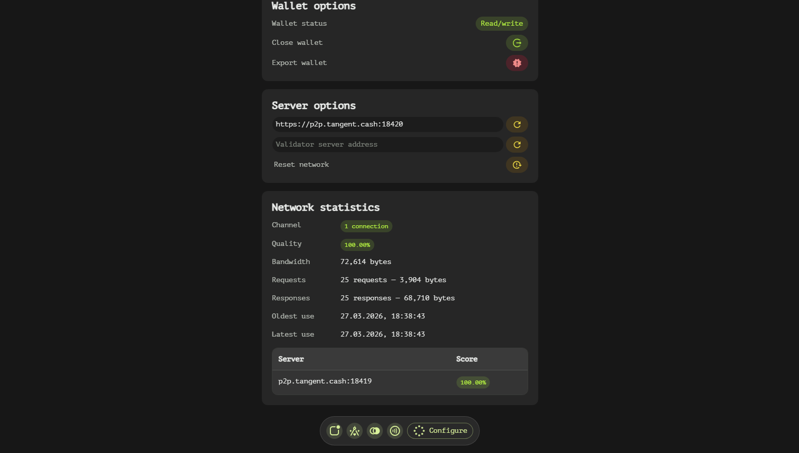
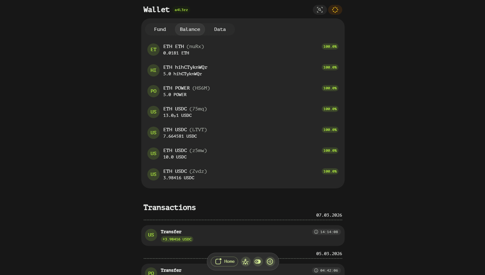
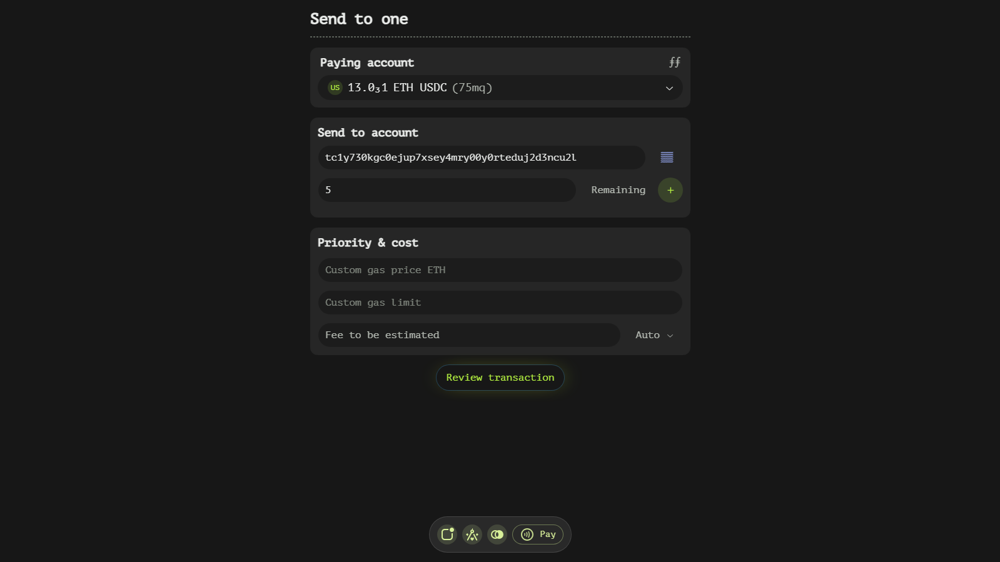
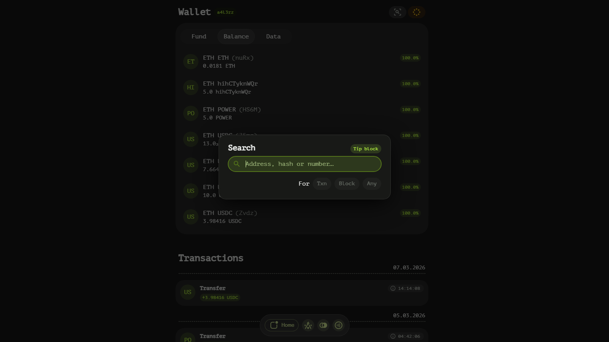
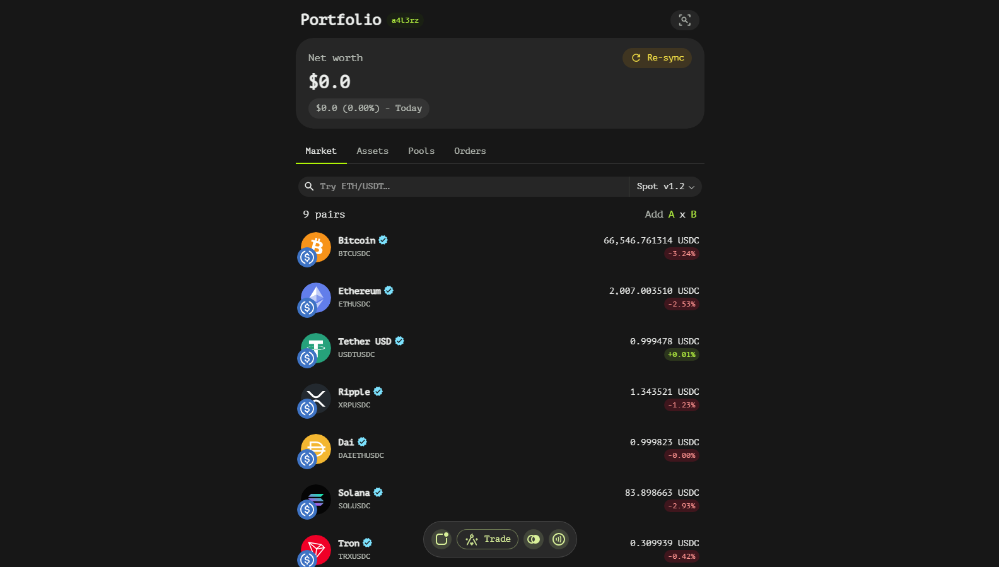

# Overview

Tangent Wallet is an app designed to provide users with seamless access to the Tangent blockchain. This documentation outlines the key features and functionalities of the Tangent Wallet, highlighting its security measures, connectivity options, and user-friendly interface.

## Security Measures

Tangent Wallet prioritizes user security by storing wallet credentials locally within secure storage protected by a password. Unlike many other applications, it does not utilize cookies or share user data with any third parties. This ensures that sensitive information remains confidential and under the control of the user.

## Connectivity and Blockchain Interaction

The application connects to the Tangent blockchain through its main RPC server, facilitating direct interaction with the network. Users can also customize their connection settings by changing the RPC server to an alternative or self-hosted option. This flexibility allows for optimized performance based on individual preferences and network conditions.

Tangent Wallet includes a powerful blockchain explorer that enables users to monitor accounts, transactions, blocks, and bridges. This feature is invaluable for those who need to track on-chain activities and gain insights into the network's operations.

## Transaction Management

One of the core functionalities of Tangent Wallet is its transaction sending capability. Users can perform various actions on the blockchain directly from the app, making it a comprehensive tool for managing digital assets and interacting with smart contracts.

## Wallet Import and Mode Selection

Tangent Wallet offers flexibility in wallet management by allowing users to import wallets in either read-write mode or read-only mode. Read-write mode requires secret credentials, providing full access to the wallet's functionalities. In contrast, read-only mode does not require secret credentials, offering a secure way to view wallet information without the risk of unauthorized transactions.

## Network Monitoring and Data Caching

The application enables users to monitor the network usage of an RPC node, providing valuable insights into the performance and efficiency of their connection. Additionally, Tangent Wallet stores blockchain data cache locally, allowing users to view the state of their or others' accounts, transactions, and blocks even when offline. This feature ensures uninterrupted access to critical information.

## Customization Options

Tangent Wallet offers several customization options to enhance user experience. Users can specify a discovery server that automatically finds the best RPC servers to pull data from, ensuring optimal performance and reliability. Furthermore, the app allows users to generate new wallets directly within the application, streamlining the onboarding process for new users.

## User Interface and Experience

Designed with simplicity in mind, Tangent Wallet hides verbose details until the user explicitly searches for them. This approach creates an intuitive and uncluttered interface, making it accessible for both novice and experienced users. The app also includes a query feature that allows users to find specific blockchain data efficiently.

## Decentralized Exchange (DEX)

Tangent Wallet integrates a DEX, enabling users to trade assets directly from their account without leaving the application. This seamless integration provides a convenient and secure way to manage and exchange digital assets, enhancing the overall user experience.

