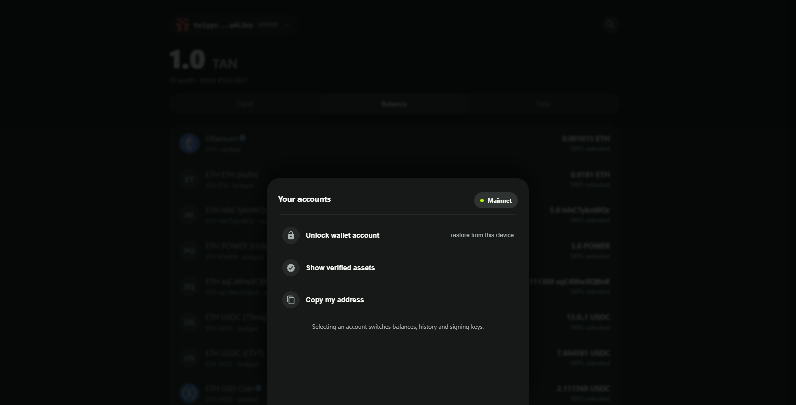
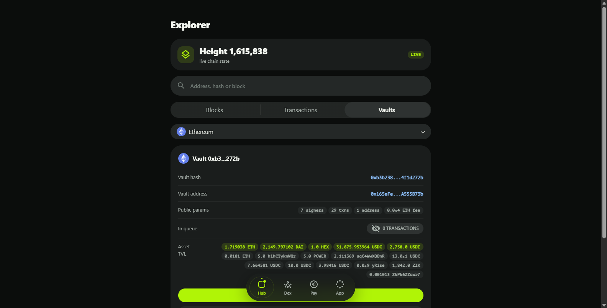

# Overview

Tangent Wallet is a non-custodial application for the Tangent blockchain. It keeps your keys on your device, talks to the network through public RPC servers you can replace at any time, and bundles a block explorer, a bridge (vault) interface, a decentralized exchange front-end and a payment composer in a single app. The same interface runs as a Web app at [tangent.cash](https://tangent.cash) and as a desktop application.

## Security First

Wallet credentials are stored encrypted on the device, protected by a password. Nothing is uploaded: there are no accounts, no e-mail, no cookies and no analytics. Signing always happens locally — even when you browse the explorer or the DEX, your key is never sent anywhere. A watch-only import lets you monitor balances and history without ever touching a private key.

## The Hub

The Hub is the wallet home screen: your address, total balance in fiat, asset count and the latest block height. Below it you can switch between the Fund, Balance and Data tabs, and scroll a live list of transactions affecting the account.

## Explorer

A global finder (top-right search) locates accounts, transactions and blocks by hash or address. Every block page exposes full internals — roots, proofs, slot statistics — and every transaction page breaks down gas use, calldata and emitted events. The explorer also renders vault (bridge) state per blockchain.

## Payments

The Pay screen composes every on-chain action: token transfers, approvals of pre-built transaction files, vault claims and account setup (block production, vault participation and attestations). Fees are estimated automatically, with an advanced mode for custom nonce, gas price and gas limit.

## Decentralized Exchange

The Dex tab is a full trading terminal on top of an on-chain order book and concentrated liquidity pools: price chart, depth chart, order maker, liquidity pools and an account wallet view with open orders and positions.

## Vaults (Bridges)

Assets from external blockchains (Bitcoin, Ethereum, Tron, Ripple and others) move in and out through vaults run by on-chain participant committees. The wallet shows funding addresses for deposits, vault capacity and queues, and guides withdrawals back to the destination chain.

## Networks

Three networks are selectable at wallet setup: **Reglocal** (a local development node), **Testnet** (public peers with test coins) and **Mainnet** (live production network). The active network is always visible in the interface.
