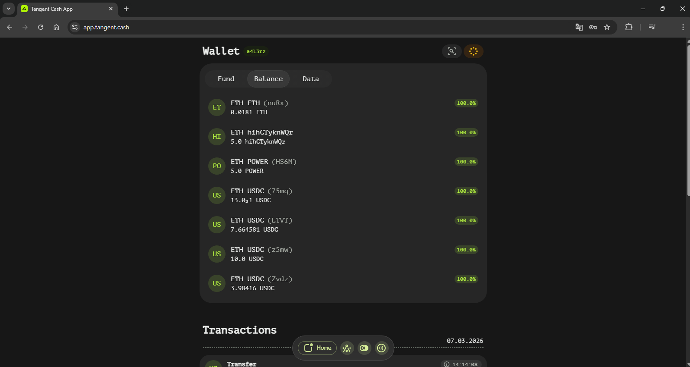
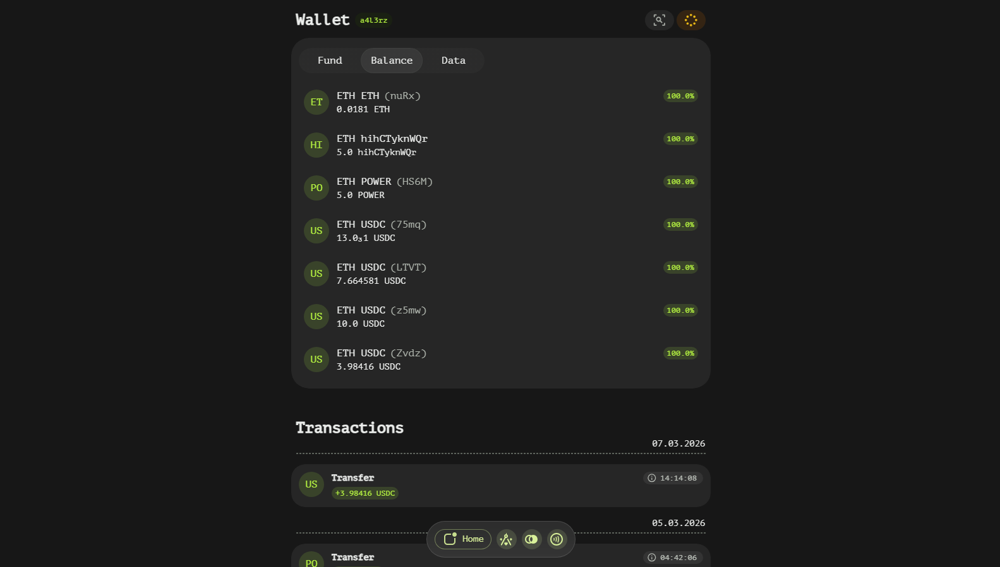

# Install

## Overview

Tangent Wallet is a versatile application designed to provide users with secure and convenient access to their digital assets stored on Tangent blockchain. It is available in two forms: Web and Desktop, catering to different user preferences and needs.

## Accessing Tangent Wallet

### Web Version

The Web version of Tangent Wallet offers a seamless experience for users who prefer accessing their wallet through a web browser. To open the Web version, follow these steps:

1. Open your preferred web browser.
2. Navigate to the following URL: [https://app.tangent.cash](https://app.tangent.cash)
3. The Tangent Wallet Web application will load, allowing you to access your digital assets directly from your browser.

**Benefits of the Web Version:**
- No installation required
- Accessible from any device with a web browser
- Convenient for users who prefer not to download additional software

### Desktop Version

For users who prefer a more robust and integrated experience, the Desktop version of Tangent Wallet is available. To install the Desktop version, follow these steps:

1. Open your web browser and go to the following GitHub releases page: [https://github.com/tangentcash/wallet/releases](https://github.com/tangentcash/wallet/releases)
2. Locate the latest release of the Tangent Wallet Desktop application.
3. Download the respective binary file for your operating system (e.g., Windows, macOS, Linux).
4. Follow the installation instructions provided on the GitHub page to complete the setup process.

**Benefits of the Desktop Version:**
- Offline access capabilities
- Enhanced security features
- Integration with local system resources

## Additional Resources

For more detailed information and updates, visit the [Tangent Wallet GitHub repository](https://github.com/tangentcash/wallet). The repository contains source code, issue tracking, and contribution guidelines for developers interested in contributing to the project.