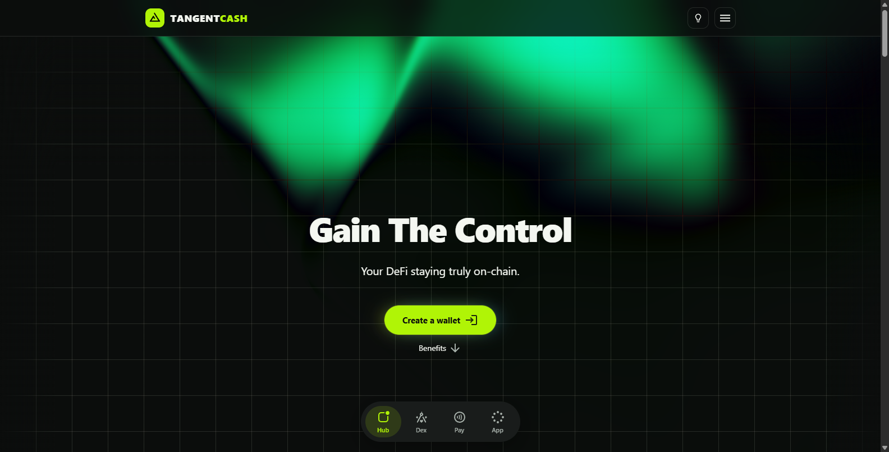
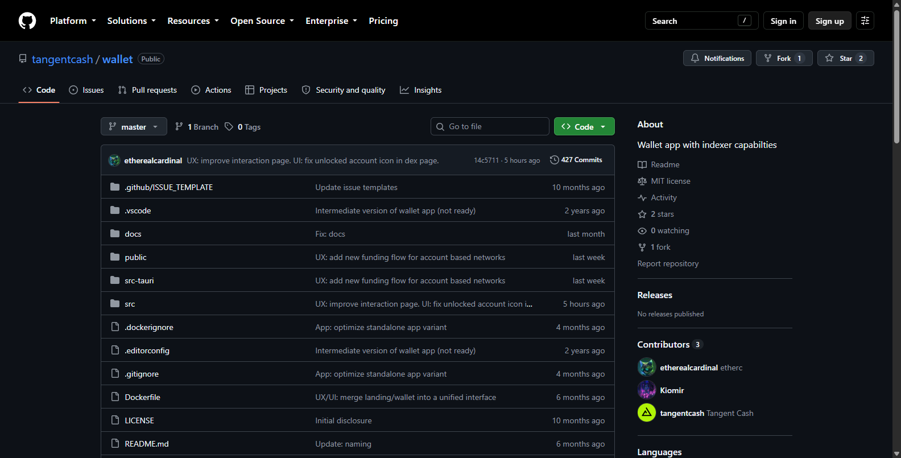

# Install

Tangent Wallet ships in two flavors that share the exact same feature set: a Web app and a Desktop application. Both talk to the same networks and store keys only on your device.

## Web Version

The Web version needs no installation and works in any modern browser.

1. Open your preferred web browser.
2. Navigate to [https://tangent.cash](https://tangent.cash).
3. Press **Open Wallet** — the app loads locally in your browser; create a new wallet or import an existing one.

**Benefits of the Web Version:**
- No installation required
- Accessible from any device with a web browser
- Always the latest version

## Desktop Version

The Desktop version packages the same client as a native application built with Tauri.

1. Open the [releases page](https://github.com/tangentcash/wallet/releases).
2. Locate the latest release of the Tangent Wallet Desktop application.
3. Download the installer for your operating system (Windows, macOS or Linux).
4. Run the installer and launch the app.

**Benefits of the Desktop Version:**
- Runs in its own window, independent of the browser
- Built-in debugger for advanced diagnostics
- Integration with local system resources

## Additional Resources

Source code, issue tracking and contribution guidelines live in the [Tangent Wallet GitHub repository](https://github.com/tangentcash/wallet).
