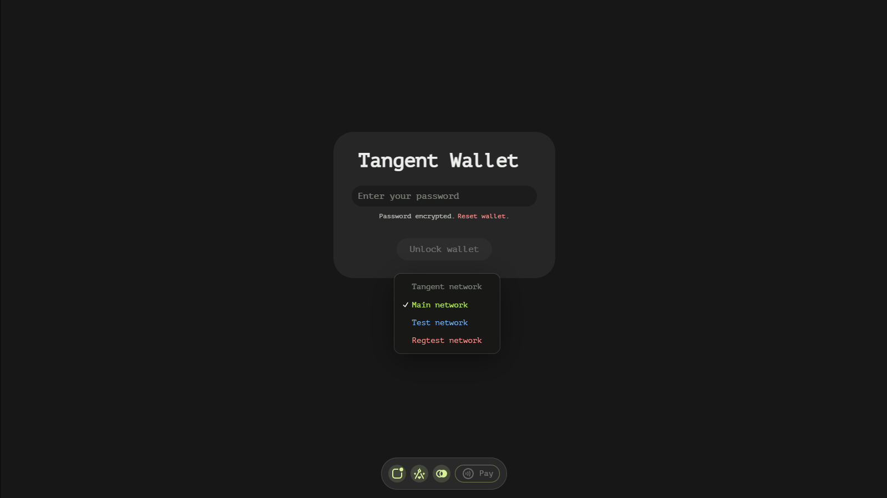
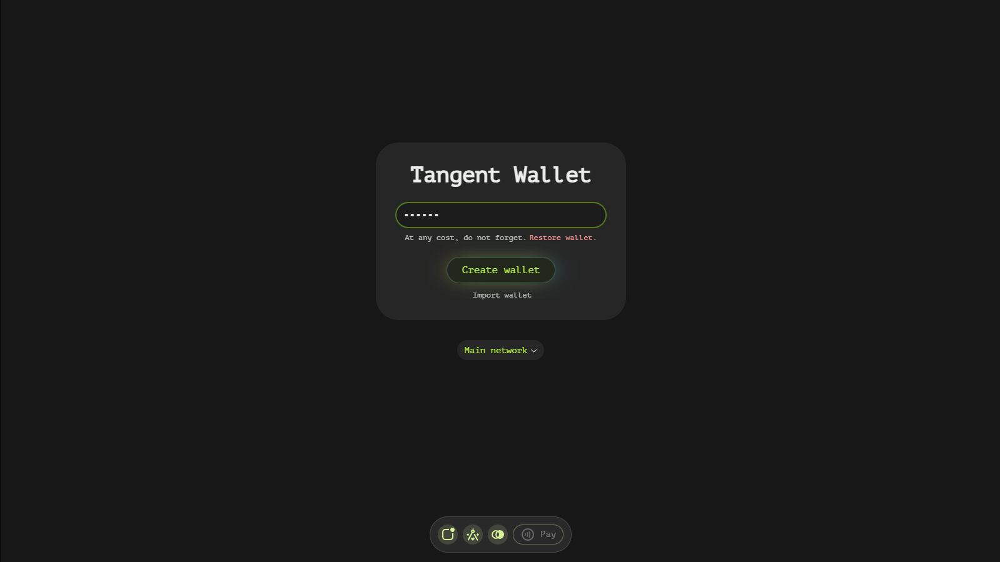
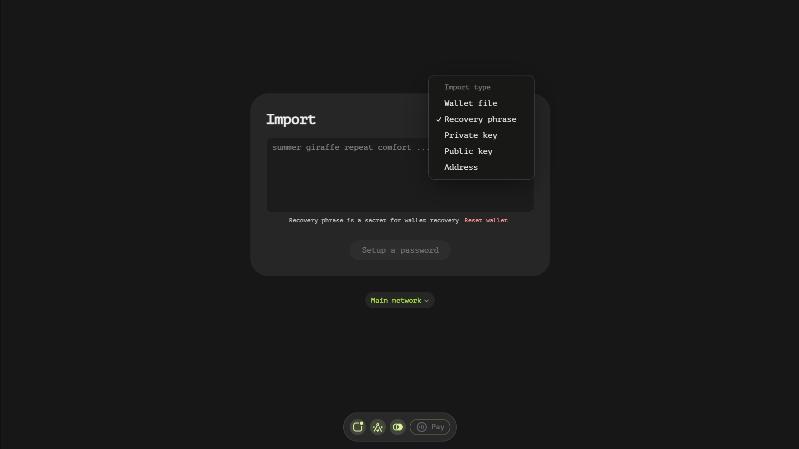

# Setup Page

The Setup page of our application is designed to handle wallet generation, import, and reset functionalities. It provides users with the flexibility to select their preferred blockchain network: Regtest, Testnet, or Mainnet. This documentation will guide you through the various features and processes available on the Setup page.

## Network Selection

Upon opening the Setup page, users are prompted to choose the blockchain network they wish to use:

- **Regtest**: A private blockchain network used for testing purposes.
- **Testnet**: A public test blockchain network that mimics the properties of Mainnet but with test tokens.
- **Mainnet**: The main production blockchain network where real transactions occur.

## Wallet Generation

1. **Password Entry**: By default, the Setup page prompts users to enter a password to generate a new wallet.
2. **Mnemonic Phrase**: After entering the password, users are presented with a 24-word recovery phrase, also known as a mnemonic. It is crucial that users remember these words in their exact order and/or save them securely.
3. **Proceed to Main Page**: Once the mnemonic is noted or saved, users must click on the glowing button to proceed to the main page of the application.

### Read-Only Mode

When users reopen the app, it defaults to read-only mode. This is because the credentials are password-protected and stored in-memory. Upon closing the wallet, all data is wiped. To access read-write features, users must enter their password. However, viewing wallet data in read-only mode does not require a password, as the account's address is saved in plain text form.

## Wallet Import

Users can import an existing wallet by clicking on the 'Import wallet' button, which is a small text-like button. The import process supports various credential types:

- **Wallet File**: Allows users to import a wallet file. This can be either read-only or read-write, depending on the file type.
- **Recovery Phrase**: Users can import a wallet using a recovery phrase, which provides read-write access.
- **Private Key**: Importing using a private key also grants read-write access.
- **Public Key**: Allows import in read-only mode.
- **Address**: Can be imported in read-only mode.

### Import Process

1. **Select Import Type**: Users choose the preferred import type from the options listed above.
2. **Enter Credentials or Choose File**: Depending on the selected import type, users either enter the necessary credentials (recovery phrase, private key, public key, address) or choose a wallet file.
3. **Secure with Password**: Users are prompted to enter a password that will secure the imported credentials.

## Additional Features

- **Wallet Reset**: Users can reset their wallet by following a similar process to wallet generation, ensuring a fresh start with new credentials.