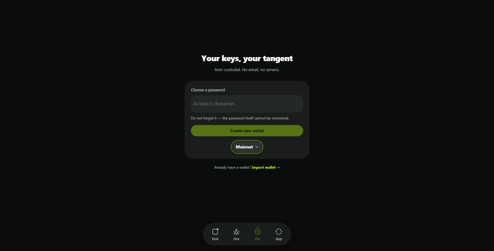
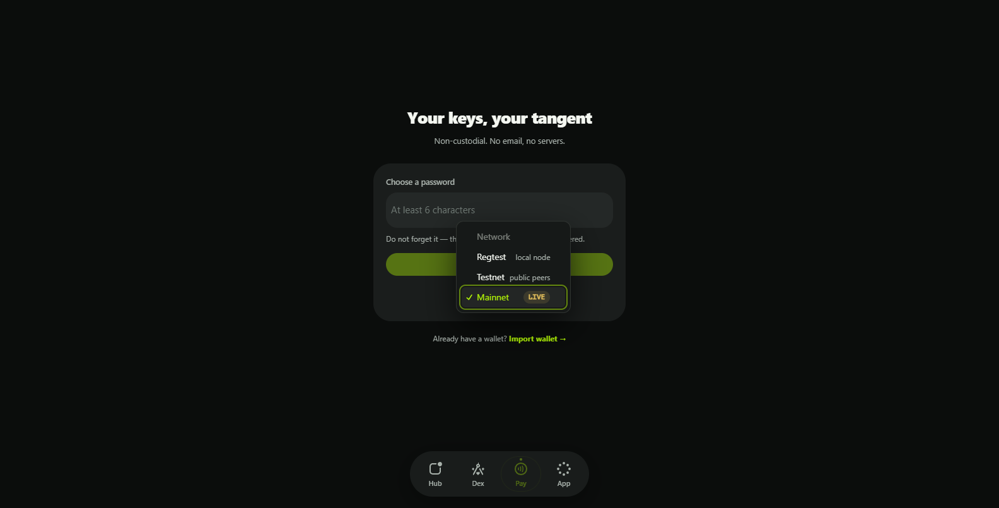
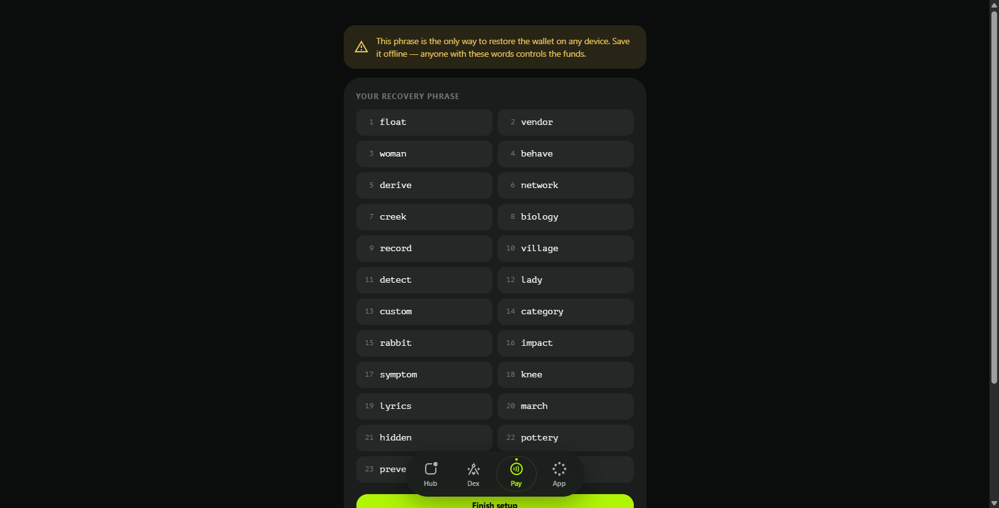
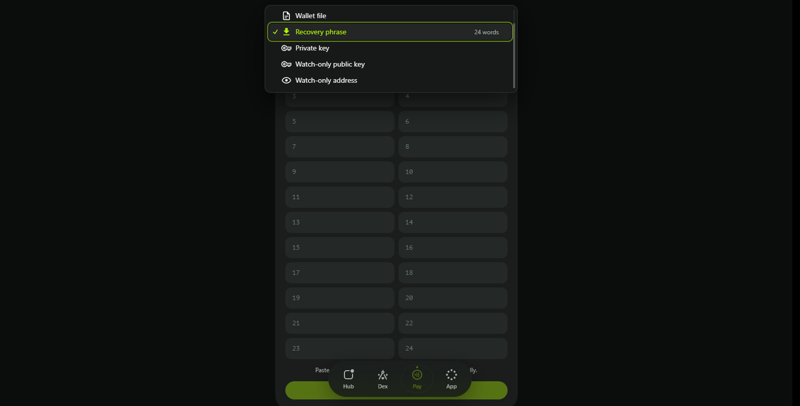
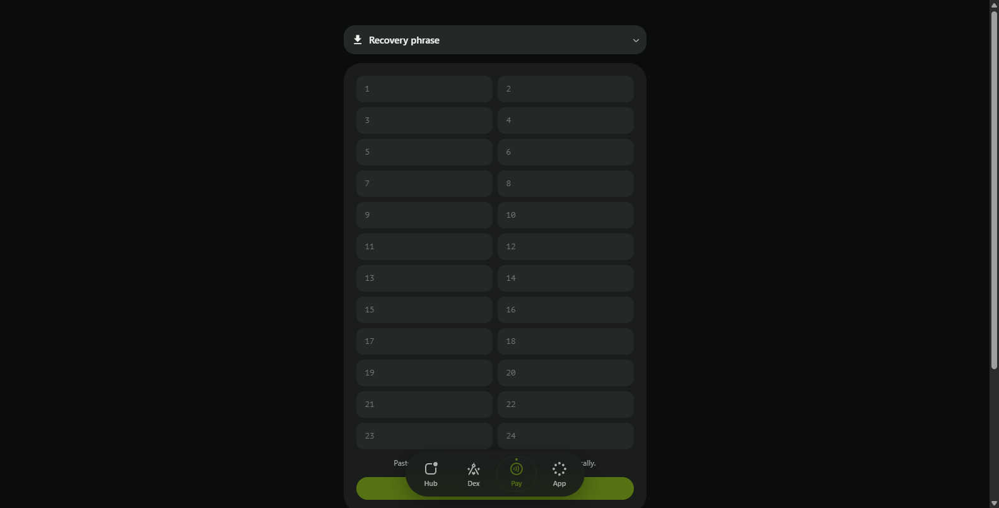
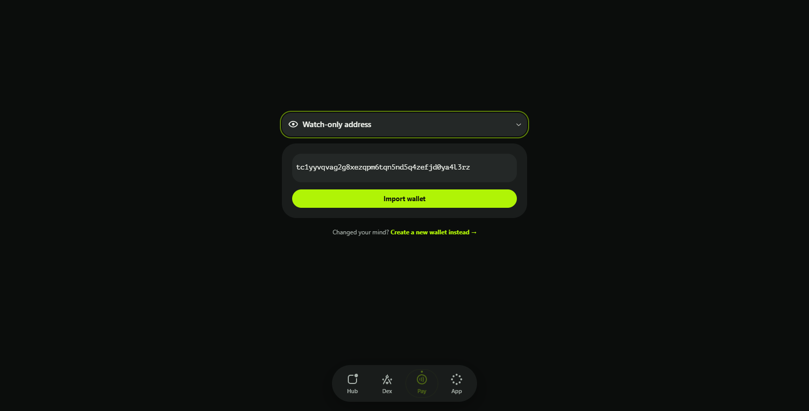
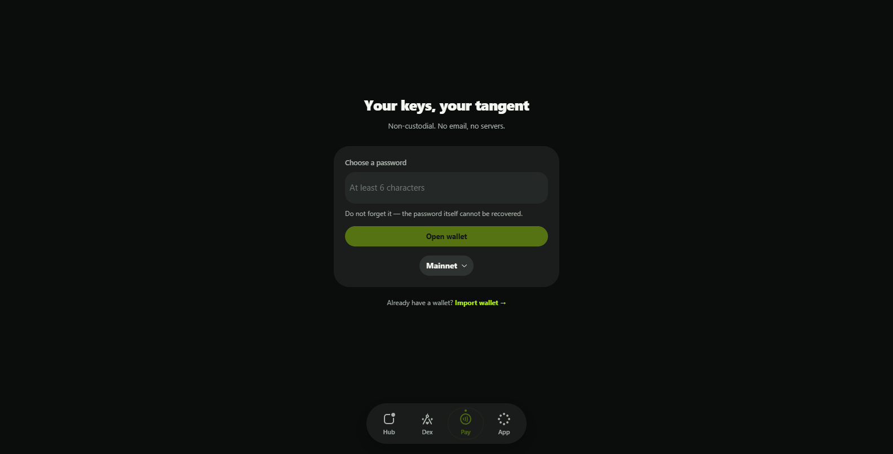

# Setup Page

The Setup page handles wallet creation, import and reset. It is the first screen you see on a fresh install and is reachable later through the wallet switcher. From here you also pick the blockchain network the wallet will operate on.

## Network Selection

The network pill at the top of the card switches the target network before keys are created:

- **Reglocal** — a private local node used for development and testing.
- **Testnet** — a public test network with the same rules as Mainnet, but with valueless coins.
- **Mainnet** — the live production network (marked *LIVE*).

Address prefixes follow the network: Mainnet addresses start with `tc`, test networks use their own prefixes, and the import forms validate against the selected network.

The dropdown lists the three networks with short descriptions:

## Wallet Generation

1. **Password Entry** — the page defaults to creating a new wallet. Choose a password that encrypts the wallet keys on this device.
2. **Recovery Phrase** — a 24-word mnemonic is generated and shown for confirmation. Save the words in the exact order: they are the only way to recover funds if the device is lost. The password itself cannot be recovered.
3. **Finish Setup** — confirm the phrase to activate the wallet.

## Wallet Import

Press *Already have a wallet? Import wallet* to bring existing credentials on board. The **Import source** dropdown selects what you are importing:

- **Wallet file** — a `.json` wallet file exported from this app.
- **Recovery phrase** — a 24-word mnemonic (full read-write control).
- **Private key** — a single account secret key (full read-write control).
- **Watch-only public key** — monitor and compose, no signing.
- **Watch-only address** — read-only mode: balances and history only.

For a recovery phrase the app asks for the words one by one:

Watch-only imports take an address (or public key) and state clearly what the mode allows:

### Import Process

1. **Select Import Type** — choose one of the sources above.
2. **Enter Credentials or Choose File** — paste the phrase, key or address, or pick a wallet file.
3. **Secure with Password** — set the device password that encrypts the imported credentials, then press **Open wallet**.

## Wallet Reset

Resetting follows the same flow as generation: destroy the current wallet (App → *Destroy wallet*) and create or import a new one from this page. On-chain funds are untouched as long as you still hold the recovery phrase.
