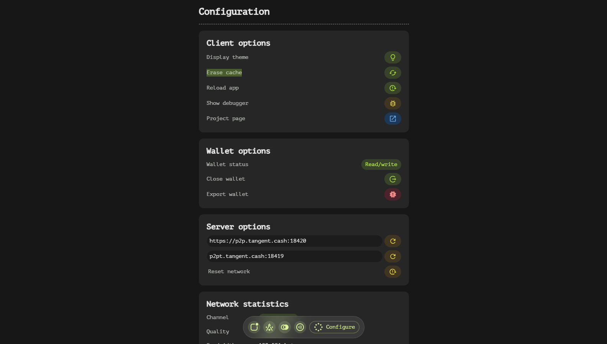
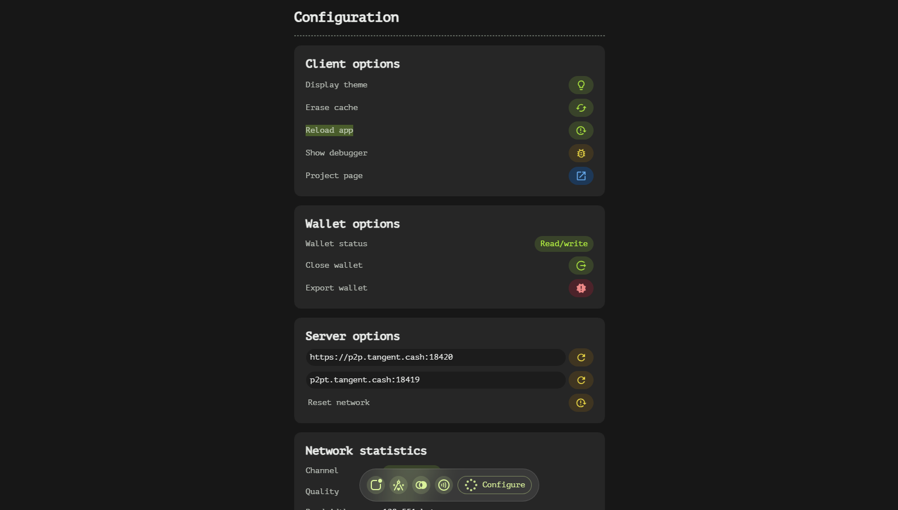
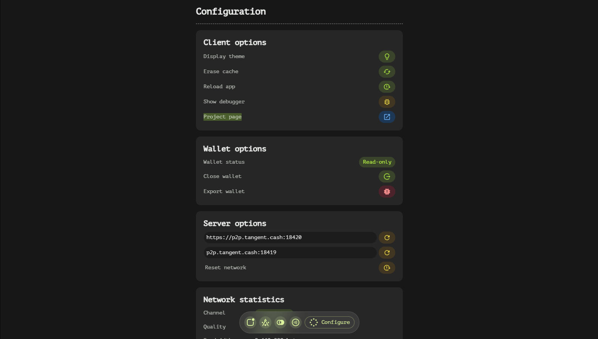
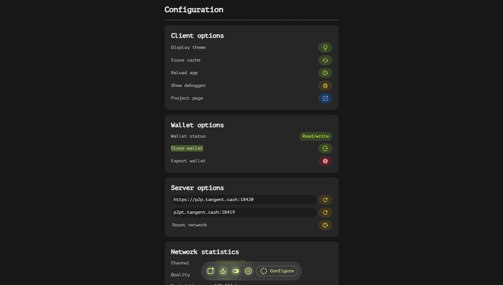
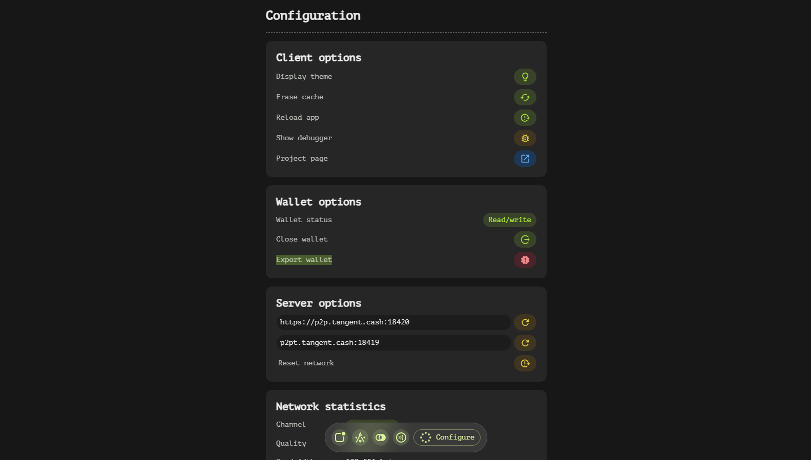
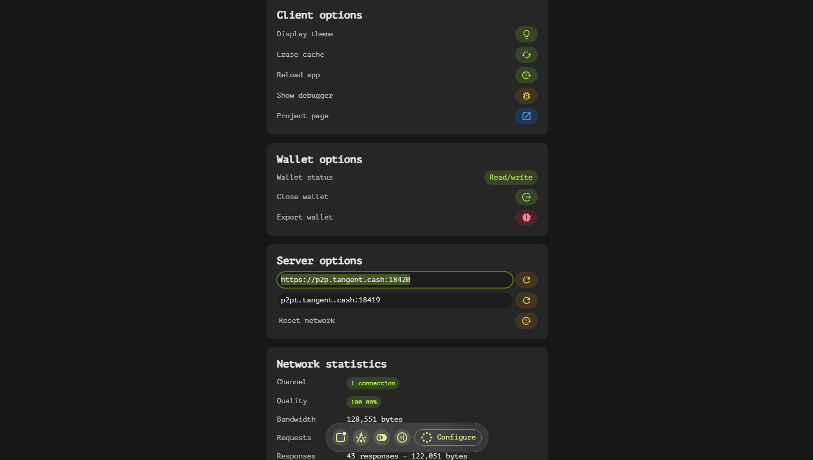
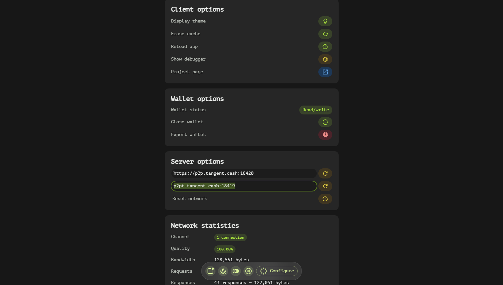
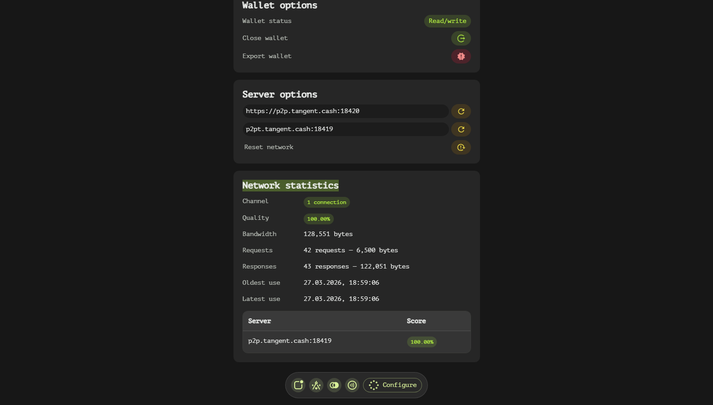

# Config Page

The Configuration page provides users with the ability to view and modify various settings, allowing for a tailored experience and enhanced control over the application's behavior.

## Client Options

### App Appearance
Users can toggle between **dark mode** and **light mode**, ensuring that the app's interface suits their preferences and environmental conditions. This setting enhances readability and visual comfort.

### Cache Management
The option to **erase app cache** allows users to clear temporary files stored by the application, which can help resolve performance issues or free up storage space.

### App Reload
Users have the ability to **reload the app**, refreshing its state without requiring a full restart. This is particularly useful for applying changes immediately or resolving minor glitches.

### Debugger Access
For advanced users, there's an option to **open the debugger**. This provides access to detailed technical information and tools, aiding in troubleshooting and development tasks.

### Project Page
Project Landing Page

## Wallet Options

### Wallet Status
Users can check their wallet's current status, which is displayed as either **read-only** or **read-write**. This read-only view ensures that users are aware of their wallet's permissions at any given time.

### Wallet Closure
The **close wallet** option allows users to securely close their wallet by erasing secret credentials from memory. This action transitions the wallet to a read-only mode, enhancing security when the wallet is not in use.

### Wallet Export
Users can export their wallet file, providing a backup or facilitating wallet transfer between devices. This feature ensures that users have control over their wallet data and can recover it if needed.

## Server Options

### Discovery Server
Users can set a **discovery server** to specify which server the application should use for discovering network resources. This setting is crucial for ensuring connectivity and optimizing performance within specific networks.

### RPC Server
The option to set an **RPC (Remote Procedure Call) server** allows users to define the server that handles remote procedure calls. This is essential for configuring how the application communicates with external services and systems.

## Network Statistics

### Connection Monitoring
Users can monitor their current network connections, including metrics such as success rate, bandwidth usage, requests/responses count, and usage time. This information provides insights into network performance and helps identify any potential issues or bottlenecks.

By offering these comprehensive configuration options, the Configuration page empowers users to tailor their experience, ensure security, and optimize performance according to their specific needs.

