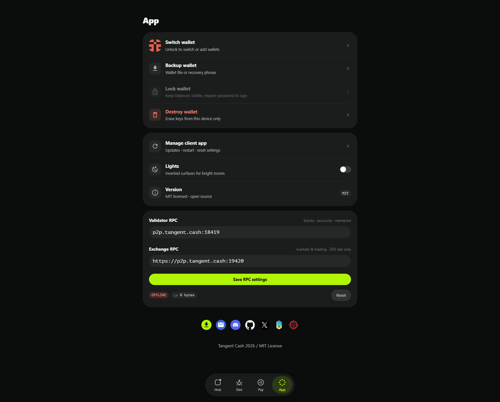
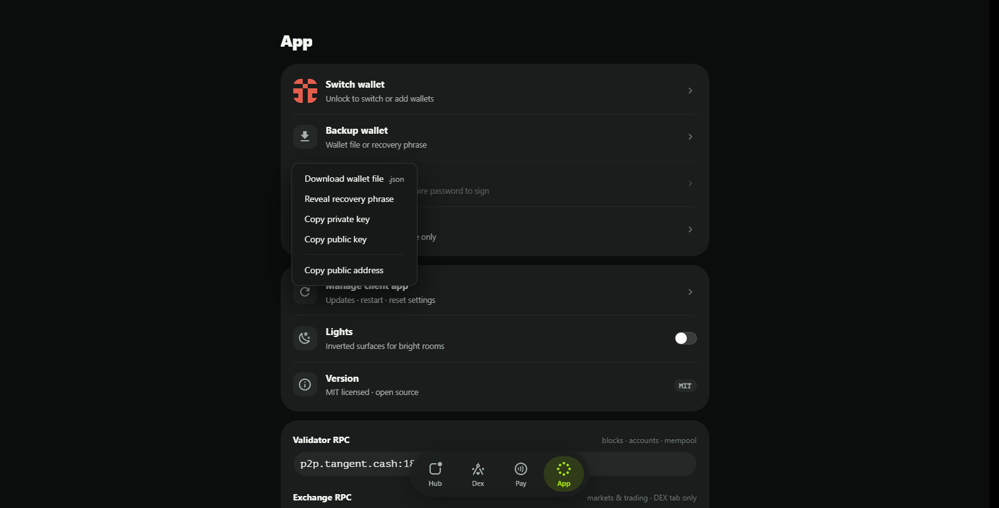
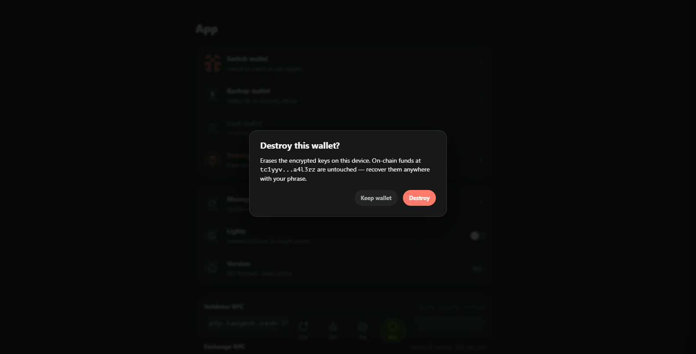
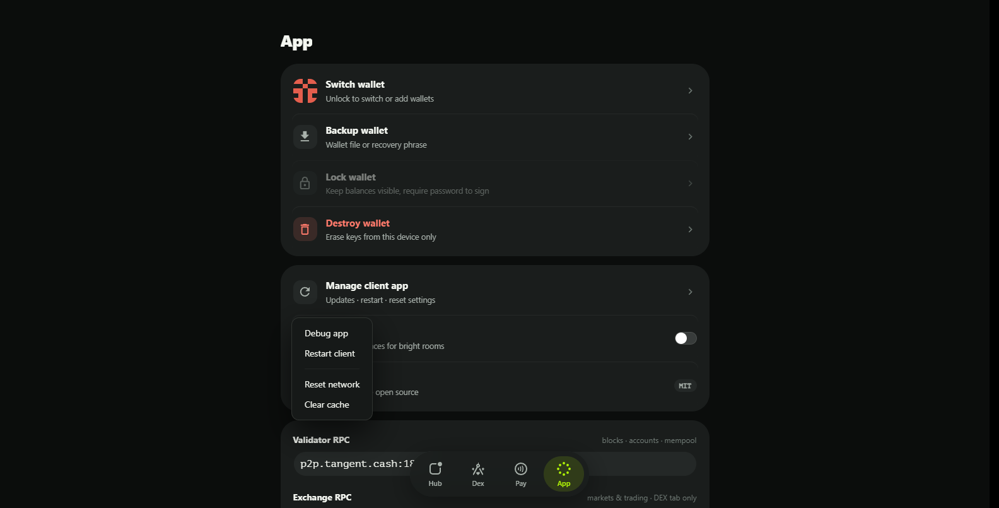
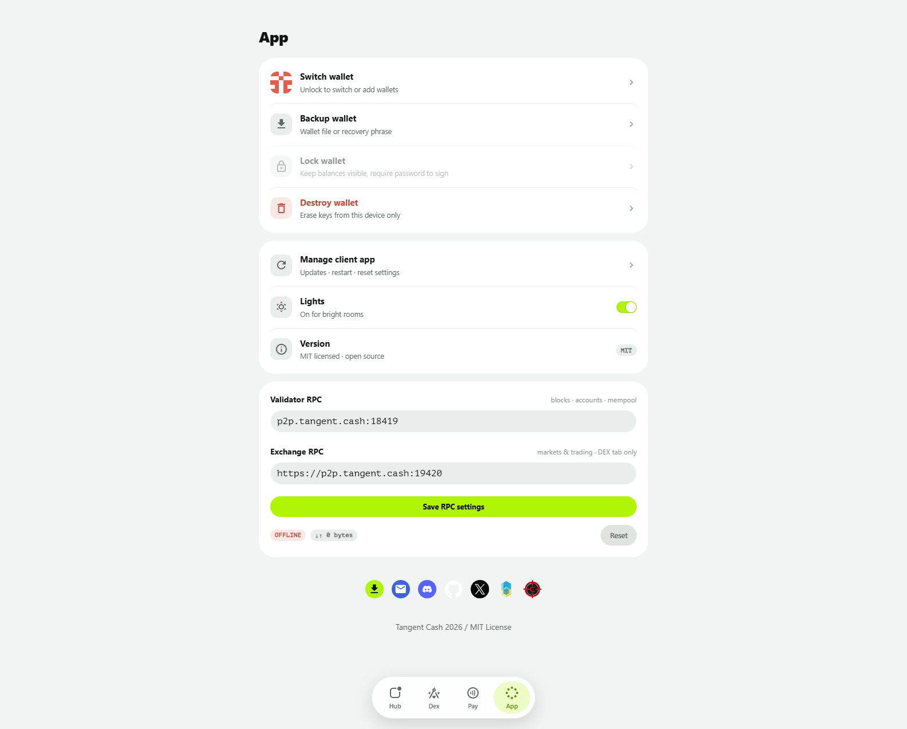

# Config Page

The App page (bottom-right of the navigation bar) collects everything about the client itself: wallet management, backups, appearance and RPC server settings.

## Wallet Section

### Switch Wallet

The first row shows the active account. The dropdown lists every account stored on this device — pick one to switch to it, or use **Add wallet** to create or import an additional wallet next to the current one.

### Backup Wallet

*Backup wallet* opens the export menu. Everything here requires the wallet password, and every item is meant to be stored offline:

- **Download wallet file (.json)** — the encrypted wallet file.
- **Reveal recovery phrase** — shows the 24-word mnemonic on screen.
- **Copy private key** — the account secret key to the clipboard.
- **Copy public key** — the public key (safe to share).
- **Copy public address** — the receiving address.

### Lock Wallet

*Lock wallet* removes the signing key from memory. Balances and history stay visible; signing requires the password again. Watch-only wallets are permanently locked by design and show a `LOCKED` badge across the app.

### Destroy Wallet

*Destroy wallet* erases the encrypted keys from this device. A confirmation dialog explains that on-chain funds at your address are untouched and can be recovered anywhere with the phrase. When several wallets are stored, the dialog distinguishes **Wipe wallet** (active wallet only) from **Wipe all**.

## Client Section

### Manage Client App

- **Debug app** — opens the developer tools (Desktop version only).
- **Restart client** — reloads the application.
- **Reset network** — re-acquires the RPC connection and refreshes network settings.
- **Clear cache** — erases the locally cached RPC data.

### Lights

A switch toggles between the dark theme (inverted surfaces, the default) and the light theme for bright rooms.

### Version

Shows the build license — MIT, open source — linking to the full license and terms on the Legal page.

## Network Section

### RPC Servers

- **Validator RPC** (`hostname:port`) — the node serving blocks, accounts and the mempool. Leave empty for the built-in default or point the app at your own node.
- **Exchange RPC** (`http://…`) — the read-only DEX indexer used by the Dex tab.

Press **Save RPC settings** to apply. Custom endpoints are persisted per device.

### Connection Status

Below the fields the app reports the live connection state — an `ONLINE`/`OFFLINE` badge and accumulated traffic (`↓↑` bytes) — with a **Reset** chip to re-handshake without touching the saved addresses.
