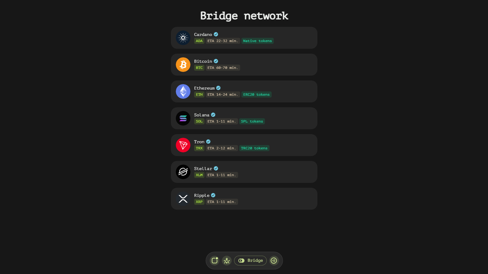
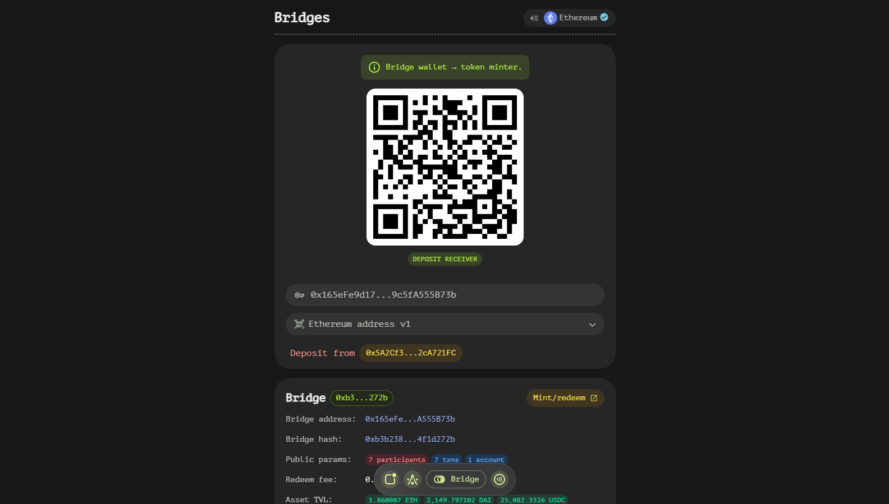
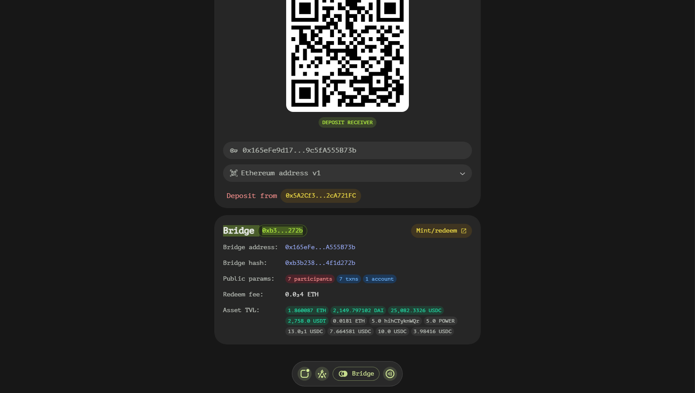
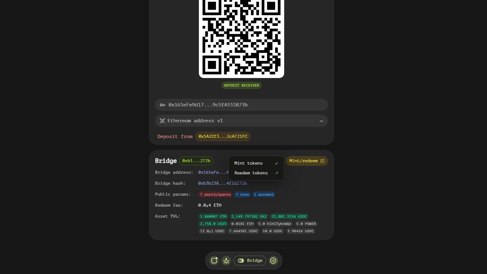
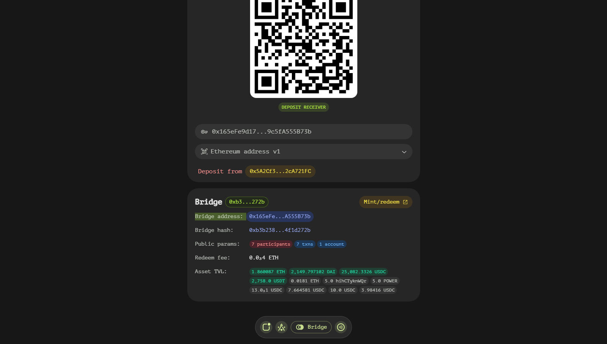
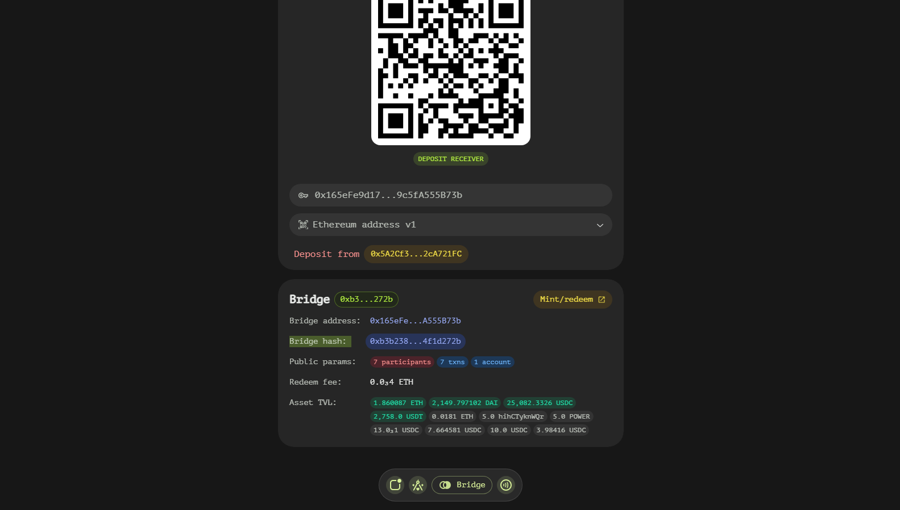
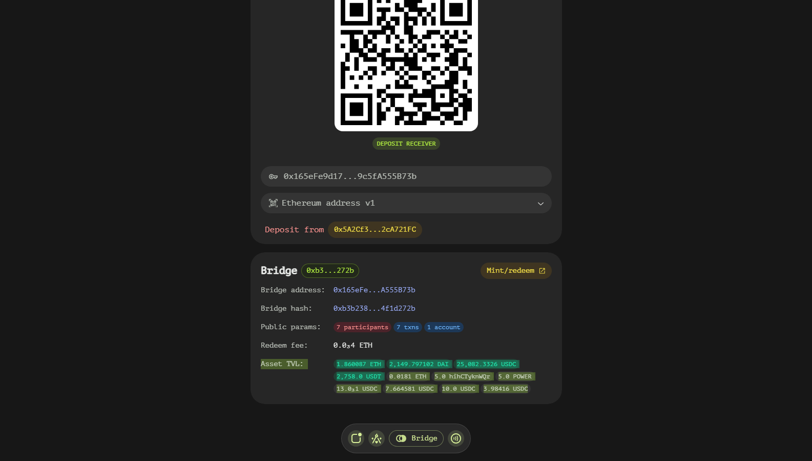
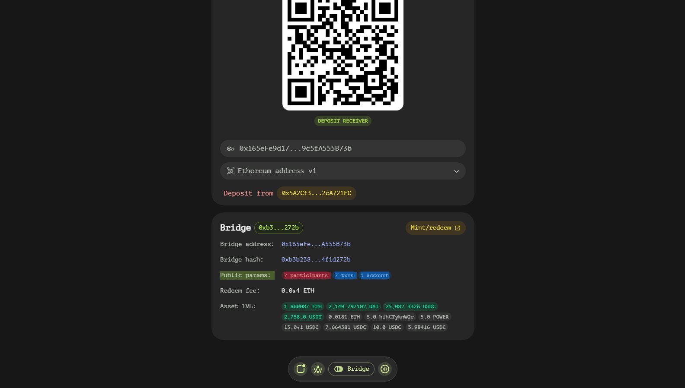
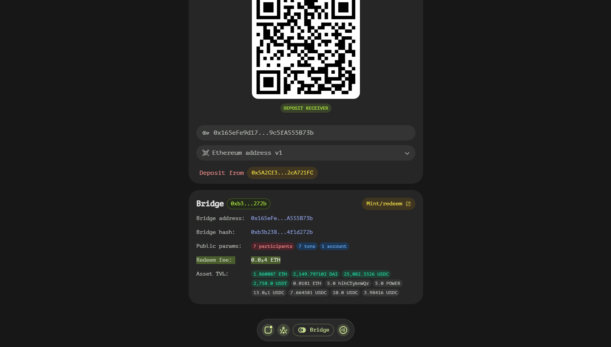

# Bridges Page

The Bridges page is designed to provide users with comprehensive information about supported blockchains and the available bridging options. This page serves as a hub for managing cross-chain transactions and understanding the details of each blockchain network.

## Supported Blockchains

By default, the Bridges page displays a list of supported blockchains along with essential information for each:

- **Blockchain Name and Cryptocurrency Symbol**: Each entry starts with the name of the blockchain and its associated cryptocurrency symbol.
- **ETA (Estimated Time of Arrival)**: This field provides an estimate of the time it will take for deposits or withdrawals to be processed, based on the blockchain's block time and the number of required confirmations.
- **Tokens**: Optionally, this section may include information about token support for the blockchain, such as 'ERC20 tokens' for the Ethereum network.

## Selecting a Blockchain

When you select a specific blockchain from the list, a detailed subpage opens, offering in-depth information and options:

### Registrations

This section contains critical information about your addresses and transaction instructions:

- **Deposit Addresses**: A list of deposit addresses assigned to your account. You can use any of these addresses to deposit off-chain assets onto the chosen blockchain. Detailed instructions on how to make a deposit are also provided. To view more addresses or instructions, click the 'Bindings' button. If this button is not present, it indicates that no applicable addresses are available.

### Bridges

This section allows you and provides sorting options for bridges based on preference:

#### Sorting Options

You can sort the list of bridges by either the bridge's security level or the Total Value Locked (TVL) in the bridge.

#### Bridge Details
Each bridge entry contains the following fields:

  - **Bridge Badge**: Displays the eight symbols of the bridge's hash

  

  - **Mint/redeem**: A button that initiates either the deposit process or a withdrawal using the payment page.

  - **Deposit Address**: An optional global deposit address where you can send assets to receive them on-chain.

  - **Bridge Ref Hash**: The hash of the bridge essentially equals to a name.

  - **Total Value Locked (TVL)**: The total assets managed by this bridge.

  - **Public params**: A lower value suggests faster but less secure operations, while a higher value indicates slower but more secure transactions. This number reflects the number of participants involved in the bridge.

  - **Redeem fee**: The amount of native tokens deducted during the withdrawal process (specific to the bridge's blockchain, not other tokens like ERC20).

