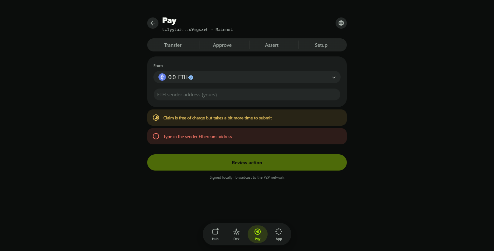
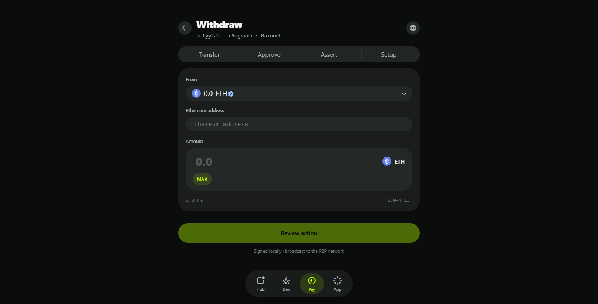

# Bridges Page

Assets from external blockchains enter and leave Tangent through **vaults** — on-chain bridge committees that hold the custody and pay out withdrawals. The Vaults view is part of the Explorer and is opened from the Fund tab of any bridged asset (the *VAULTS* button).

## Supported Blockchains

Pick the blockchain in the selector at the top — Bitcoin, Ethereum, Tron, Ripple, Litecoin, Cardano and the rest of the supported networks. The page then lists every active vault for that chain as a card:

Each vault card shows:

- **Vault hash** — the unique on-chain identifier of the bridge, the vault's "name".
- **Vault address** — the address on the *external* blockchain where deposits are made and from which withdrawals are paid.
- **Public params** — committee size (`N signers`), operational parameters and the withdrawal fee in the native asset of the bridge chain.
- **In queue** — the number of withdrawal requests currently waiting for payout.
- **Total Value Locked (TVL)** — the assets the vault manages on the external chain, broken down per token.

## Depositing (Registering a Claim Address)

Pressing the funding action on a vault opens the **Pay** screen in register mode. To receive your bridged assets you provide an address you own on the destination chain:

- **From** — the Tangent asset (and gas asset) you are operating with.
- **Destination chain sender address** — the external-chain address (for example your `ETH sender address`) that will claim the funds. Registering it up front lets you re-claim to your own address and enables direct sends through the vault.

Claims are free to submit on-chain, but the payout itself takes the vault's confirmation time (chain block time × required confirmations, shown as the vault ETA).

## Withdrawing

Withdrawals are composed on the **Withdraw** screen, reached from the asset's row:

- **Destination address** — your address on the external blockchain (memo/destination tag fields appear for chains that need them, such as XRP or XLM).
- **Amount** — how much to withdraw, with a `MAX` shortcut.
- **Vault fee** — the fee deducted by the vault signers, paid in the native token of the destination blockchain (shown on the form before you confirm).

Review the transaction, sign with your password, and the request enters the vault queue; the committee pays out to your external address, and the exit appears in your transaction history.

## When a Withdrawal Stalls

If the off-chain payout never arrives after the vault's time-lock, the Assert tab of the Pay screen lets you reclaim the funds: enter the hash of the vault's relay (broadcast) transaction and submit the assert transaction to get a full refund to your Tangent account.
