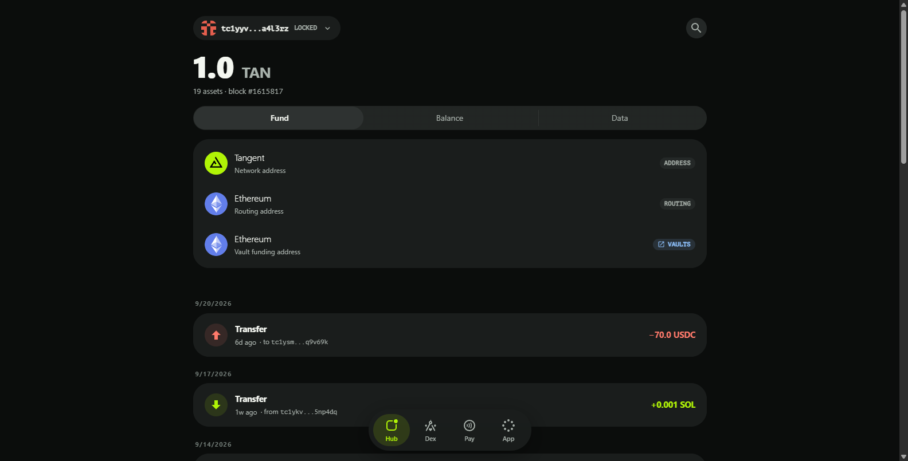
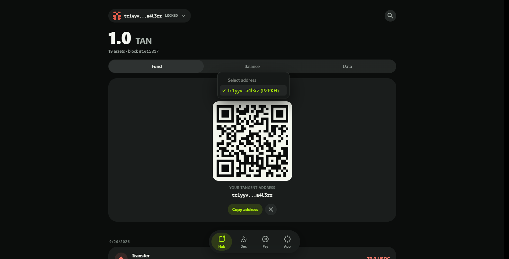
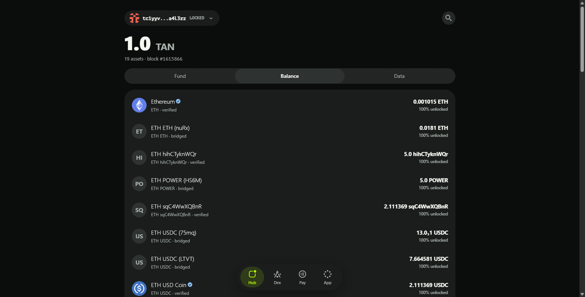
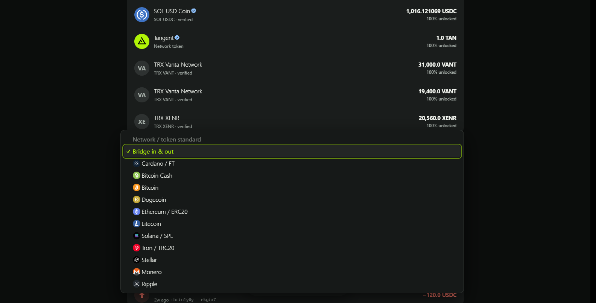
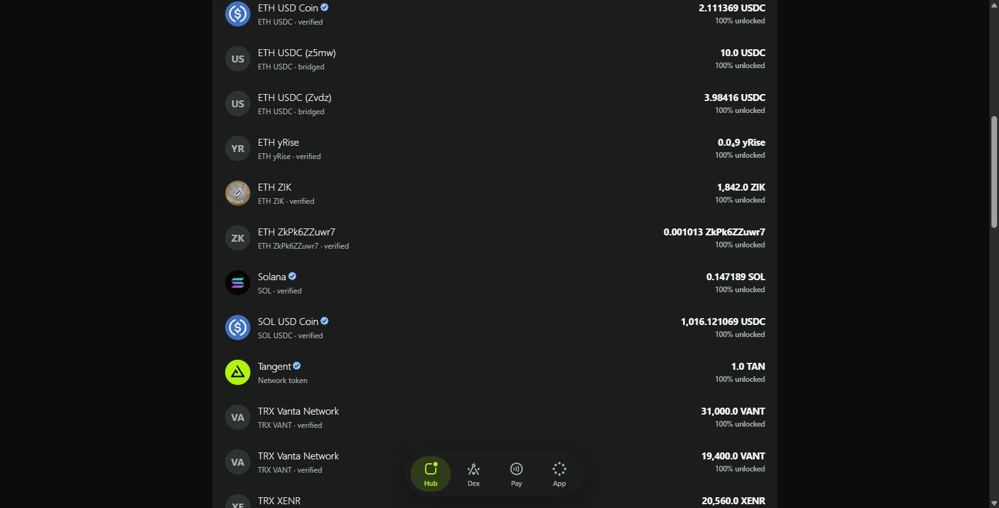
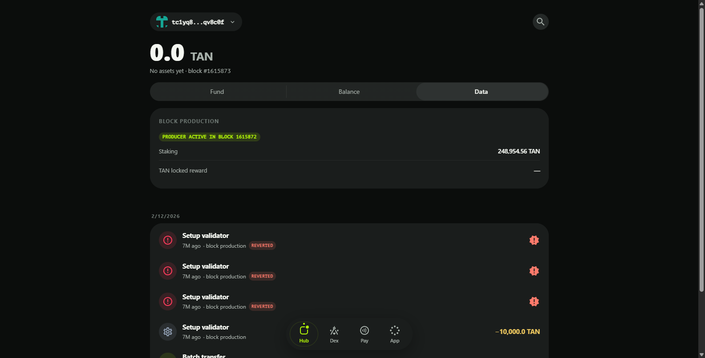

# Account Page

The Hub is the wallet home screen. It shows the selected account's balance, its addresses, on-chain participation records and a live transaction feed.

## Header

The chip in the top-left carries the account avatar, the shortened address and — when the signing key is not loaded — a `LOCKED` badge. Clicking it opens the **Your accounts** sheet:

- A list of all accounts on this device; switching happens instantly (`full control` for keys you hold, `watch control` for watch-only entries).
- The active **network badge** (Reglocal / Testnet / Mainnet).
- **Unlock / Lock wallet account** — load the key for signing, or drop it from memory.
- **Show verified assets** — hide or show assets outside the verified list.
- **Copy my address**.

The magnifier on the right opens the global finder: look up any account, transaction or block. Below the header sits the account summary — total value in fiat, asset count, the latest block height and the current fee reference.

## Main Tabs

### Fund

The Fund tab lists the addresses that identify you on each chain:

- **Network address** — your Tangent account address.
- **Routing address** (green) — additional addresses owned by your account, used to route or withdraw assets.
- **Vault funding address** (blue `VAULT` badge) — deposit addresses owned by bridge vaults; sending here credits your Tangent account after confirmations. Chains that require a memo/destination tag (XRP, XLM…) show it alongside.

Clicking a row opens the address with its QR code, purpose and a copy button; the dialog also lets you jump between your addresses:

Assets that bridge through a vault show a `VAULTS` button that opens the Vaults view for that blockchain.

### Balance

The Balance tab lists every asset with a balance: icon, name, amount, fiat value and provenance badges (`verified`, `bridged`). The percentage under the amount is the **unlocked share** — the part of your total holding not locked by orders, pools or stakes; hovering the row reveals the locked and reserve values.

The filter button switches the list between all assets and a per-network view:

The full list keeps the same layout for every holding:

### Data

The Data tab reports the account's on-chain roles:

- **Block production** — production status, the block it was set in, the staked amount and accumulated rewards.
- **Vault participation** — committee membership: `ACTIVE`/`OFFLINE`, the activation block and the participation stake.
- **Vault attestation** — one card per attested blockchain with its status, block and stake.

An account without contracts, production or vault records shows a clean *No on-chain data* state.

## Transaction List

Below the tabs is the account's transaction feed — everything that affected the account, whether you sent it or not. Pending (mempool) transactions appear first, before finalized ones. Each entry is collapsed to the net balance changes of your account; clicking it expands the full transaction element with status, block, confirmations, gas and calldata (see the [Transaction page](07-transaction.md)).
