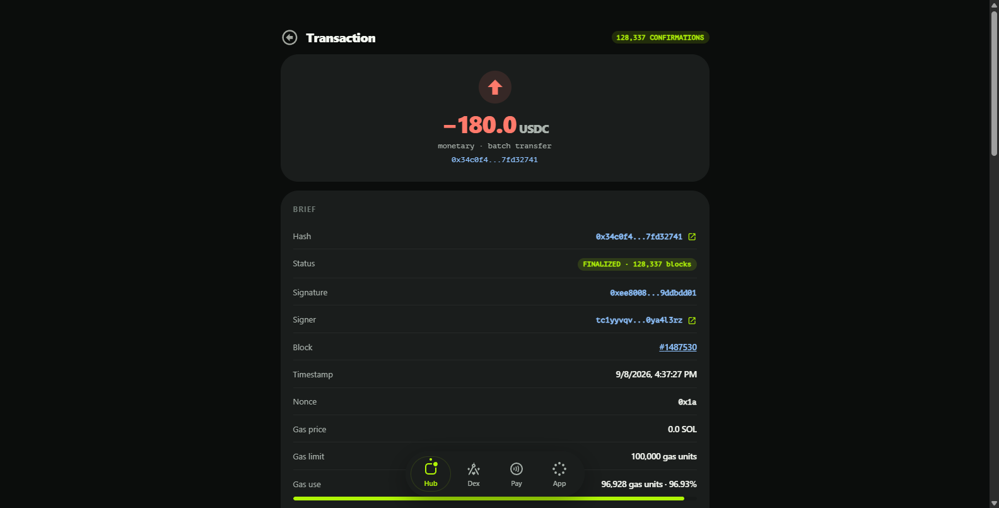
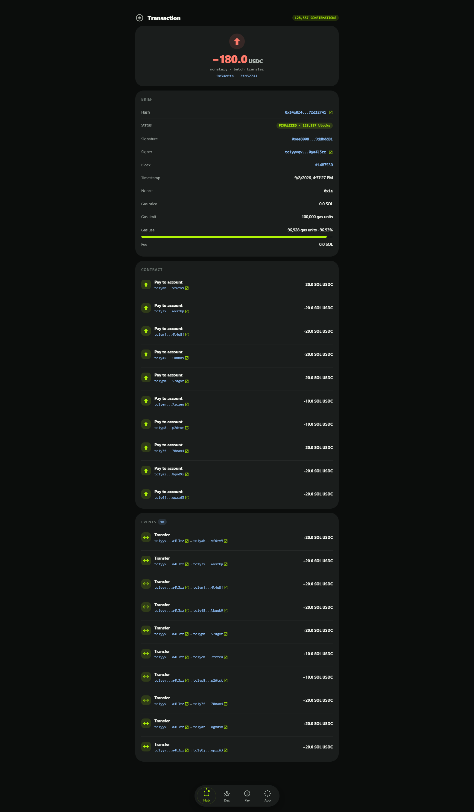

# Transaction Page

The transaction element gives a complete view of a single transaction: header badges when collapsed, a full breakdown when expanded. It is used both in the account feed and as a standalone page (`/transaction/<hash>`), reachable from any hash link in the explorer.

## Collapsed View

Collapsed, the element shows a compact summary: the transaction hash, a status pill and the net changes it made to the account in question. Clicking the row expands it.

## Expanded View

Expanded, the element reveals the full set of fields describing the transaction's attributes and execution:

### Transaction Hash
A unique identifier for the transaction — its digital fingerprint, used to locate and reference it anywhere in the network.

### Status
The execution result: a green `SUCCESS` pill for executed transactions, a red `REVERTED` one for failures, with the failure reason included when available.

### Block
The number of the block that included the transaction; the block number is a link to its [Block page](08-block.md).

### Confirmations
How many blocks have been produced after the including block. More confirmations mean more finality.

### Timestamp
The exact time the transaction was executed.

### Paying Account
The account that authorized and signed the transaction — recovered from the signature itself, so it cannot be forged.

### Nonce
A strictly increasing per-account counter that makes each transaction unique. It prevents replay attacks where the same payment would otherwise be valid over and over.

### Gas Network
Which network's token is used to pay the transaction fee — for bridged assets this can be a chain other than Tangent.

### Gas Price
The price per unit of gas, in the gas asset. Gas prices move with network demand and congestion.

### Gas Limit
The maximum amount of gas the transaction may consume — a user- or app-set ceiling against runaway costs.

### Gas Use
The gas actually consumed during execution; never more than the limit.

### Fee Paid
What was actually charged: gas price × gas use.

### Signature
The cryptographic signature authorizing the transaction.

## Calldata Section

The calldata section shows the raw payload of the transaction — the encoded call and its arguments. Its meaning depends on the transaction type (transfer, setup, vault operation, contract call), and the hex can be copied for external inspection.

## Event Log Section

The event log lists every event the transaction emitted, in order: state changes and notices other contracts and users react to — transfers, order fills, vault movements. Together with the calldata this makes a transaction fully auditable.

