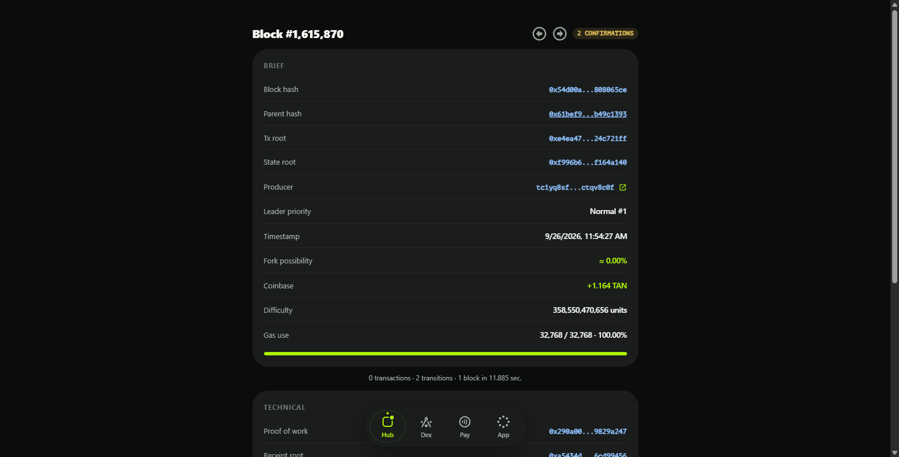
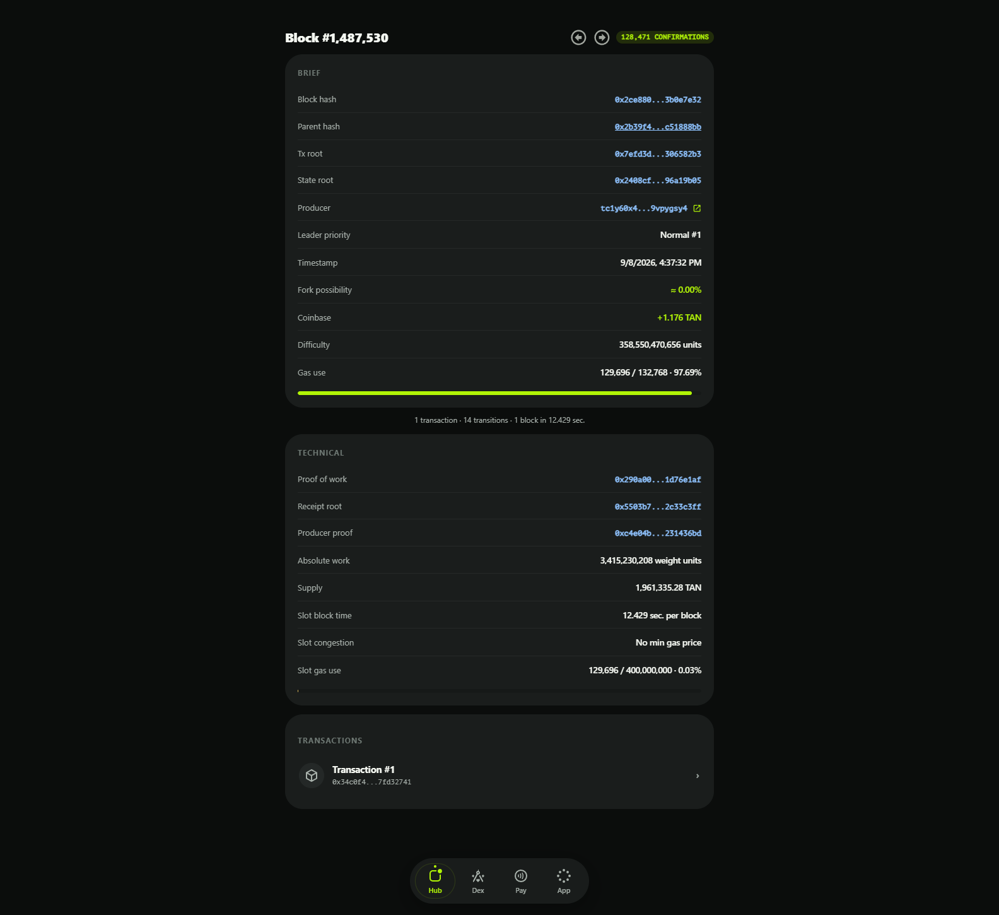

# Block Page

The Block page (`/block/<number>`) shows the full internals of one block: identifiers, proofs, roots and consensus metrics. The header carries the block number, a `CONFIRMATIONS` badge and arrows to walk to the previous/next block.

## Brief Section

- **Block hash** — the unique ID identifying this block.
- **Parent hash** — the ID of the previous block, binding the chain together.
- **Tx root** — Merkle root of all transaction hashes included up to this block.
- **State root** — Merkle root of the complete blockchain state after this block.
- **Producer** — the account that created the block, recovered from the block signature.
- **Leader priority** — the producer's position in the committee for this slot. A block produced at priority `Unforkable #1` has instant finality; anything else is marked `Normal` and can theoretically be forked.
- **Timestamp** — when the block was evaluated.
- **Fork possibility** — the estimated chance this block gets orphaned, falling rapidly with each confirmation.
- **Coinbase** — the TAN minted to the producer as the block reward.
- **Difficulty** — how hard the block was to produce; blocks not produced by leader #1 carry a difficulty penalty.
- **Gas use** — gas used by this block versus the block gas limit, with a utilization bar.

The line under the section summarizes throughput: the number of transactions, the number of state transitions and the time it took to extend the chain after the previous block.

## Technical Section

- **Proof of work** — the VDF solution proof demonstrating the work behind the block.
- **Receipt root** — Merkle root of all transaction receipts, proving execution completed.
- **Producer proof** — the signature authenticating the block.
- **Absolute work** — total accumulated work of the chain through this block; the value that decides fork resolution.
- **Supply** — circulating TAN supply at this block.
- **Slot block time** — average block time measured across the current slot.
- **Slot congestion** — the minimum gas price the next block will accept. When the slot gas-use/limit ratio climbs to roughly 25%, the network becomes congested: nodes reject costless transactions and only fee-paying ones are included until utilization drops.
- **Slot gas use** — total gas used across the slot versus the slot gas limit (max block gas limit × slot length).

## Transaction Section

Blocks containing transactions end with a `TRANSACTIONS` list — every included transaction, indexed within the block and linked to its own page:

