# Payment Page

The payment page in our wallet app is designed to provide users with a comprehensive interface for creating and submitting transactions. This documentation will guide you through the various components and functionalities available on this page.

## Initiating a Transaction

To begin a transaction, users need to select an asset from the 'Paying account' window. This selection determines which asset will be used to cover gas fees. The chosen asset is crucial as it dictates the native blockchain token that will be utilized for fee payments.

## Transaction Type Selection

Adjacent to the 'Paying account' window, you'll find a 'ff' button. Clicking this button allows users to switch between different transaction types. Our app supports several transaction types, each serving a unique purpose:

- **Transfer**: This type enables users to send tokens to one or more accounts. It is the most straightforward and commonly used transaction type.

- **Approve**: This option facilitates the creation of a transaction from a tx file. It is useful for users who need to build transactions based on pre-existing files.

- **Protest**: This transaction type allows users to protest a bridge withdrawal. It is specifically designed for scenarios where users need to contest or dispute a withdrawal action.

- **Setup**: With this type, users can configure their account's status within the network participation framework. It is essential for setting up or modifying an account's role in the network.

We will explore each transaction type in greater detail later in this documentation. For now, let's continue with the general fields available on the payment page.

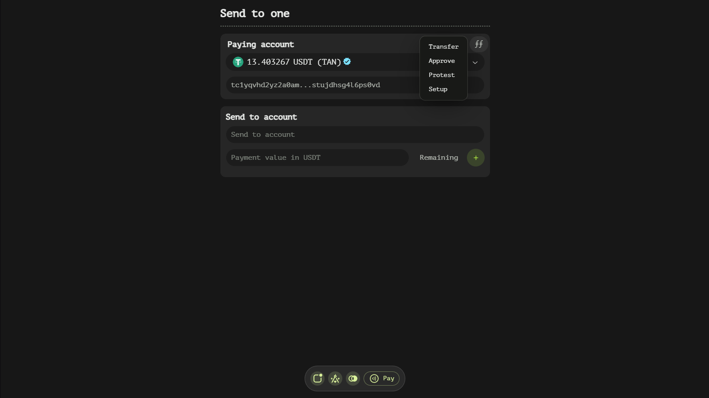

## Priority & Cost Settings

The 'Priority & cost' window provides users with granular control over their transaction fees. This section includes several key fields:

- **Custom gas price**: Users can specify a custom price per gas unit based on the selected paying asset's native blockchain token. This allows for precise control over how much users are willing to pay for transaction processing.

- **Custom gas limit**: Here, users can define the maximum number of gas units that their transaction is allowed to consume. Setting an appropriate gas limit ensures that transactions do not exceed a predetermined cost threshold.

- **Fees text field**: This read-only field displays the maximum fees payable by the current transaction based on the specified custom gas price and limit.

- **Auto button**: For users who prefer automatic fee calculation, this button can populate the custom gas price and limit based on current network conditions. Clicking it opens a dropdown menu with various percentiles and descriptive terms, such as "Fastest > 95%." This option ensures that transactions are prioritized according to user preferences, with higher percentages indicating faster processing times but also higher costs.

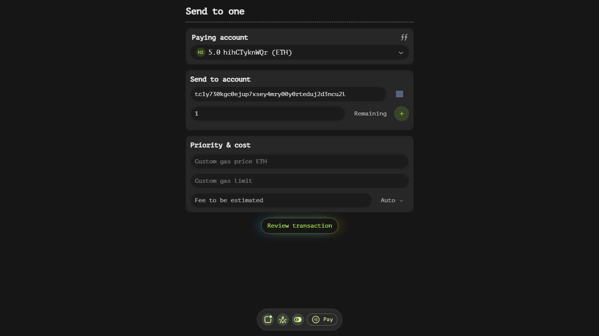

## Reviewing and Confirming the Transaction

Once all necessary fields have been configured, users can proceed by clicking the 'Review transaction' button. This action opens a confirmation dialog that provides a brief summary of the potential effects of the transaction. If no custom gas price or limit were specified earlier, the app will automatically estimate these values based on the 95th percentile.

The confirmation dialog also includes a 'Dump' button, which, when clicked, copies the JSON payload of the finalized transaction into the clipboard. This feature is particularly useful for users who need to share or review the transaction details externally.

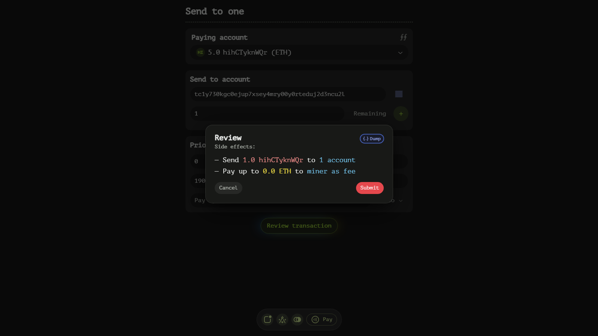

# Transfer Function

The Transfer type contains one or more windows, each designed to handle individual transfer destinations. This modular approach allows users to manage multiple transfers simultaneously, providing flexibility and efficiency in token distribution.

### Key Fields within Each Transfer Window

Each window within the Transfer type includes several essential fields that facilitate precise control over the transfer process:

- **Account**: This field is where you input the recipient's account address. Ensuring accuracy in this field is crucial as it determines the destination of your tokens. Our app supports easy copying and pasting of addresses to minimize errors.

- **Value**: Here, you specify the exact amount of tokens to be sent to the designated account. Precision is key in this field, as it directly impacts the balance transfer. Users can input values manually or utilize additional features to streamline this process.

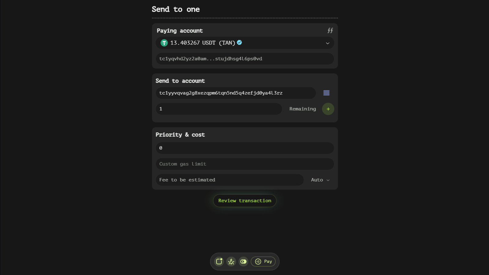

### Enhancing Efficiency with Additional Features

To further enhance user experience and efficiency, the Transfer window includes several interactive buttons:

- **Remaining button**: This feature is incredibly useful for users who wish to send their entire remaining balance to a specific account. By clicking this button, the 'Value' field will be automatically populated with the available balance, ensuring that no tokens are left behind unintentionally.

- **+/- buttons**: These buttons allow users to add or remove transfer destinations dynamically. The '+' button creates a new window for an additional transfer, enabling users to send tokens to multiple accounts in a single transaction. Conversely, the '-' button removes a selected window, providing flexibility in managing the number of transfer destinations.

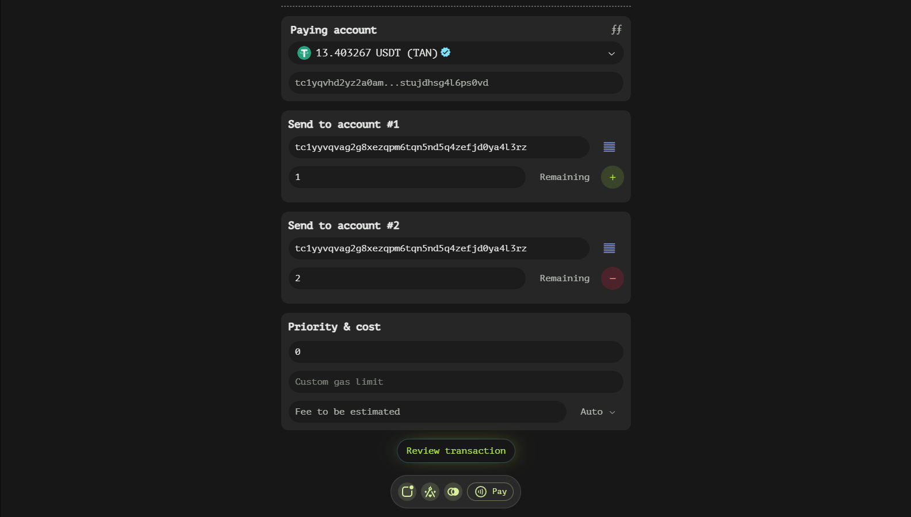

## Streamlining Multiple Transfers

The ability to handle multiple transfers within a single interface is one of the standout features of our Transfer window. This capability is particularly beneficial for users who need to distribute tokens across several accounts simultaneously. By utilizing the '+/-' buttons effectively, users can tailor their transaction to meet specific distribution requirements without the need for multiple individual transactions.

## Best Practices and Tips

To ensure a smooth experience when using the Transfer window, consider the following best practices:

- **Double-check addresses**: Always verify that the account address entered is correct to avoid sending tokens to an unintended recipient.
- **Utilize the Remaining button wisely**: This feature can be a time-saver but use it cautiously, especially if you need to retain a small balance for future transactions.
- **Plan your transfers**: Before adding multiple transfer destinations, plan out the distribution to ensure accuracy and efficiency.

# Approve Function

The Approve Payment is designed to facilitate the creation and review of transactions based on pre-built files. This documentation will guide you through the unique features and functionalities available within this interface, ensuring you have a comprehensive understanding of how to utilize it effectively.

## Understanding the Approve Window Structure

### Enhanced 'Paying Account' Window

In the Approve type, the 'Paying account' window is augmented with an additional field that includes a 'Browse' button. This button opens a dialog that allows users to select a pre-built transaction file. The file can contain either binary or hex transaction data, providing flexibility in how transactions are prepared and imported.

### Selecting a Transaction File

When you click the 'Browse' button, a file selection dialog appears, enabling you to navigate your local file system and choose a valid transaction file. Once a file is selected, the app will process it to ensure its validity. If the file contains a valid transaction, the paying asset specified in the file will be replaced with the asset currently selected in the 'Paying account' window. This ensures that the transaction aligns with your current preferences and available assets.

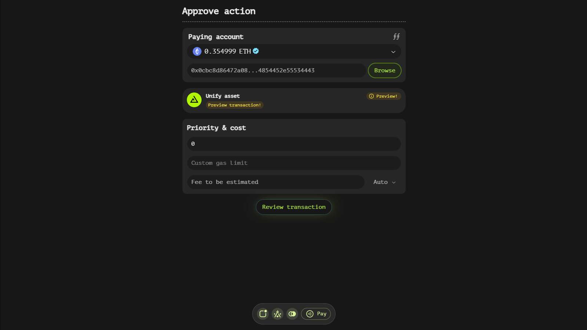

## Transaction Preview and Simulation

### Read-Only Transaction View

Upon selecting a valid transaction file, a new read-only window appears below the main interface. This window provides a detailed preview of how the transaction would appear in your account after being finalized. The preview is static at this stage, offering a clear view of the transaction's structure and details.

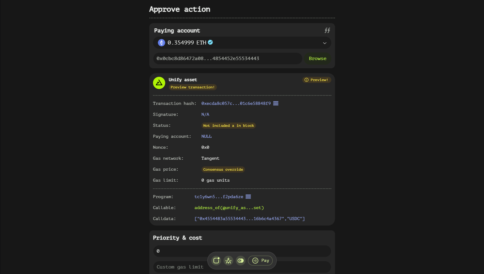

### Reviewing the Transaction

When you click the 'Review transaction' button, the app performs a transaction simulation. This process updates the transaction view with data received from the simulation, including any occurred events and additional fields that result from the simulation. The updated view provides a more dynamic and comprehensive overview of the potential impacts and outcomes of the transaction.

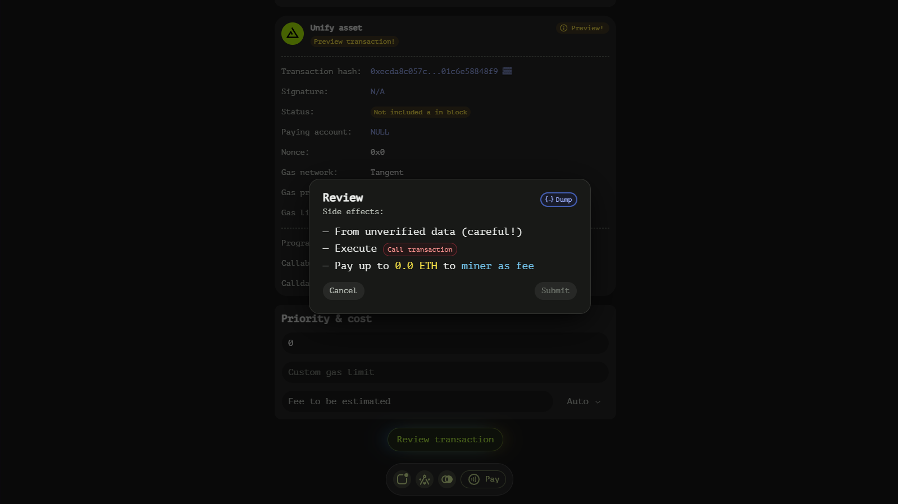

## Key Features and Benefits

- **Flexibility in Transaction Creation**: By supporting both binary and hex transaction data, the Approve window caters to users with varying levels of technical expertise and preferences.
- **Dynamic Asset Selection**: The ability to replace the paying asset specified in the file with a currently selected asset ensures that transactions are always aligned with your available resources.
- **Detailed Transaction Preview**: The read-only transaction view offers a clear and unalterable preview of the transaction, promoting transparency and understanding.
- **Simulation-Based Updates**: The transaction simulation provides insights into potential events and outcomes, enhancing the user's ability to make informed decisions.

## Best Practices and Tips

To ensure a smooth experience when using the Approve window, consider the following best practices:

- **Verify File Integrity**: Always ensure that the transaction file you are importing is valid and free of errors to avoid unexpected issues during processing.
- **Review Asset Selection**: Double-check that the paying asset selected in the 'Paying account' window is appropriate for the transaction to prevent any discrepancies.
- **Study the Preview**: Take advantage of the read-only transaction preview to familiarize yourself with the transaction's structure and details before proceeding.
- **Analyze Simulation Results**: Carefully review the data provided by the transaction simulation, including occurred events and additional fields, to gain a comprehensive understanding of the transaction's potential impacts.

# Setup Function

The Setup function is designed to configure and manage various aspects of your account's participation in the blockchain network, including block production, bridge participation, and attestation settings. This documentation will provide a detailed overview of the components and functionalities available within this interface, ensuring you have a comprehensive understanding of how to utilize it effectively.

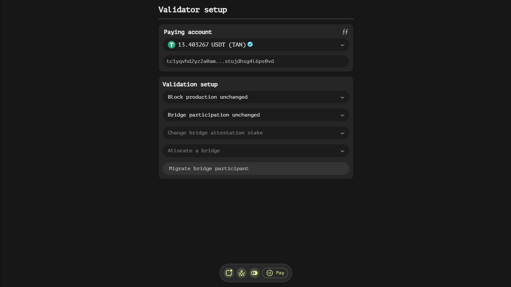

## Understanding the Setup Window Structure

### Block Production Status

This field allows you to enable or disable your account's capability to produce blocks. When enabled, an additional subfield appears:

- **Block production stake**: Specify the amount of TAN tokens you wish to stake for block production. This stake is crucial for participating in the consensus mechanism and earning rewards.

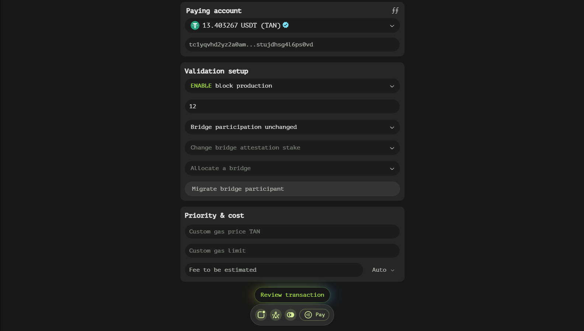

### Bridge Participation Status

This field enables or disables your account's capability to participate in bridge production. When enabled, an additional subfield becomes available:

- **Bridge participation stake**: Specify the amount of TAN tokens you wish to stake for bridge participation. This stake is necessary for engaging in cross-chain activities and earning associated rewards.

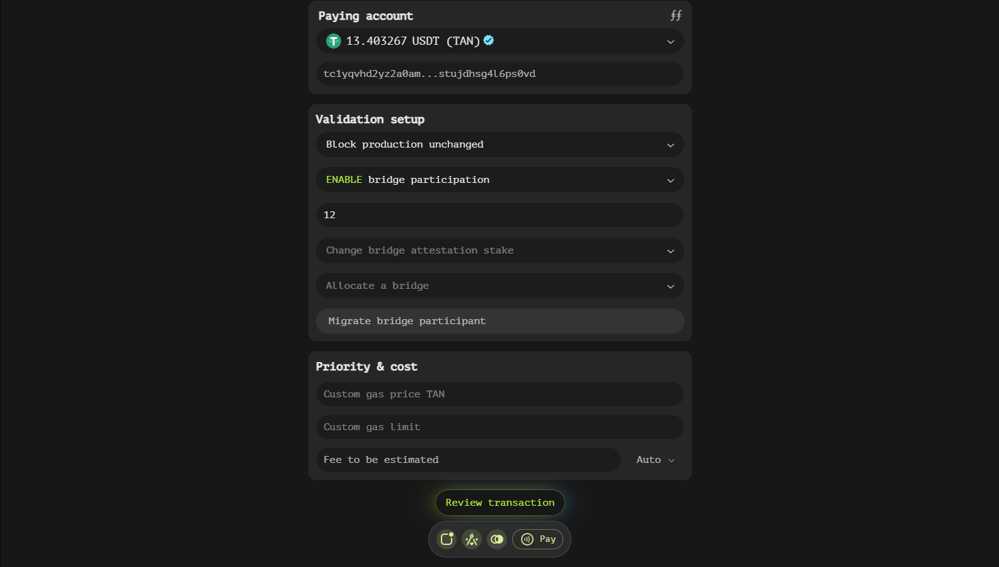

### Bridge Attestation Change

A dropdown menu lists various blockchains. Selecting a blockchain adds an 'Attestation' subwindow, allowing you to configure attestation settings for the chosen blockchain.

### Bridge Allocation

A dropdown menu that also lists various blockchains. Selecting a blockchain adds an 'Bridge' subwindow, allowing you to create a new bridge for the chosen blockchain.

### Migrate Bridge Participant

A button that, when clicked, adds a 'Participant migration' subwindow. This feature is useful for replacing failed participants in a bridge.

## Attestation Subwindow Fields

The Attestation subwindow appears when a blockchain is selected from the 'Attestation Change' dropdown menu. It contains several fields to configure attestation settings:

- **Attestation stake**: Specify the amount of TAN tokens to stake for attestation purposes.
- **Absolute fee**: Optionally specify the minimal bridge fee to be coordinating the bridge operation.
- **Cancel changes button**: Remove the Attestation subwindow if you need to revert or start over.
- **Unlock stake checkbox**: Check this box to disable the bridge and unlock the staked tokens, including any accumulated rewards.

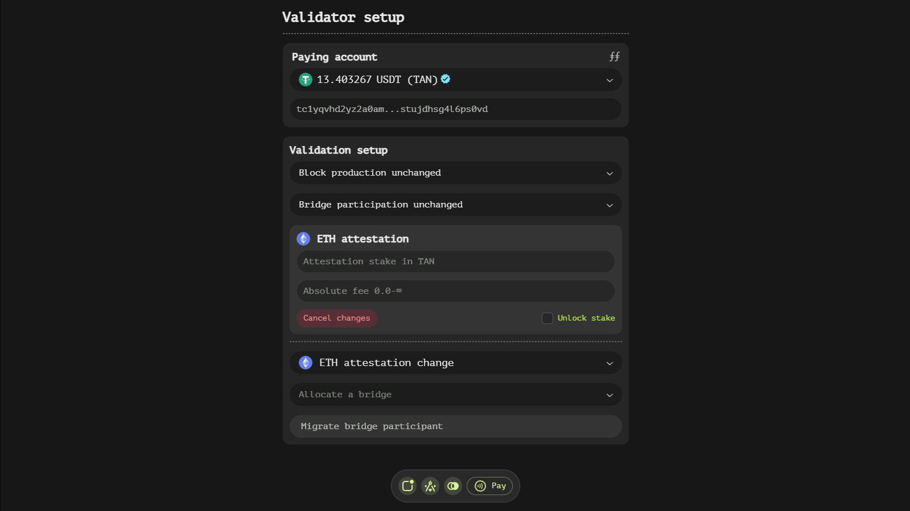

## Bridge Subwindow Fields

The Bridge subwindow appears when a blockchain is selected from the 'Bridge Allocation' dropdown menu. It contains several fields to required to create a bridge:

- **Security level**: Define how many participants must be included in a bridge to ensure security and reliability.
- **Absolute fee**: Define the withdrawal fees for the current bridge.
- **Cancel bridge allocation button**: Remove the Bridge subwindow if you need to revert or start over.

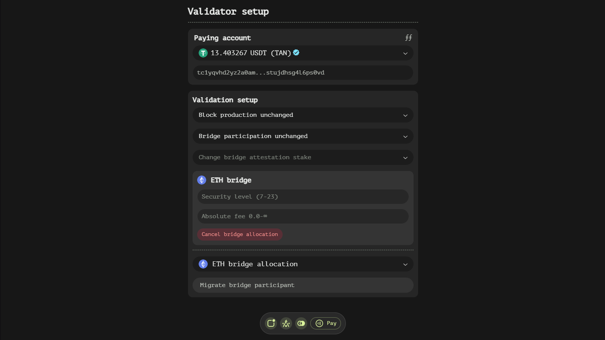

## Participant Subwindow Fields

The Participant subwindow is added when you click the 'Migrate Bridge Participant' button. It contains fields for handling participant migrations:

- **Failed transaction hash**: Enter the hash of a 'broadcast' transaction that has failed. This helps identify the specific failure point.
- **Participant to replace**: Input the account address of the bridge's participant assumed to be responsible for the 'broadcast' transaction failure. This step is crucial for replacing the faulty participant with a new one.

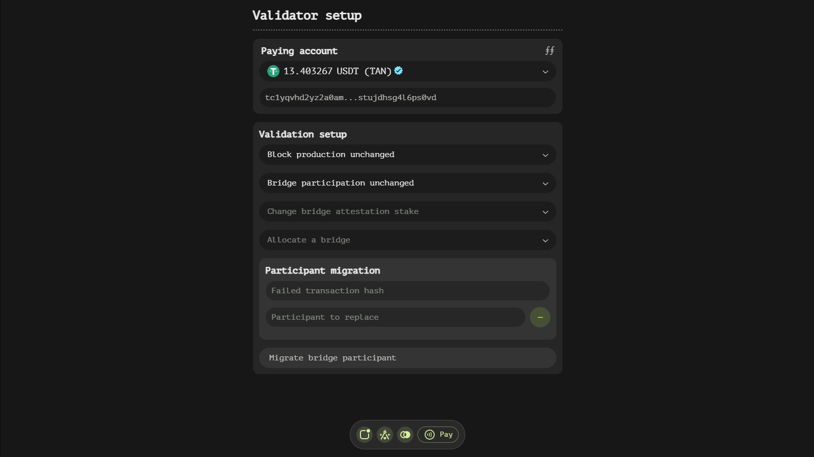

## Key Features and Benefits

- **Flexible Staking Options**: The ability to specify stakes for block production, bridge participation, and attestation provides users with control over their engagement and reward potential.
- **Detailed Bridge Configuration**: The Attestation subwindow offers comprehensive settings for managing bridge operations, including fees, thresholds, and policies.
- **Participant Management**: The Participant subwindow facilitates the smooth replacement of failed participants, ensuring the continued functionality and security of the bridge.

## Best Practices and Tips

To ensure a smooth experience when using the Setup window, consider the following best practices:

- **Plan Your Stakes**: Carefully consider the amount of TAN tokens to stake for each activity. Higher stakes can increase your chances of earning rewards but also lock more funds.
- **Monitor Bridge Settings**: Regularly review and adjust bridge settings, such as fees and participation thresholds, to optimize performance and security.
- **Stay Informed About Failures**: Keep track of failed transactions and be prompt in replacing participants to maintain the integrity of the bridge.

# Protest Function

The Protest function is designed to facilitate the process of contesting bridge withdrawals, allowing users to recover their funds under specific circumstances. This documentation will provide a detailed overview of the components and functionalities available within this interface, ensuring you have a comprehensive understanding of how to utilize it effectively.

## Understanding the Protest Window Structure

### Dedicated Protest Window

The Protest type introduces a new window that is specifically tailored for handling protest transactions. This window contains a single, crucial field:

- **Successful transaction hash**: This field requires the hash of the 'broadcast' transaction associated with the 'withdraw' transaction request that you wish to protest. Entering this hash is essential as it identifies the specific withdrawal you are contesting and seeking to recover funds from.

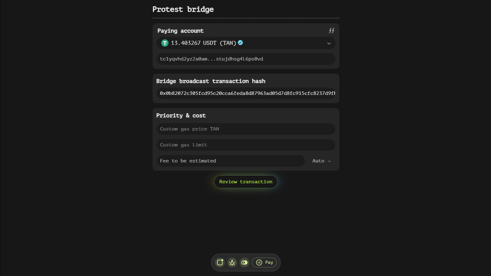

## Purpose and Use Case

The Protest type is particularly useful in scenarios where an off-chain transaction has not been completed within a specified time-lock period. By initiating a protest, users can signal their intention to reclaim their funds, assuming that the withdrawal process has failed or been delayed beyond the acceptable time frame.

### Key Considerations

- **Time-Lock Period**: Ensure that you are initiating the protest after the time-lock period has passed. This is crucial as protests submitted before this period may be considered premature and potentially invalid.
- **Accurate Hash Input**: The successful transaction hash must be entered precisely. Any errors in this field could lead to the protest being associated with the wrong withdrawal, potentially complicating the recovery process.

## Step-by-Step Guide

1. **Identify the Withdrawal**: Determine the specific withdrawal transaction that you wish to protest. This should be a 'withdraw' transaction request for which you have not received the expected funds due to an off-chain absence.

2. **Obtain the Transaction Hash**: Retrieve the hash of the 'broadcast' transaction associated with the withdrawal. This hash is typically available in your transaction history or can be obtained from blockchain explorers.

3. **Enter the Hash**: Input the successful transaction hash into the designated field in the Protest window. Double-check for accuracy to ensure that the protest is correctly associated with the intended withdrawal.

4. **Review and Submit**: Once the hash has been entered, review the details to ensure everything is correct. Then, proceed to submit the protest transaction.

## Best Practices and Tips

To ensure a smooth experience when using the Protest window, consider the following best practices:

- **Keep Records**: Maintain detailed records of your withdrawal transactions, including their hashes and corresponding time-lock periods. This will facilitate quicker and more accurate protests if needed.
- **Monitor Time-Locks**: Stay vigilant about the time-lock periods for your withdrawals. Setting reminders can help ensure that you initiate protests promptly after the period has elapsed.
- **Verify Hash Accuracy**: Always double-check the transaction hash before submitting a protest to avoid any potential mismatches.