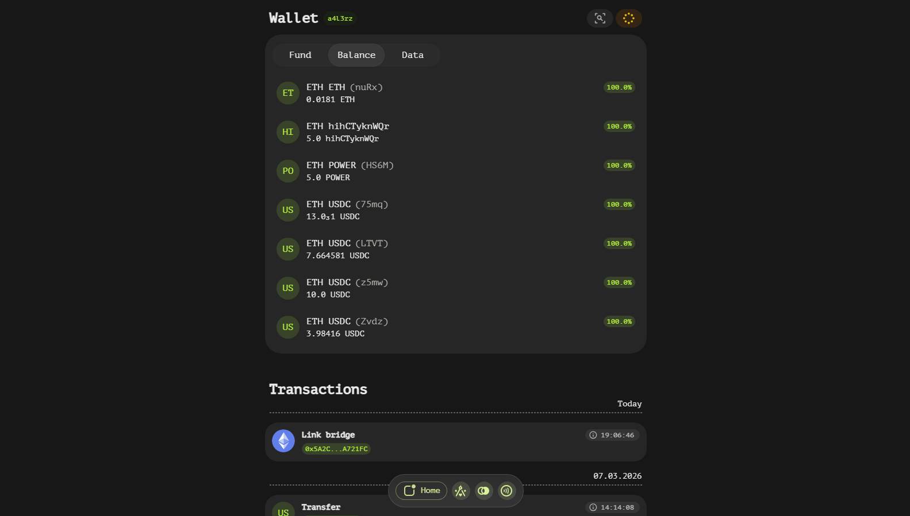
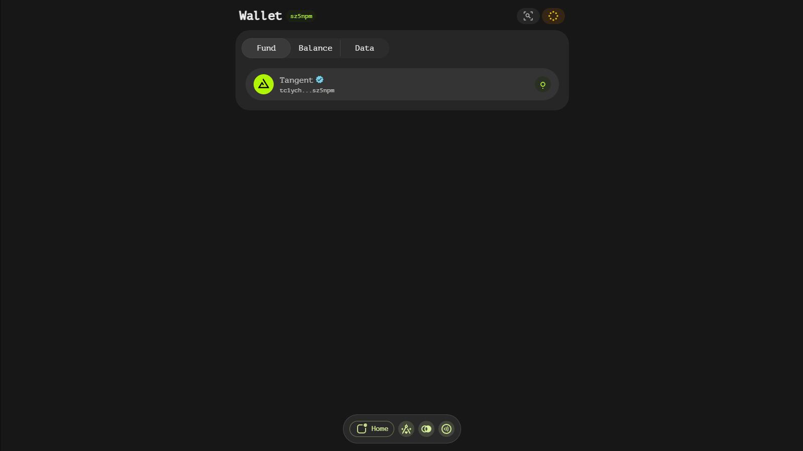
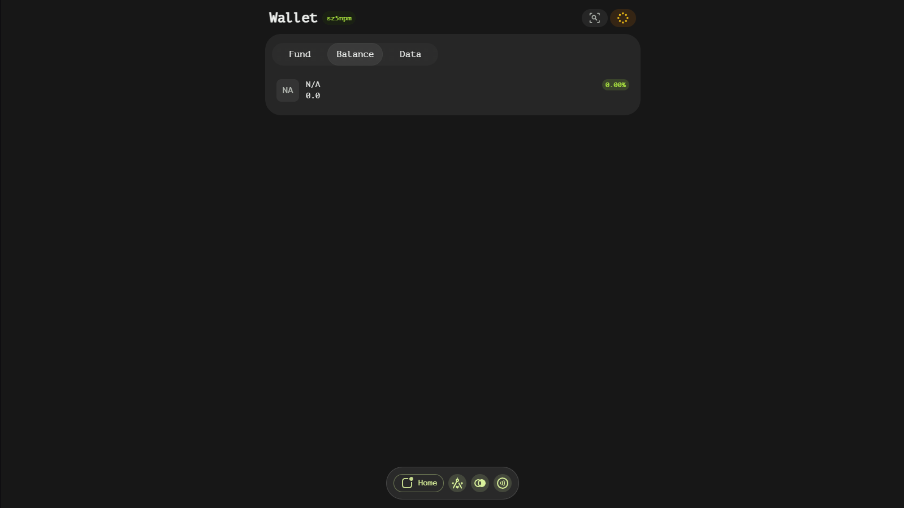
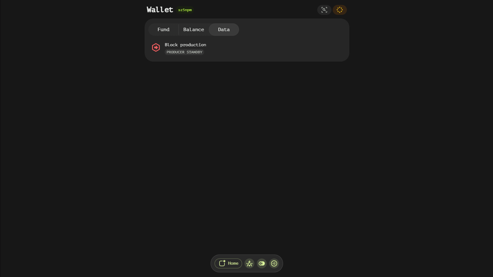
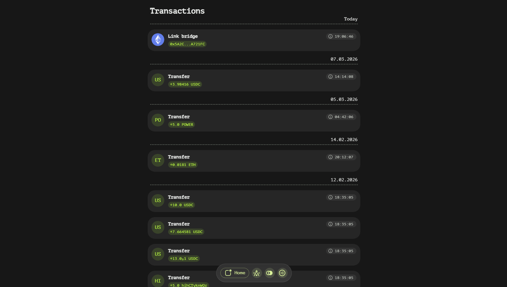

# Account Page

Welcome to the documentation for the home page of our wallet app! This page provides a comprehensive overview of the features and functionalities available on the main dashboard, helping users navigate and utilize the app effectively.

## Header

At the top of the home page, you'll find a badge displaying the last 6 symbols of your account's address. This badge serves as a quick reference for your current account.

- **Clickable Badge:** If the displayed account is the one currently loaded in your wallet, clicking this badge will open a setup page.
- **Wallet Unlock:** If your wallet is locked, clicking the badge will prompt you to unlock it.
- **Find button:** You can find another account, transaction or block by utilizing the finder, you may also click on 'Last block' button to reveal latest block

## Main Window

The main window of the home page is divided into three tabs: Fund, Balance, and Node. Each tab provides specific information and functionalities related to an account.

### 1. Fund Tab

The Fund tab displays a list of addresses linked to your shown account. By default, the Tangent account address is displayed if no other addresses are present.

- **Routing Addresses:** These addresses are marked with a green circle icon and are owned by your account. They include Tangent account addresses or off-chain addresses used for withdrawals.
- **Bridge Addresses:** These addresses are marked with a blue bridge icon and are owned by bridges. They are off-chain addresses used for deposits.
- **Address Details:** Clicking on any address will present you with a QR code and a description of the address's purpose, along with the address itself. Some bridge addresses also include memo/destination-tags, such as those for XRP and XLM.

### 2. Balance Tab

The Balance tab provides an overview of your asset balances, including detailed information about each asset.

- **Asset Details:** Each balance entry displays the asset name, icon, total balance, and available balance badge shown as a percentage.
- **Detailed Information:** Hovering over the available balance badge reveals detailed balance and reserve values for that specific balance entry.

### 3. Node Tab

The Node tab offers governance-related statuses and information about your account's participation in the network.

- **Block Production:** This item shows the last block produced by or penalized against your account, along with the stacking amount.
- **Bridge Participation:** This item displays the block in which bridge participation was activated and the associated stacking amount.
- **Bridge Attestation:** A list of bridge attestation items, each containing the attestation blockchain, activation block number, and stacking amount.

There are also two buttons:

- **Bridge button:** provides quick access to bridges page for specific asset.
- **Trade button:** opens up a DEX portfolio page to trade assets of your account.

## Transaction List

Below the main window, you'll find a list of transactions related to your account. This section includes all transactions that have affected your account, regardless of whether they were initiated by you or not.

- **Pending Transactions:** If there are any pending transactions, they will be displayed in a dedicated section.
- **Collapsed View:** Each transaction is initially collapsed, showing only the changes made to your account. Clicking on a transaction will expand it to reveal more details.

