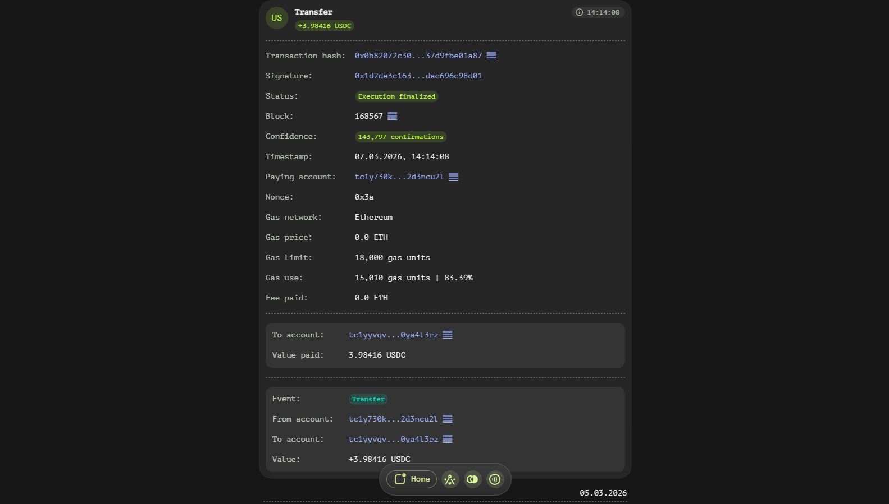

# Transaction Page

The transaction element within the wallet app serves as a comprehensive overview and detailed view of individual transactions. This documentation provides an in-depth look at its structure, functionality, and the information it presents.

## Overview

The transaction element is designed to be user-friendly yet informative. By default, it appears in a collapsed state, displaying only essential details through a series of badges that represent state changes for a specific account or across various contexts. To access more detailed information, users can expand the transaction element by clicking on it.

## Expanded View

When expanded, the transaction element reveals several detailed fields that provide a thorough breakdown of the transaction's attributes and status.

### Transaction Hash
A unique identifier for each transaction, serving as a digital fingerprint. This hash can be used to locate and reference the specific transaction within the blockchain network.

### Signature
The digital signature associated with the transaction, which verifies its authenticity and ensures that it was indeed authorized by the paying account holder.

### Status
Indicates the execution status of the transaction. A green status signifies a successful transaction, while a red status denotes failure. Additionally, a brief reason for the failure is provided to assist users in understanding what went wrong.

### Block
Displays the block number in which the transaction was included. This helps users understand where and when the transaction occurred within the blockchain's structure.

### Confidence
Represents the number of confirmations for the transaction, indicating how many blocks have been created after the block that included this transaction. More confirmations generally imply a higher level of security and finality for the transaction.

### Timestamp
The exact time at which the transaction was executed, providing users with a temporal context for their transactions.

### Paying Account
Identifies the account that authorized and signed the transaction. This information is recovered from the digital signature attached to the transaction.

### Nonce
A always growing number representing unique transaction id within paying account. This prevents replay attacks where a transaction sending eg. 20 coins from A to B can be replayed by B over and over to continually drain A's balance.

### Gas Network
An indication of which network (blockchain) you will use to pay transaction fees.

### Gas Price
Specifies the price per unit of gas based on the asset used in the transaction. Gas prices can fluctuate and are often a reflection of network congestion and demand.

### Gas Limit
The maximum amount of gas that the transaction is allowed to consume. This limit is set by the user or the application initiating the transaction to prevent excessive resource usage.

### Gas Use
Indicates the actual amount of gas consumed by the transaction during its execution, which may be less than or equal to the gas limit specified.

### Fee Paid
Calculates the total fee paid for the transaction, derived from multiplying the 'Gas Price' by the 'Gas Use'. This value represents the cost incurred for processing the transaction on the blockchain network.

## Calldata Section

The calldata section is tailored to provide fields specific to the current transaction. These fields can vary depending on the type of transaction and the smart contract interactions involved, offering detailed insights into the data being processed or transferred.

## Event Log Section

Finally, the event log section records all events triggered by the transaction. Events are a way for smart contracts to communicate changes in state or important occurrences that other contracts or users might be interested in. This section provides a chronological list of these events, enhancing transparency and traceability within the blockchain ecosystem.