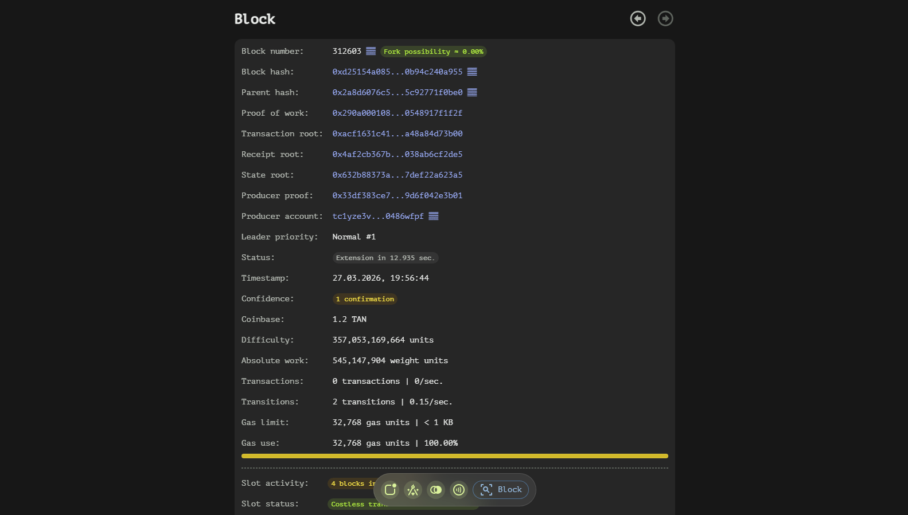
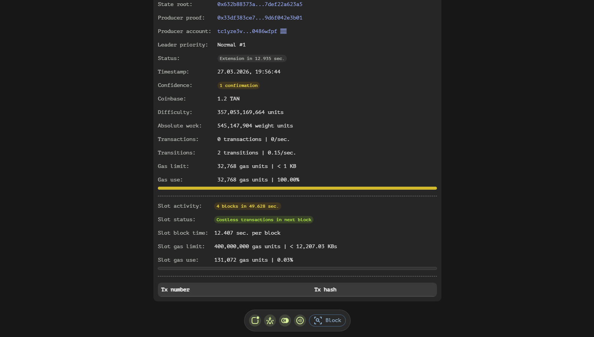

# Block Page

The Block page within the wallet app provides a detailed view of the internal structure and metadata of a specific block in the blockchain. This documentation outlines each component and field present on the Block page, offering insights into the technical aspects of blockchain operations.

## Core Section

The Block element contains comprehensive information about the internals of a block, including its unique identifiers, proof of work, roots, proofs, and various metrics.

- **Block Number**: A unique identifier for each block, also referred to as block height. This field indicates the position of the block in the blockchain and includes an approximate fork possibility.
- **Block Hash**: A unique ID that identifies a block, ensuring its uniqueness within the blockchain.
- **Parent Hash**: The unique ID of the previous or parent block, establishing the chain of blocks.
- **Proof of Work (VDF Solution Proof)**: Evidence that the block producer has performed sufficient computational work to generate the block.
- **Transaction Root**: A Merkle root of all transaction hashes included in a block and its parent block's transaction root, ensuring data integrity.
- **Receipt Root**: A Merkle root of all transaction receipts hashes included in a block and its parent block's receipt root, verifying the completion of transactions.
- **State Root**: A Merkle root of all state hashes included in a block and its parent block's state root, confirming the current state of the blockchain.
- **Producer Proof**: A signature that authenticates the block, ensuring it was created by an authorized producer.
- **Producer Account**: The account that created the block, recovered from the signature, identifying the block creator.
- **Leader Priority**: The producer account's position in the committee. When the leader number is 1, the block is considered unforkable, achieving instant finality.
- **Status**: Contains chain extension time, indicating how long it took to extend the chain with this block.
- **Timestamp**: The date and time when the block was evaluated, providing a temporal reference for the block's creation.
- **Confidence**: The number of blocks created after this block (confirmations), indicating the level of trust in the block's permanence.
- **Transactions**: The total number of transactions included in the block.
- **Transitions**: The number of state transitions that occurred within the block.
- **Coinbase**: The amount of TAN token minted for the block producer as a reward.
- **Difficulty**: An abstract value indicating how hard it is to mine the block. It may also include a penalty badge if the block was created by a leader other than 1, signifying increased difficulty.
- **Absolute Work**: An abstract value representing the total work done by the entire chain, including this block. This value is crucial for fork resolution.
- **Gas Limit**: The total gas limit for the block, calculated as the sum of the 'Gas limit' fields of all transactions within it.
- **Gas Use**: The amount of gas used by this block, indicating the computational resources consumed.

## Slot Section

The Slot section provides insights into the timing and performance of block creation.

- **Slot Activity**: The time taken to create a specified number of previous blocks, offering a measure of blockchain activity.
- **Slot Status**: Specifies next block's minimal transaction fees based on slot congestion that is based on slot gas use/limit ratio. Usually, network becomes congested when this ratio rises to about 25%. When this happens, next block will only include paid transaction as an anti-spam measure and nodes will reject costless transactions until network becomes under-utilized again.
- **Slot Block Time**: The average block time based on the slot activity field, providing a benchmark for expected block creation times.
- **Slot Gas Limit**: Max block gas limit multiplied by max slot length.
- **Slot Gas Use**: The total gas use for a slot, calculated as the sum of the 'Gas use' fields of all blocks within it.

## Transaction Section

The Block page also includes a list of transaction hashes contained within the block. Each transaction hash is indexed within the block, allowing users to access specific transactions easily.