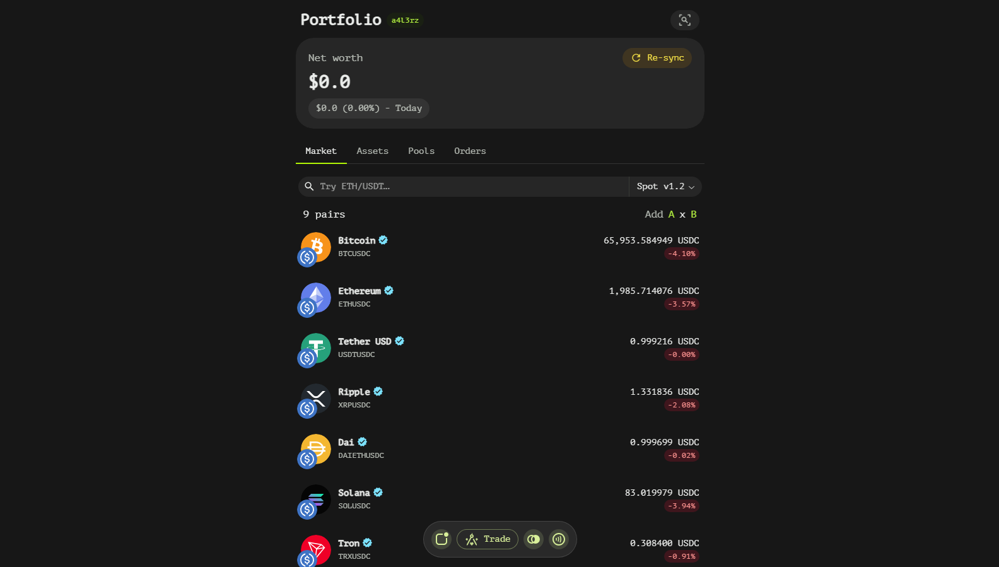
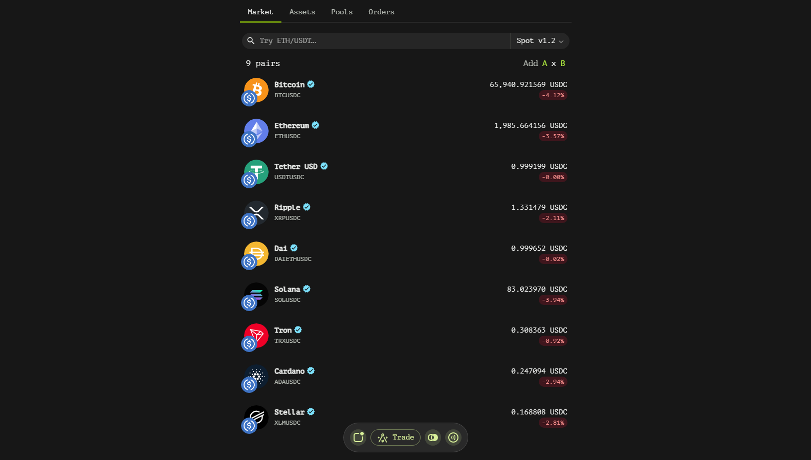
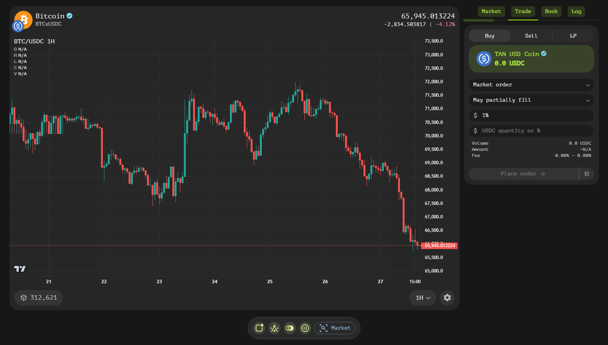

# Overview
Tangent Swap is a decentralized exchange (DEX) built on smart contracts deployed on the blockchain. It integrates seamlessly with a wallet app, providing users with a comprehensive trading experience directly within their digital wallet.

## Key Features

### User Dashboard
The user dashboard offers a centralized view of your trading activities and portfolio status. Key elements include:

- **Net Worth**: Get an instantaneous overview of your total assets in the chosen currency.
- **Profit and Loss (P&L)**: Track your gains and losses over time to make informed trading decisions.
- **Balances with Market Price**: See real-time updates on your asset balances alongside their current market prices.
- **Active Orders**: Monitor your currently active buy and sell orders in the market.
- **Inactive Orders**: Review any orders that have been canceled or expired.
- **Liquidity Pools**: Access information on both active and inactive liquidity pools, allowing you to participate in providing liquidity.

### Trading Pairs Exploration
Tangent Swap allows users to explore a wide range of trading pairs. Key functionalities include:

- **Trading Pair Discovery**: Browse through available trading pairs to find opportunities that align with your strategy.
- **Asset Addition**: Easily add new assets to the platform, expanding the possibilities for creating unique trading pairs.
- **New Trading Pairs Creation**: Combine existing or newly added assets to create custom trading pairs tailored to your needs.

### Advanced Trading Tools
For a more sophisticated trading experience, Tangent Swap offers advanced tools:

- **Visual Price Chart**: Utilize interactive charts to analyze price movements and identify trends.
- **Market Information**: Access detailed market data, including volume, order flow, and other relevant metrics.
- **Order Maker**: Create and manage your orders with precision using the intuitive order maker tool.
- **Order Book**: View the current order book to understand supply and demand dynamics in real-time.
- **Open Market Trades History**: Review historical trade data to gain insights into market behavior and patterns.

## Getting Started
To begin trading on Tangent Swap, follow these steps:

1. **Access the UI**: Open the Tangent Swap interface within your wallet app on your nav bar using the 'Trade' button.
2. **Explore and Trade**: Start exploring trading pairs, monitoring markets, and executing trades using the provided tools.

