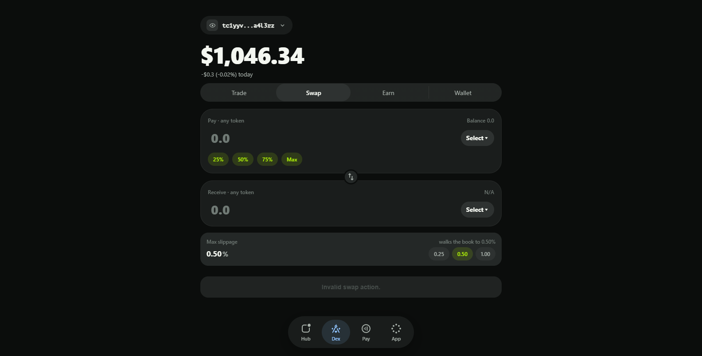

# Overview

The Dex tab is Tangent's decentralized exchange front-end: a fully on-chain order book plus concentrated liquidity pools, with settlement handled by market smart contracts on the blockchain itself. While the rest of the wallet talks to the node RPC, the DEX interface reads from the **Exchange RPC** — a read-only indexer — and submits orders through ordinary wallet transactions. The Exchange RPC endpoint can be replaced with your own instance (App → Network) to be fully independent.

Everything is reachable from the Dex page, which is organized into four tabs: **Trade**, **Swap**, **Earn** and **Wallet**.

## Wallet

The Wallet tab is the account dashboard: total portfolio value with a today/always P&L toggle, per-asset balances with market prices and unified-asset wrapping, plus sections for delegated liquidity, liquidity pools and open orders — each with a history view.

## Swap

The Swap tab routes token-to-token exchanges along the best available path — through liquidity pools or straight across the order book — with a slippage tolerance you control.

## Trading Terminal

Opening any pair from the Trade list opens the trading terminal: an interactive price chart, the live order book depth, the order maker for creating buy/sell orders and liquidity pools, and a stream of market activity. Orders match inside the market's policy contract; every fill settles on-chain.

## Getting Started

1. **Open the Dex** — press the Dex button in the navigation bar.
2. **Pick a pair** — search or select a market on the Trade tab.
3. **Trade** — place an order, route a swap or provide liquidity; positions and orders appear in the Wallet tab.
