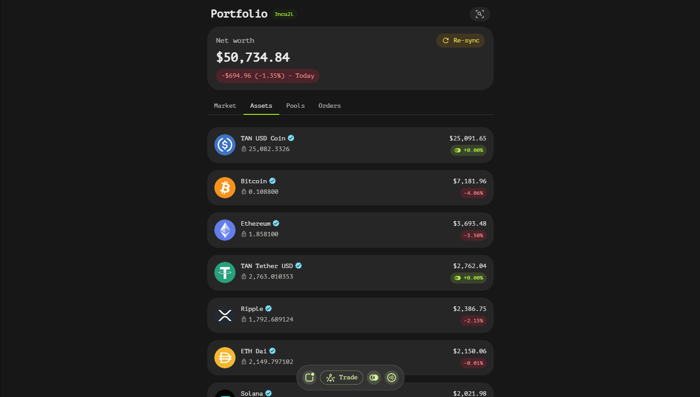
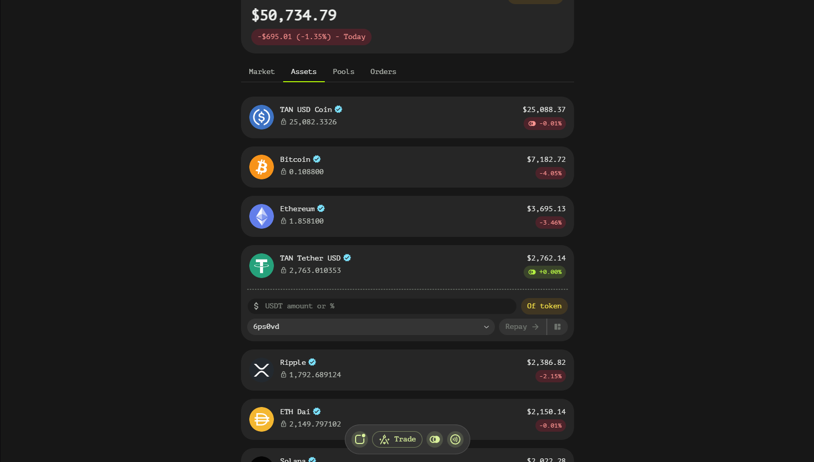
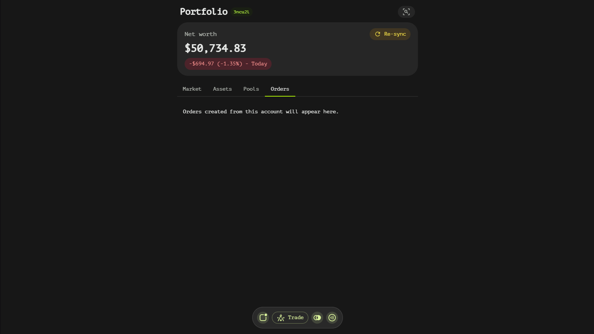
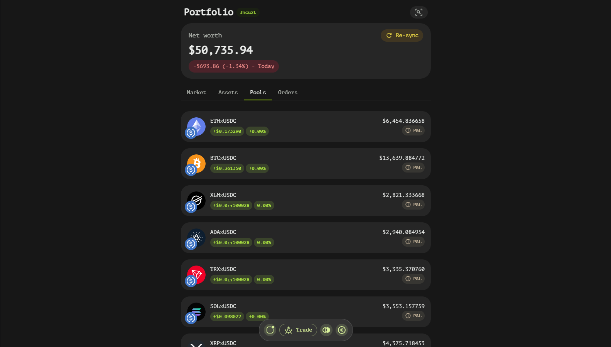

# Portfolio Page
The Portfolio page in Tangent Swap provides users with a comprehensive view of their trading activities, balances, and positions. This page is designed to offer a detailed overview of your assets and performance, enabling you to make informed decisions.

## Total Account Balance Window
The portfolio page features a prominent total account balance window that displays:

- **Total Balance**: A real-time update of your overall account balance.
- **P&L Button**: This button allows you to toggle between viewing Profit and Loss (P&L) for the current day or for all time. Selecting "Today" will show your P&L since midnight, while selecting "All Time" will display your cumulative P&L from the moment you started trading on Tangent Swap.

## Tabs Overview
The Portfolio page is organized into three main tabs: Balances, Orders, and Pools. Each tab provides specific information to help you manage your assets effectively.

### Assets Tab
The Balances tab offers a detailed breakdown of your asset holdings:

#### Asset List
A comprehensive list of all assets in your portfolio, including:

  - **Asset Name**: The name of the asset.
  - **Amount**: The quantity of each asset you hold.
  - **Asset Worth**: The current market value of your holdings.
  - **P&L**: Profit and Loss for each individual asset.

  

#### Redeemable Assets
For assets minted by smart contracts, a clickable P&L button is available. Clicking this button allows you to:

  - Redeem synthetic assets for real assets of your choice.
  - Enter the amount of tokens you wish to redeem.
  - Select the token you want to receive in exchange.
  - Choose the smart contract that minted the tokens (usually selected automatically).

  

### Orders Tab

A list of collapsed order book orders, showing both historical and currently active orders. Each entry includes:

  - Order details such as type (buy/sell), price, amount, and status.
  - The ability to expand each order for more detailed information.

  

### Pools Tab

A list of collapsed liquidity pools that you have created or are currently participating in. Each entry includes:

  - Pool details such as pair, total value locked (TVL), and status (active/inactive).
  - The ability to expand each pool for more detailed information, including your share of the pool and potential rewards.

  

## Navigating the Portfolio Page
To effectively use the Portfolio page:

1. **Total Balance Window**: Regularly check your total balance and toggle the P&L button to understand your performance over different time frames.
2. **Assets Tab**: Monitor your asset holdings, their values, and P&L. Use the redeem feature for synthetic assets as needed.
3. **Orders Tab**: Keep track of your trading activity by reviewing both active and historical orders.
4. **Pools Tab**: Stay informed about your liquidity positions and their performance.