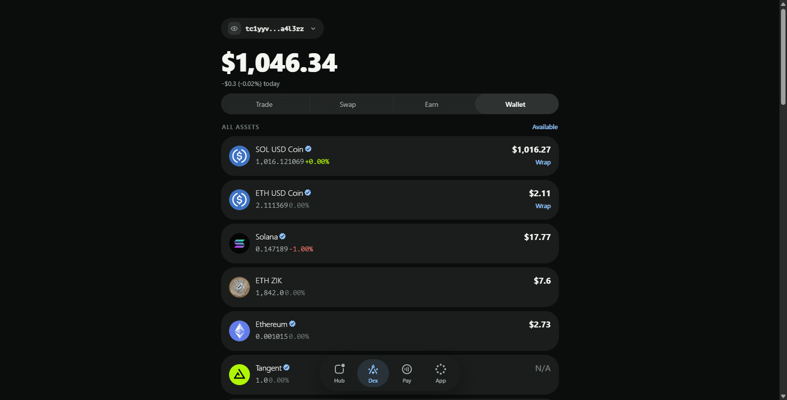
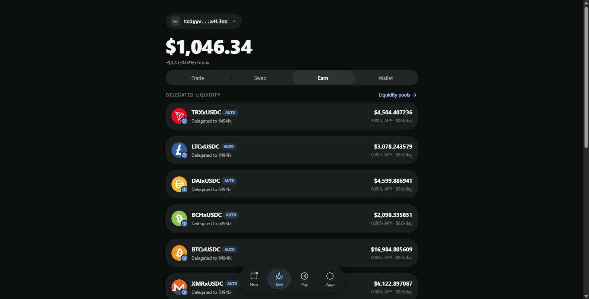
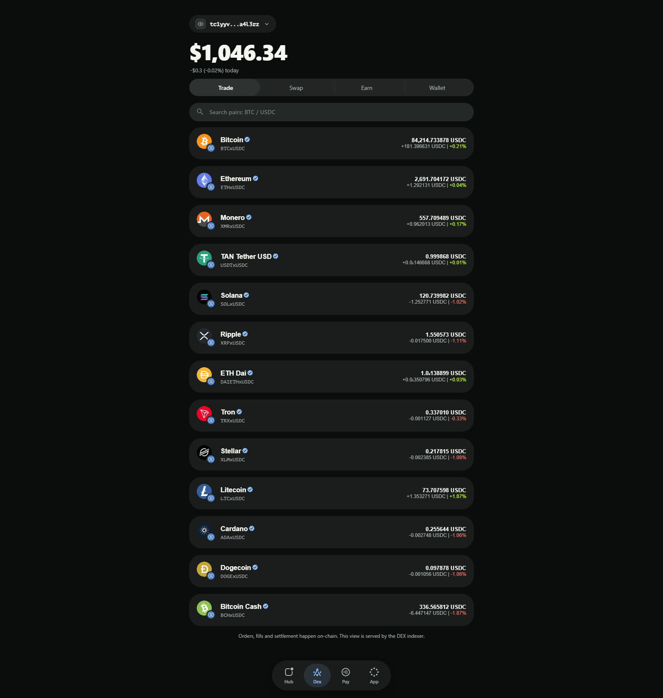

# Portfolio Page

The Dex page doubles as the portfolio: four tabs — **Trade**, **Swap**, **Earn** and **Wallet** — cover market discovery, exchanges, liquidity provision and your own positions. Your account chip in the header opens the account selector, and the page can also display any other account's portfolio (paste an address in the account search).

## Trade Tab

The Trade tab is the market list: every trading pair with its latest price and 24h change, sorted by activity. The search box (`Search pairs: BTC / USDC`) filters by symbol; typing a pair that doesn't exist yet lets you create it from the base and quote assets. Opening a pair goes straight to the trading terminal.

## Swap Tab

The Swap tab exchanges one token for another along the best route. Enter the amount on either side (in or out), pick the tokens, and the router quotes the path — through liquidity pools or across the order book — before submitting. The slippage tolerance control caps how much price impact you accept.

## Earn Tab

The Earn tab lists **delegated liquidity** pools: vault-operated concentrated positions anyone can fund. Each pool shows current value, APR/APY, 24h volume and the operator's fee; funding a pool delegates your assets into the operator-managed range, and the position shows up in your Wallet tab.

## Wallet Tab

The Wallet tab is the account dashboard:

- **Total balance window** — overall portfolio value in fiat with a P&L toggle (today vs. all time) and a `Total / Available` switch that includes or excludes balance locked by orders and positions.
- **Asset list** — every holding with amount, market value and P&L. Multi-variant tokens (for example the same stablecoin on different chains) appear as **unified assets** with a `Wrap` action: wrap 1:1 into the unified form to trade them as one, unwrap back at any time without fees.
- **Delegated liquidity** — your funded operator pools, with a `History` toggle for withdrawn positions.
- **Liquidity pools** — your own LP positions, active and closed.
- **Open orders** — live orders placed from the terminal, with a `History` toggle for settled and cancelled ones.

Everything on this tab is on-chain truth; USD values and estimates come from the DEX indexer.

## Navigating

1. Check the **Wallet** tab for total value and locked balance.
2. Use **Trade** to find markets and **Swap** for instant routes.
3. Provide liquidity from **Earn** (delegated) or the terminal's LP maker (self-managed).
4. Track orders in the Wallet tab's open orders section.
