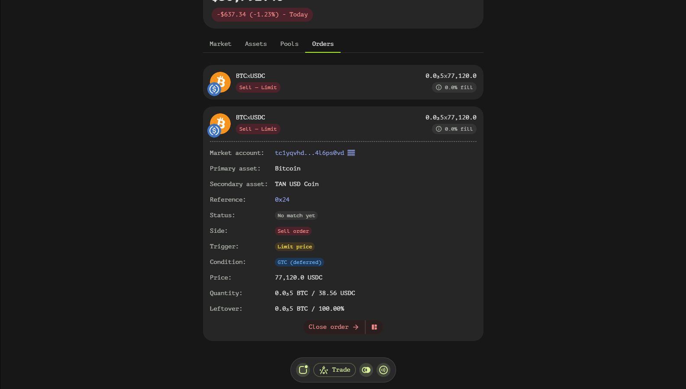

# Order Window
The Order Window in Tangent Swap provides users with a detailed view of their active and inactive orders. This window is designed to offer comprehensive information about each order, allowing users to monitor and manage their trading activities effectively.

## Order Window Fields
The Order Window contains various fields that provide detailed information about each order. Some fields are specific to certain order types and may not be visible for all orders.

### General Order Information
- **Market Account**: The smart contract address of the order book where this order was placed.
- **Primary Asset**: The first asset in the trading pair (e.g., BTC in BTC/USDT).
- **Secondary Asset**: The second asset in the trading pair (e.g., USDT in BTC/USDT).
- **Reference**: An internal order ID assigned by the smart contract, displayed in hexadecimal format.
- **Status**: The current fill status of the order, indicating whether it is fully filled, partially filled, or pending.
- **Side**: The direction of the order, specifying whether it is a buy or sell order.

### Order Trigger and Condition
- **Trigger**: The type of trigger that initiates the order execution (e.g., market price, limit price, trailing stop price).
- **Condition**: The execution condition of the order, such as Good Till Cancelled (GTC), along with the time in force specification (immediate or deferred).

### Price and Stop Details
- **Price**: The worst acceptable price at which the order can be executed.
- **Stop Price**: The worst acceptable price at which the order can be triggered.
- **Trailing Step**: The price step before triggering a change in the stop price.
- **Trailing Distance**: The relative or absolute distance to maintain from the market price for trailing orders.

### Slippage and Quantity
- **Price Slippage**: The maximum allowable price slippage for the order.
- **Quantity**: The amount of tokens involved in the order, specified in terms of the primary asset. For certain order types, this may also include the quantity in terms of the secondary asset.

### Leftover Information
- **Leftover**: The remaining amount of tokens to be filled, specified in terms of the primary asset. For certain order types, this may also include the leftover quantity in terms of the secondary asset.

## Navigating the Order Window
To effectively use the Order Window:

1. **Identify the Order**: Use the Market Account, Primary Asset, and Secondary Asset fields to identify the specific trading pair and order book.
2. **Check Order Status**: Review the Status field to understand whether the order is active, partially filled, or complete.
3. **Understand Order Details**: Examine the Trigger and Condition fields to comprehend how and when the order will be executed.
4. **Monitor Price and Stop Settings**: Pay attention to the Price, Stop Price, Trailing Step, and Trailing Distance fields to ensure your order is set up according to your strategy.
5. **Review Quantity and Leftover**: Check the Quantity and Leftover fields to track how much of your order has been filled and how much remains.

