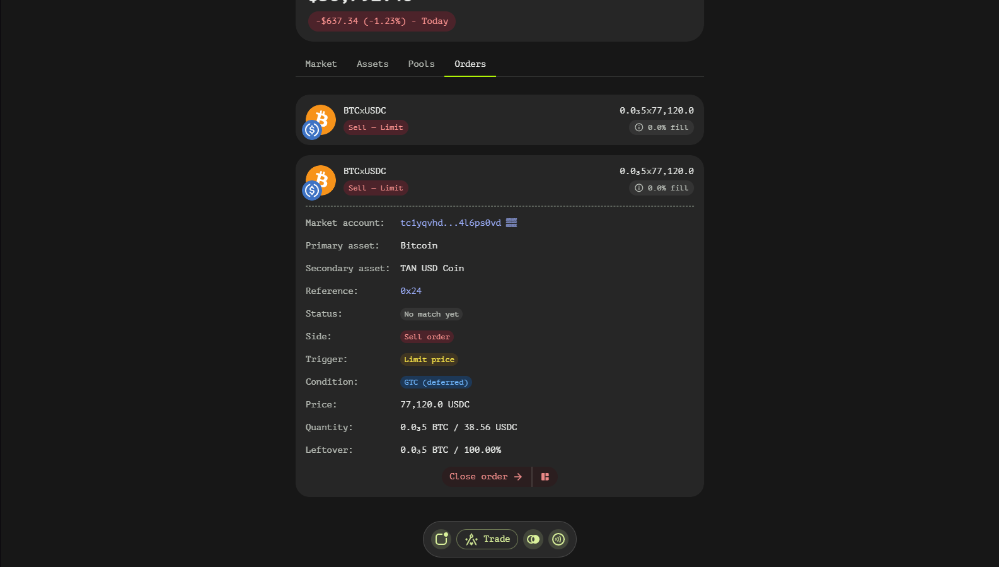

# Order Window

Orders live in the Wallet tab of the Dex page: the **Open orders** section lists live orders, and the `History` toggle switches to settled and cancelled ones. Each order is a collapsed card showing the pair, side, price and fill progress; expanding it opens the full Order Window. Some fields only appear for order types that use them.

## Order Window Fields

### General Order Information
- **Market account** — the address of the order book contract where the order was placed (click to open that market's portfolio view).
- **Primary asset** — the first asset of the pair (BTC in BTC/USDC).
- **Secondary asset** — the second asset of the pair.
- **Reference** — the internal order ID assigned by the contract, shown in hex; copyable.
- **Status** — the fill status: pending, partially filled, filled, or inactive once settled/cancelled.
- **Side** — buy or sell.

### Order Trigger and Condition
- **Trigger** — what starts execution: market price, limit price or stop price.
- **Condition** — the time-in-force policy, such as Good-Till-Cancelled, immediate or deferred.

### Price and Stop Details
- **Price** — the worst acceptable execution price; a **Base price** row appears when the effective price differs.
- **Stop price** — the price at which a stop order triggers.
- **Trailing step** — the market move required to shift the stop price.
- **Trailing distance** — the absolute or relative gap kept from the market price for trailing orders.
- **Price slippage** — the maximum tolerated price slippage (shown as a percentage or absolute price for market orders).

### Quantity and Leftover
- **Quantity** — the ordered amount, quoted in the primary asset and, when applicable, its secondary-asset value.
- **Leftover** — what remains to be filled, in token terms and as a percentage of the order.

## Using the Order Window

1. Identify the order by market account and asset pair.
2. Watch **Status** and **Leftover** to track fills.
3. Verify **Trigger** and **Condition** to know when and how the order executes.
4. Keep stop, trailing and slippage settings aligned with your strategy.

Orders are created on the terminal's Order tab and cancel from the expanded card while they remain active.
