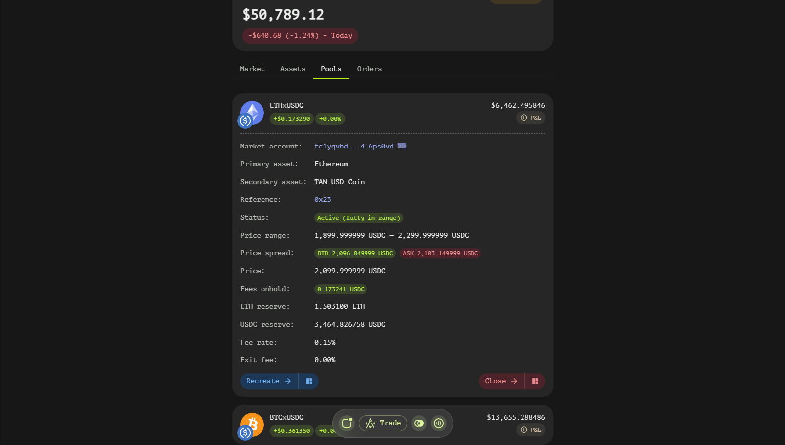

# Pool Window
The Pool Window in Tangent Swap provides users with detailed information about liquidity pools, allowing them to view both active and inactive pools. This window is essential for liquidity providers (LPs) who want to monitor their positions and make informed decisions.

## Pool Window Fields

### General Information
- **Market Account**: Displays the order book smart contract associated with this pool. This helps identify the market in which the pool operates.
- **Primary Asset**: Shows the first asset in the trading pair (e.g., BTC in BTC/USDT).
- **Secondary Asset**: Shows the second asset in the trading pair (e.g., USDT in BTC/USDT).

### Identification and Status
- **Reference**: An internal pool ID assigned by the smart contract, typically displayed in hexadecimal format. This unique identifier helps track the pool across the platform.
- **Status**: Indicates whether the pool is active or inactive. For Concentrated Liquidity Pools (CLPs), additional statuses such as "in range" or "out of range" are also displayed.

### Price and Range Information
- **Lowest Price**: The minimal price for concentrated liquidity pools, defining the lower bound of the price range.
- **Current Price**: The current price according to the liquidity provider (LP) curve, based on the ratio of tokens in the pool. This provides real-time insight into the pool's pricing dynamics.
- **Highest Price**: The maximal price for concentrated liquidity pools, defining the upper bound of the price range.

### Token Reserves and Revenue
- **Token1 Reserve**: Displays the amount of the first token currently held in the pool.
- **Token1 Revenue**: Shows the amount of the first token's revenue generated on top of its reserve.
- **Token2 Reserve**: Displays the amount of the second token currently held in the pool.
- **Token2 Revenue**: Shows the amount of the second token's revenue generated on top of its reserve.

### Fee Structure
- **Fee Rate**: The percentage fee taken from each trade and placed into the revenue. This fee is a key component of the pool's earnings.
- **Exit Fee**: The fee charged when liquidity providers close their positions in the pool, deducted from the revenue.

## Concentrated Liquidity Pool (CLP) Specific Fields
Some fields are exclusively available for Concentrated Liquidity Pools:

- **Lowest Price**: Essential for defining the price range of CLPs.
- **Highest Price**: Also crucial for setting the price range of CLPs.
- **Status**: Additional statuses like "in range" or "out of range" help LPs understand whether their liquidity is currently being utilized.

## Navigating the Pool Window
To effectively use the Pool Window:

1. **Identify the Pool**: Use the Market Account, Primary Asset, and Secondary Asset fields to quickly identify the pool.
2. **Check Status**: Regularly review the Status field to ensure your pool is active and performing as expected.
3. **Monitor Prices**: Keep an eye on the Current Price and compare it with the Lowest and Highest prices to understand the pool's price dynamics, especially for CLPs.
4. **Review Reserves and Revenue**: Track Token1 and Token2 reserves and revenues to assess the pool's performance and potential earnings.
5. **Understand Fees**: Be aware of the Fee Rate and Exit Fee to maximize your returns and plan your exits strategically.