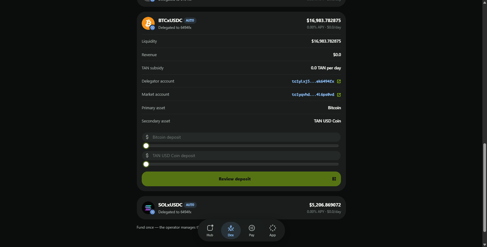

# Pool Window

Pool cards appear in the Wallet tab of the Dex page — under **Liquidity pools** for positions you opened yourself and under **Delegated liquidity** for positions funded into operator-managed vaults. Collapsed, a card shows the pair, your value and status; expanded, it opens the full Pool Window.

## Pool Window Fields

### General Information
- **Market account** — the market contract the pool belongs to (linked to its portfolio view).
- **Primary asset / Secondary asset** — the two sides of the pair (BTC and USDC in BTC/USDC).
- **Reference** — the internal pool ID assigned by the contract, in hex, copyable.
- **Status** — `Active`, `Partially active (out of range)` for concentrated pools whose range no longer contains the market price, or `Inactive` once closed.

### Price and Range
- **Spread** — the bid/ask quotes implied by the pool's current composition.
- **Price** — the pool's marginal price from the token ratio.
- **Price range** — for concentrated liquidity pools (CLP), the lower and upper bounds of your position.

### Reserves and Revenue
- **Primary/Secondary reserve** — how much of each token the position currently holds.
- **Fees** — trading fees accrued on top of the reserves, per token.
- **Revenue** — the estimated absolute revenue and the relative return of the position.

### Fee Structure
- **Fee rate** — the percentage taken from each swap routed through the pool and paid to liquidity providers.
- **Exit fee** — the fee charged when closing the position.

## Delegated Pool Extras

Delegated positions — funds entrusted to an operator's range — additionally show:

- **Your share** — your portion of the pool.
- **Fees earned (est.)** — your accrued share of trading fees.
- **TAN subsidy** — incentive rewards paid in TAN, if any.
- **Delegator account** — the operator account managing the position (linked to its portfolio view).

## Using the Pool Window

1. Identify the pool by market account and asset pair.
2. Watch **Status** — an out-of-range concentrated position stops earning swap fees.
3. Compare **Price** against your **Price range** before adding or withdrawing.
4. Track reserves and revenue to judge performance, and factor the exit fee into your timing.
