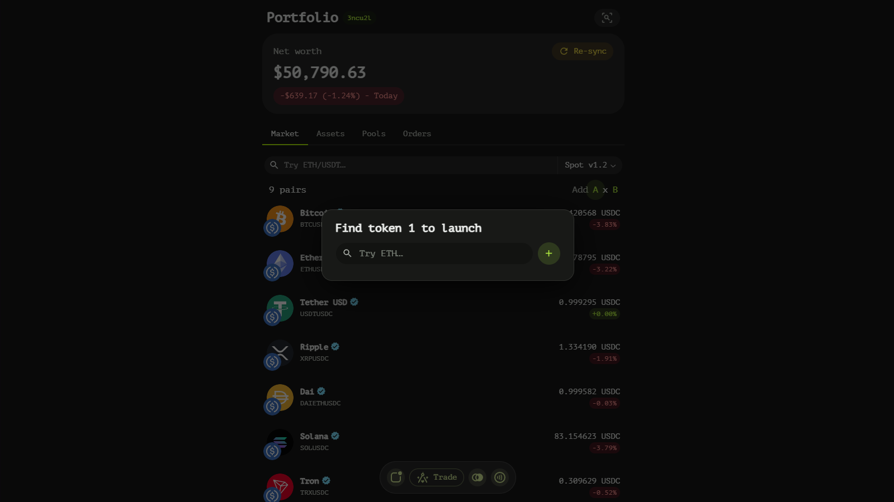
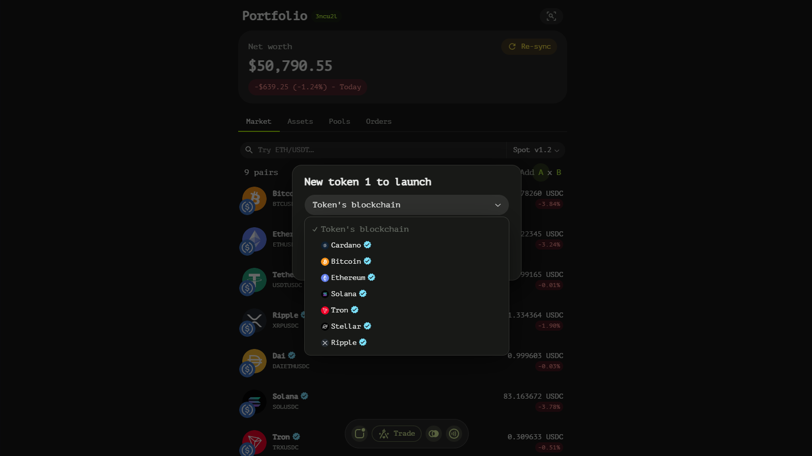
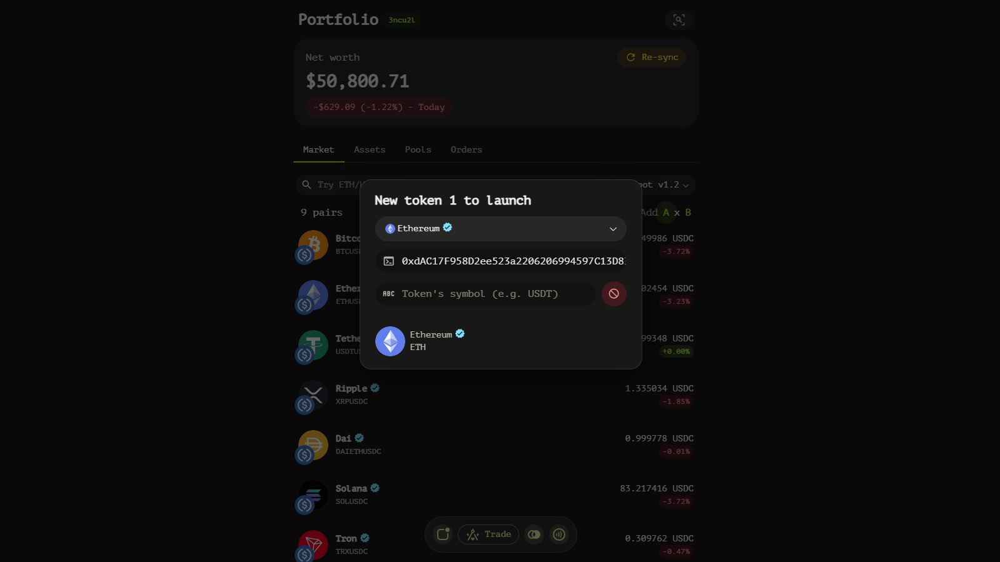
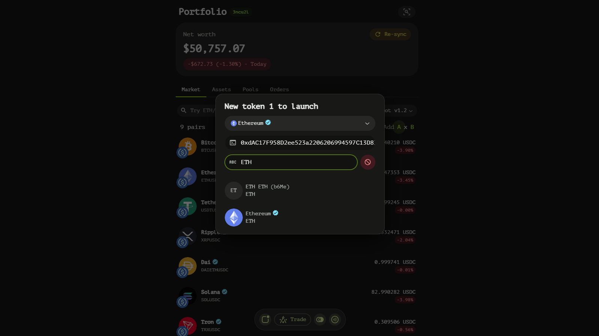

# Explorer Page
The Market Explorer page on Tangent Swap serves as a comprehensive hub for discovering and creating trading pairs. It provides users with powerful tools to navigate the decentralized finance landscape efficiently.

## Key Features

### Search and Discovery
At the heart of the Market Explorer page is an intuitive search bar, allowing users to quickly find existing trading pairs. This feature is enhanced by a smart contract selection tool, which accommodates future expansions such as perpetual futures order book implementations. As Tangent Swap evolves, this selection ensures compatibility with new smart contract standards.

### Trading Pair Creation
Creating new trading pairs on Tangent Swap is designed to be straightforward and flexible:

To initiate the creation of a new trading pair, users simply press the left button adorned with the Bitcoin symbol. This action opens a dialog box equipped with a search bar, enabling users to find primary asset tokens by name. If the desired token does not appear in the search results, users can activate the token linker mode by pressing the '+' button. This mode allows for the manual addition of new tokens by populating specific fields:

- **Token's Blockchain**: Users select from a list of available blockchains to specify where the token resides.

- **Token's Contract Address**: The contract address of the token on the selected blockchain is entered here.

- **Token's Symbol**: The symbol representing the token on the chosen blockchain is specified in this field.

Once the primary asset is defined, users can select the secondary asset by pressing the right button with the Dollar symbol. This process mirrors that of the primary asset selection, ensuring consistency and ease of use. Upon successfully selecting both assets, the new trading pair appears at the forefront of the list of existing pairs, ready for exploration or trading.

### Trading Pair List
The Market Explorer page displays a dynamic list of trading pairs, each item presenting essential information:

- **Trading Pair Name**: Clearly identifies the asset pair.
- **Price**: Shows the current market price of the pair.
- **P&L**: Displays the Profit and Loss for the trading pair, providing insights into its performance.

Each item in this list is clickable, directing users to a dedicated trading page where they can execute trades, analyze charts, and monitor order books.

## Navigating the Market Explorer Page
To effectively use the Market Explorer page:

1. **Search for Pairs**: Utilize the search bar to quickly locate existing trading pairs.
2. **Create New Pairs**: Use the Bitcoin and Dollar symbol buttons to define primary and secondary assets, respectively. If necessary, employ token linker mode to add new tokens manually.
3. **Explore and Trade**: Click on any trading pair in the list to access its dedicated trading page for detailed analysis and execution.