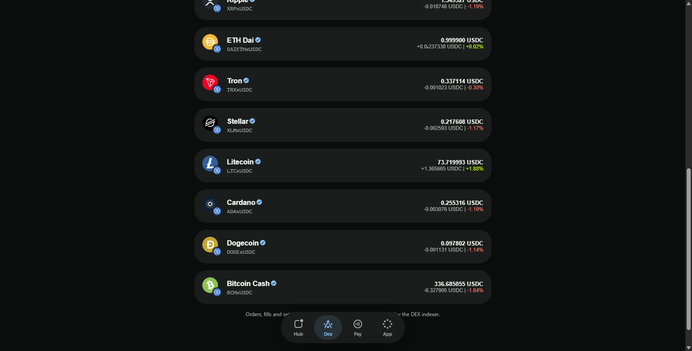
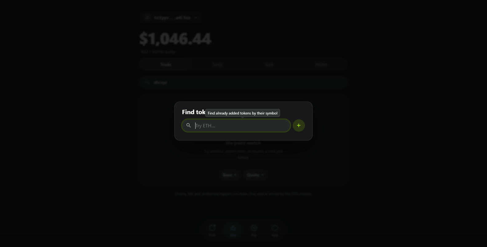

# Explorer Page

Market discovery happens on the Dex page's **Trade** tab: a searchable list of every trading pair on the order book markets, with the tools to create missing ones.

## Search and Discovery

The search bar (`Search pairs: BTC / USDC`) filters pairs by symbol as you type. A market selector accommodates additional order book contracts, so new market standards — such as futures books — slot into the same view when they arrive.

When a search matches no existing pair, the app offers to build one: choose the base and quote assets and the new pair appears at the top of the list, ready to trade.

## Adding Tokens

Pair creation goes through the token search dialog. It searches known tokens by symbol; if the token you need isn't listed yet, press the **+** button to switch the dialog into linker mode and describe the token manually:

- **Token's blockchain** — pick the chain the token lives on.
- **Token's contract address** — its address on that chain.
- **Token's symbol** — the display symbol.

Once both assets of a pair are defined, the pair is created on-chain and joins the list.

## Trading Pair List

Every row of the list shows:

- **Pair name** — the primary and secondary assets (`BTCxUSDC`).
- **Price** — the latest market price in the quote asset.
- **Change** — the 24h move, absolute and relative.

Clicking a row opens the trading terminal for that pair.

## Navigating

1. Search for the pair you want on the Trade tab.
2. Create missing pairs via base/quote selection; link new tokens when needed.
3. Open any pair to trade, swap or provide liquidity.
