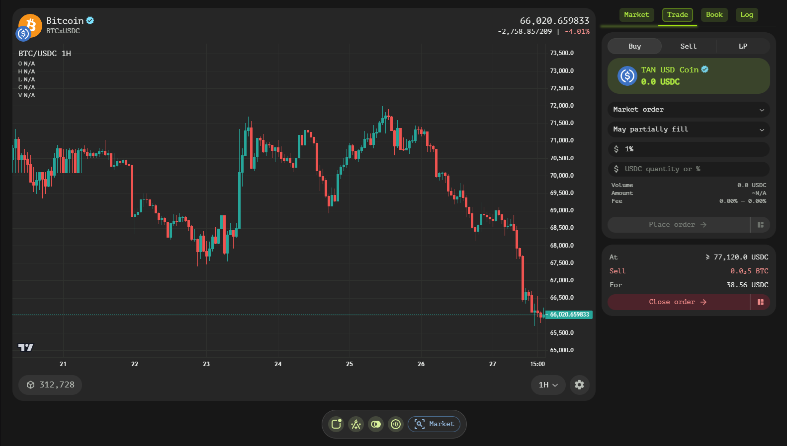
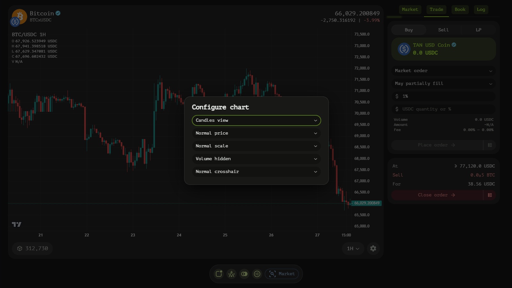
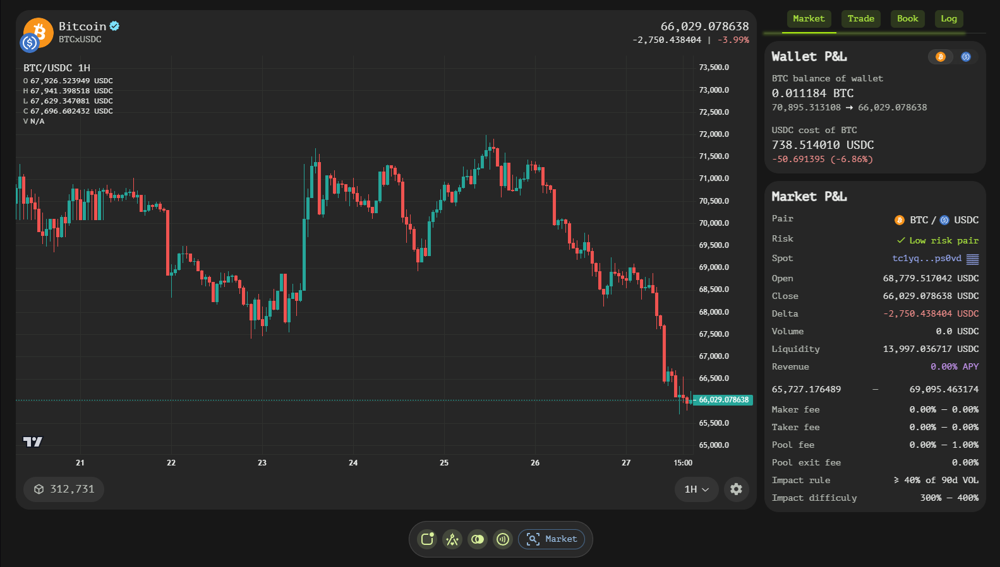
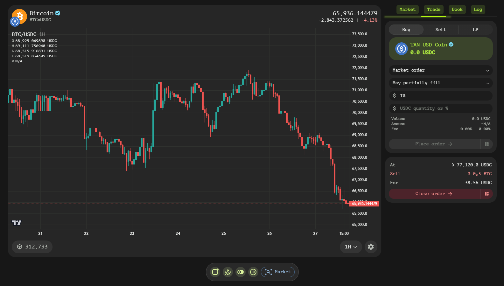
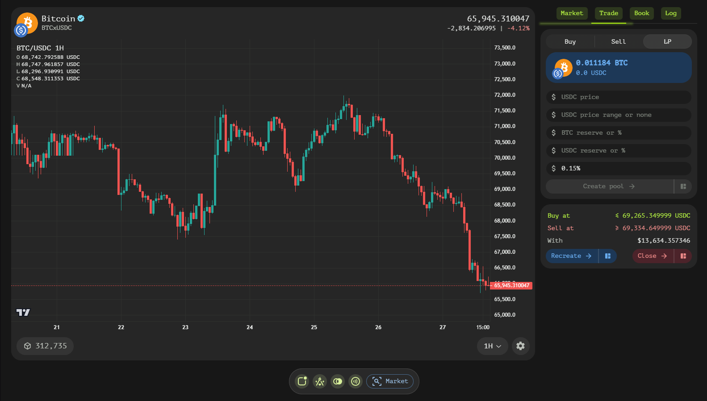
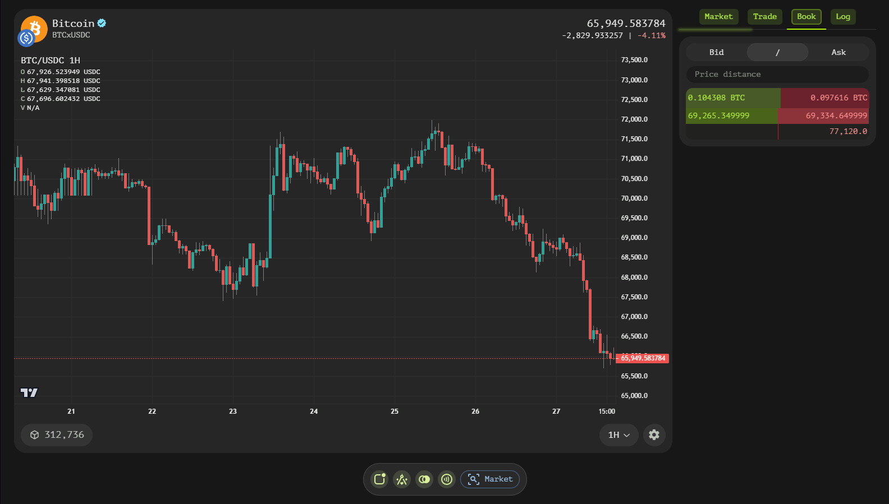
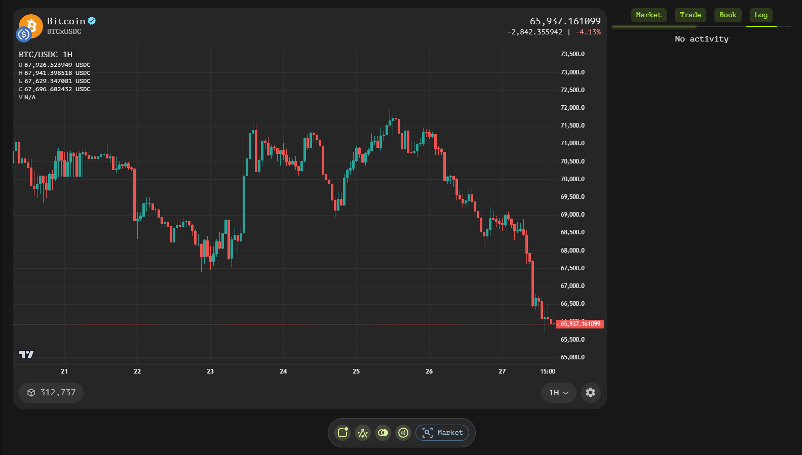

# Trading Page
The Trading Terminal on Tangent Swap is a powerful and intuitive interface designed to provide users with comprehensive tools for trading and analyzing the market. This documentation will guide you through the key features and functionalities of the trading terminal, helping you navigate and utilize its full potential.

## Chart Interface (Left Side)
The left side of the trading page is dominated by an interactive chart powered by TradingView. This chart offers a detailed visualization of price changes over time, with precise price values displayed in the top-left corner. The header of the chart provides crucial information:

- **Trading Pair Name and Symbol**: Located on the left, this clearly identifies the asset pair being traded.
- **Last Price and Price Change**: On the right, users can see the last recorded price, along with absolute and relative price changes for the day.

The footer of the chart contains a selection of time intervals, allowing users to adjust the price history displayed. Additionally, a gear icon in the footer opens a configuration dialog, offering various customization options:

- **Chart View**: Users can choose between different visual presentations such as candles, bars, mountain, or line charts.
- **Price View**: Options include normal and inverted price charts.
- **Price Scale**: Users can select from normal, logarithmic, percentage, or index price scale representations.
- **Volume Data**: This toggle shows or hides the volume bar area.
- **Crosshair Mode**: Offers different types of crosshair interactions, including normal, magnet, hidden, and magnet OHLC.

## Control Menu (Right Side)
The right side of the trading page features a control menu with four tabs: Market, Trade, Book, and History. Each tab provides unique functionalities to enhance the trading experience.

### Market Tab
The Market tab is divided into four informative windows:

- **P&L Window**: Displays the balance change of the current wallet against another asset. By default, it shows the primary asset's P&L but can be switched to the secondary asset's P&L.
- **Performance 24h Window**: Provides an approximate LPs revenue APY, price change over 24 hours, open/close/low/high prices, volume, and open interest, represented as total order book liquidity.
- **Contract Window**: Offers details about the market contract, including asset names, smart contract type (currently, only spot market contracts are available), program address, and program deployer address.
- **Rules Window**: Outlines the maker/taker fee range, pool revenue fee range, impact rule, and impact difficulty. The impact rule determines the volume required to reach the lowest maker/taker fees, while impact difficulty governs how quickly these fees decrease as trading volume grows.

### Trade Tab
The Trade tab is where users can create orders and liquidity pools:

#### Order Maker

For order creation, users have access to various fields depending on the order type:

  - **Buy/Sell Subtab**: Allows users to choose between creating a buy/sell order
  - **Balance Button**: Displays balance and sets the quantity to the current balance when clicked.
  - **Order Type**: Includes market, limit, stop, stop-limit, trailing-stop, and trailing-stop-limit orders.
  - **Order Fill**: Enables or disables complete fill-only mode.
  - **Stop Price**: Specifies the price at which the order should be triggered.
  - **Price**: Sets the base price for order execution.
  - **Step**: Defines the minimal market price move to activate stop price change (absolute or relative).
  - **Distance**: Determines the distance to the market price when changing the stop price (absolute or relative).
  - **Quantity**: Specifies the order quantity to be bought/sold (absolute or relative).
  - **Account Impact Text**: Displays the current account's impact on trading volume.
  - **Receive Minimum Text**: Indicates the minimal amount of other tokens to receive, excluding fees.
  - **Exchange Fee Text**: Shows the maker/taker fee taken by the smart contract.
  - **Place Order Button**: Opens a brief summary and redirects to a Payment Page to send a transaction if everything is as expected.

  

#### Pool Maker

For creating a liquidity pool, users can specify:

  - **LP Subtab**: Allows users to enter LP (liquidity provider) maker mode.
  - **Double Balance Badge**: Shows wallet balances of both primary and secondary tokens.
  - **Min Price/Max Price**: Can be specified to create a Concentrated Liquidity Pool (CLP).
  - **Initial Price**: Affects token reserve ratios required to be paid.
  - **Token1 Reserve/Token2 Reserve**: Specifies the reserve values of each token to be paid.
  - **Fee Rate**: Sets the fee rate percentage for this LP.

  

### Book Tab
The Book tab provides a vertical view of the order book, divided into bid and ask sections. The left part displays buying levels with liquidity on top, while the right part shows selling levels with liquidity on top. Both sections feature a visual horizontal scale indicating the liquidity at each price level. Users can customize their view by specifying price grouping to reduce the number of levels and switching between bids, asks, or both.

### Log Tab
The History tab presents a list of past on-chain trades, including details such as price, quantity, age, and whether the trade was made by the maker or taker account. This tab provides valuable context for understanding market activity and trends.

## Token Unification
When creating orders or pools, users may utilize unified tokens. Unified tokens sum the balances of multiple token variants, allowing seamless trading. For example, different variants of USDT on various blockchains are considered unified. When an order or pool is created using these tokens, they are converted into Tangent's unified token, which can be exchanged back to their original forms post-trade via the Portfolio Page with no fees.