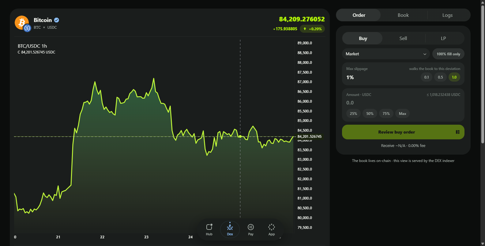
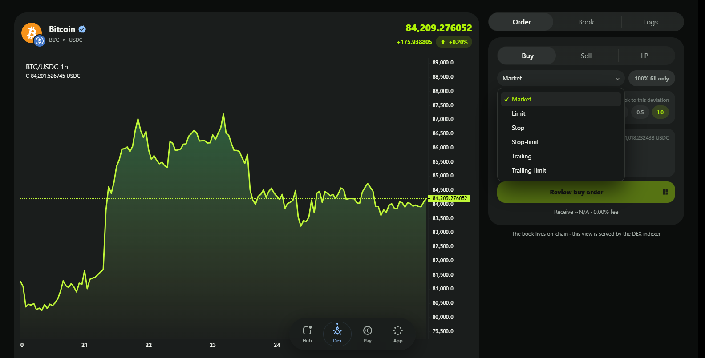
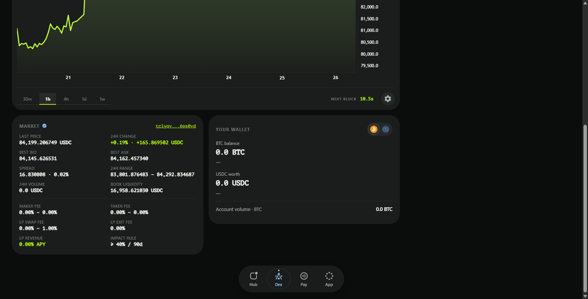
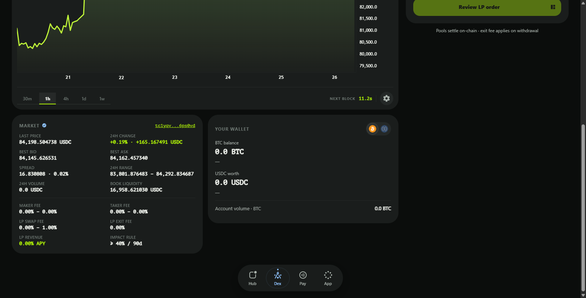
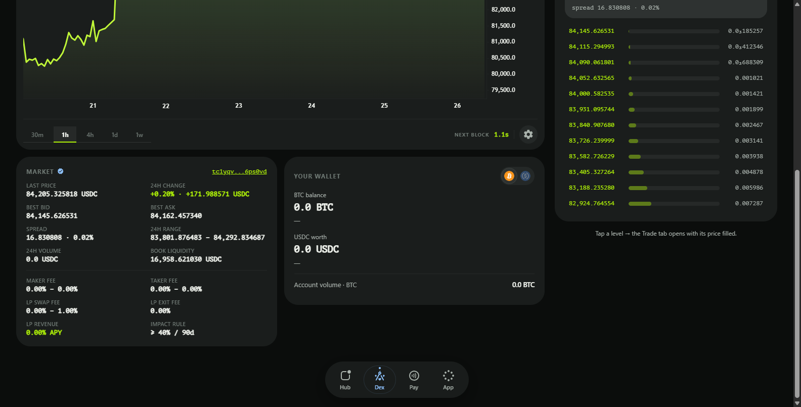
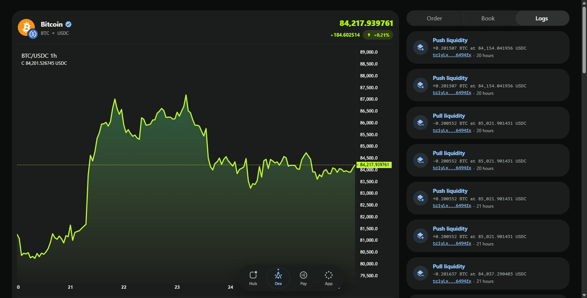

# Trading Page

The trading terminal opens on any pair from the Trade tab. The left side is the chart; the right side is the control column with four tabs: **Market**, **Order**, **Book** and **Logs**.

## Chart

The interactive chart plots price history for the pair with the last price in the header, alongside absolute and relative 24h change. The footer holds the interval selector (30m / 1h / 4h / 1d / 1w), a countdown to the next block, and a gear that opens the chart settings: candle/bar/line presentation, price scale mode, volume display and crosshair behavior.

## Market Tab

The Market tab summarizes the pair and its rules:

- **Last price, 24h change** — current market state.
- **Best bid / Best ask / Spread** — top of the order book.
- **24h range, 24h volume, Book liquidity** — activity and depth.
- **Maker / Taker fee** — the fee band of the market contract.
- **LP swap fee / LP exit fee / LP revenue** — pool economics including estimated APY.
- **Impact rule** — the volume share that unlocks the lowest fees and how fast fees decay with volume.
- **Policy account** — the market contract address, linked to its portfolio view.

A **Your wallet** card next to it shows your balances of both pair assets and your open orders in this market.

## Order Tab

The Order tab is where orders and pools are created, with `Buy` / `Sell` / `LP` subtabs.

### Order Maker

- **Order Type** — market, limit, stop, stop-limit, trailing and trailing-limit.
- **Balance button** — shows the spendable balance and fills the quantity with it.
- **Price / Stop price** — execution price and, for stop orders, the trigger price.
- **Step / Distance** — trailing parameters: the move that shifts the stop and the gap kept from the market price.
- **Quantity** — amount in the primary asset (absolute or relative).
- **Fill-only switch** — require complete fills.
- **Fee / receive estimates** — the impact tier, minimum received and the contract fee before you commit.
- **Review order** — simulates the order, then routes it to the payment screen for signing.

### Pool Maker

The `LP` subtab creates a liquidity position: set the optional **min/max price** for a concentrated pool, the initial price, the reserves of each token to deposit and the **fee rate** the pool charges. Your balances of both tokens are shown while composing.

## Book Tab

The Book tab is the vertical order book: bids on one side, asks on the other, each level with a horizontal liquidity bar. `Bids / Both / Asks` switches the view and the step field groups price levels to coarser granularity.

## Logs Tab

The Logs tab streams market activity: fills, pushes and pulls of book liquidity with price, quantity, the acting account and age — the tape behind the chart.

## Token Unification

Orders and pools can use **unified tokens**: variants of the same asset (for example USDT on different chains) are summed and traded as one unified Tangent token. After a trade, unified balances convert back to their original forms from the Wallet tab, without fees.
