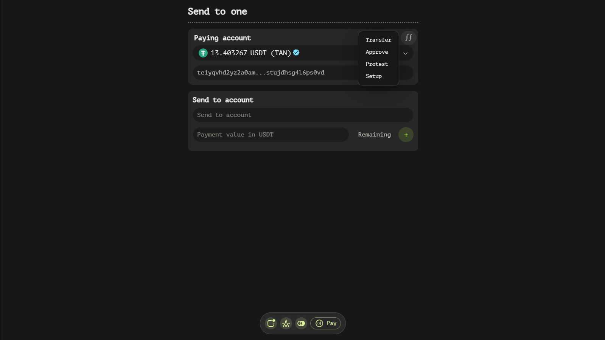
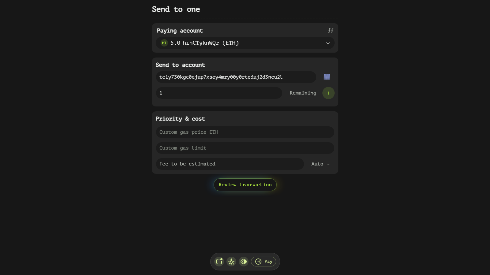
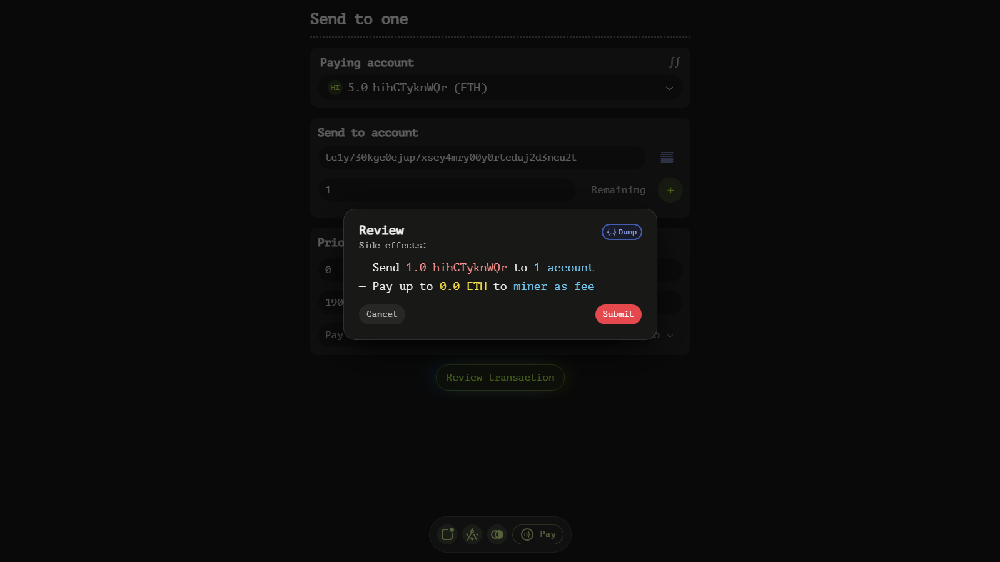

# Payment Page

The payment page in our wallet app is designed to provide users with a comprehensive interface for creating and submitting transactions. This documentation will guide you through the various components and functionalities available on this page.

## Initiating a Transaction

To begin a transaction, users need to select an asset from the 'Paying account' window. This selection determines which asset will be used to cover gas fees. The chosen asset is crucial as it dictates the native blockchain token that will be utilized for fee payments.

## Transaction Type Selection

Adjacent to the 'Paying account' window, you'll find a 'ff' button. Clicking this button allows users to switch between different transaction types. Our app supports several transaction types, each serving a unique purpose:

- **Transfer**: This type enables users to send tokens to one or more accounts. It is the most straightforward and commonly used transaction type.

- **Approve**: This option facilitates the creation of a transaction from a tx file. It is useful for users who need to build transactions based on pre-existing files.

- **Protest**: This transaction type allows users to protest a bridge withdrawal. It is specifically designed for scenarios where users need to contest or dispute a withdrawal action.

- **Setup**: With this type, users can configure their account's status within the network participation framework. It is essential for setting up or modifying an account's role in the network.

We will explore each transaction type in greater detail later in this documentation. For now, let's continue with the general fields available on the payment page.

## Priority & Cost Settings

The 'Priority & cost' window provides users with granular control over their transaction fees. This section includes several key fields:

- **Custom gas price**: Users can specify a custom price per gas unit based on the selected paying asset's native blockchain token. This allows for precise control over how much users are willing to pay for transaction processing.

- **Custom gas limit**: Here, users can define the maximum number of gas units that their transaction is allowed to consume. Setting an appropriate gas limit ensures that transactions do not exceed a predetermined cost threshold.

- **Fees text field**: This read-only field displays the maximum fees payable by the current transaction based on the specified custom gas price and limit.

- **Auto button**: For users who prefer automatic fee calculation, this button can populate the custom gas price and limit based on current network conditions. Clicking it opens a dropdown menu with various percentiles and descriptive terms, such as "Fastest > 95%." This option ensures that transactions are prioritized according to user preferences, with higher percentages indicating faster processing times but also higher costs.

## Reviewing and Confirming the Transaction

Once all necessary fields have been configured, users can proceed by clicking the 'Review transaction' button. This action opens a confirmation dialog that provides a brief summary of the potential effects of the transaction. If no custom gas price or limit were specified earlier, the app will automatically estimate these values based on the 95th percentile.

The confirmation dialog also includes a 'Dump' button, which, when clicked, copies the JSON payload of the finalized transaction into the clipboard. This feature is particularly useful for users who need to share or review the transaction details externally.

