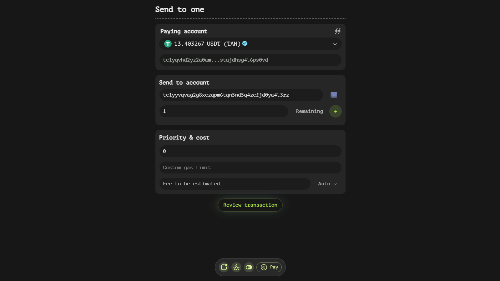
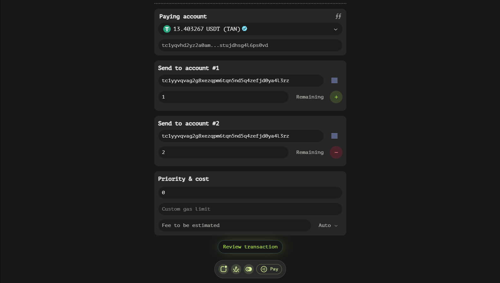

# Transfer Function

The Transfer type contains one or more windows, each designed to handle individual transfer destinations. This modular approach allows users to manage multiple transfers simultaneously, providing flexibility and efficiency in token distribution.

### Key Fields within Each Transfer Window

Each window within the Transfer type includes several essential fields that facilitate precise control over the transfer process:

- **Account**: This field is where you input the recipient's account address. Ensuring accuracy in this field is crucial as it determines the destination of your tokens. Our app supports easy copying and pasting of addresses to minimize errors.

- **Value**: Here, you specify the exact amount of tokens to be sent to the designated account. Precision is key in this field, as it directly impacts the balance transfer. Users can input values manually or utilize additional features to streamline this process.

### Enhancing Efficiency with Additional Features

To further enhance user experience and efficiency, the Transfer window includes several interactive buttons:

- **Remaining button**: This feature is incredibly useful for users who wish to send their entire remaining balance to a specific account. By clicking this button, the 'Value' field will be automatically populated with the available balance, ensuring that no tokens are left behind unintentionally.

- **+/- buttons**: These buttons allow users to add or remove transfer destinations dynamically. The '+' button creates a new window for an additional transfer, enabling users to send tokens to multiple accounts in a single transaction. Conversely, the '-' button removes a selected window, providing flexibility in managing the number of transfer destinations.

## Streamlining Multiple Transfers

The ability to handle multiple transfers within a single interface is one of the standout features of our Transfer window. This capability is particularly beneficial for users who need to distribute tokens across several accounts simultaneously. By utilizing the '+/-' buttons effectively, users can tailor their transaction to meet specific distribution requirements without the need for multiple individual transactions.

## Best Practices and Tips

To ensure a smooth experience when using the Transfer window, consider the following best practices:

- **Double-check addresses**: Always verify that the account address entered is correct to avoid sending tokens to an unintended recipient.
- **Utilize the Remaining button wisely**: This feature can be a time-saver but use it cautiously, especially if you need to retain a small balance for future transactions.
- **Plan your transfers**: Before adding multiple transfer destinations, plan out the distribution to ensure accuracy and efficiency.