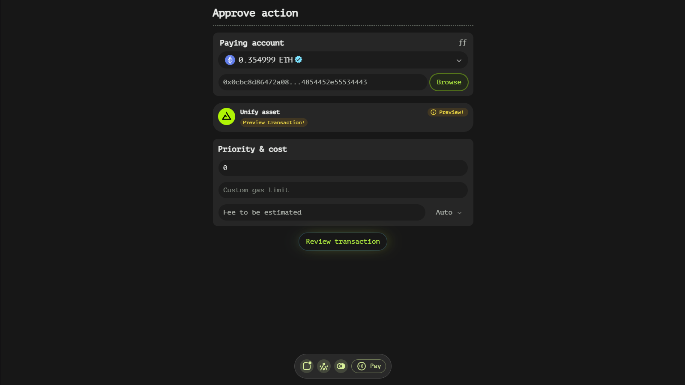
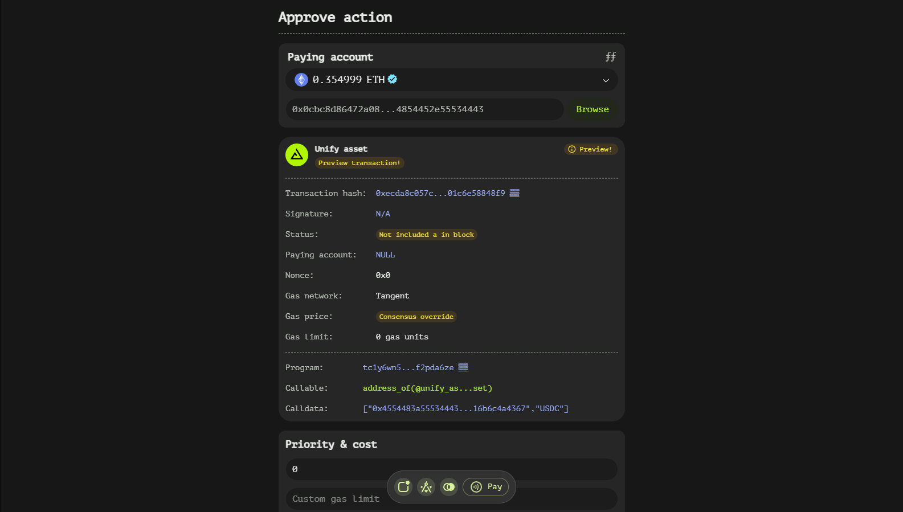
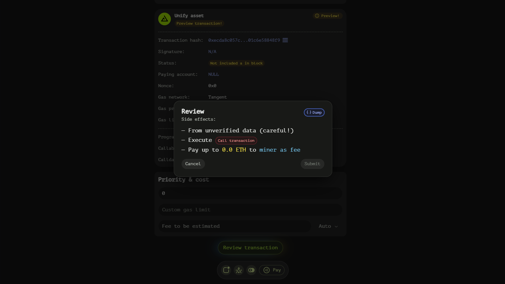

# Approve Function

The Approve Payment is designed to facilitate the creation and review of transactions based on pre-built files. This documentation will guide you through the unique features and functionalities available within this interface, ensuring you have a comprehensive understanding of how to utilize it effectively.

## Understanding the Approve Window Structure

### Enhanced 'Paying Account' Window

In the Approve type, the 'Paying account' window is augmented with an additional field that includes a 'Browse' button. This button opens a dialog that allows users to select a pre-built transaction file. The file can contain either binary or hex transaction data, providing flexibility in how transactions are prepared and imported.

### Selecting a Transaction File

When you click the 'Browse' button, a file selection dialog appears, enabling you to navigate your local file system and choose a valid transaction file. Once a file is selected, the app will process it to ensure its validity. If the file contains a valid transaction, the paying asset specified in the file will be replaced with the asset currently selected in the 'Paying account' window. This ensures that the transaction aligns with your current preferences and available assets.

## Transaction Preview and Simulation

### Read-Only Transaction View

Upon selecting a valid transaction file, a new read-only window appears below the main interface. This window provides a detailed preview of how the transaction would appear in your account after being finalized. The preview is static at this stage, offering a clear view of the transaction's structure and details.

### Reviewing the Transaction

When you click the 'Review transaction' button, the app performs a transaction simulation. This process updates the transaction view with data received from the simulation, including any occurred events and additional fields that result from the simulation. The updated view provides a more dynamic and comprehensive overview of the potential impacts and outcomes of the transaction.

## Key Features and Benefits

- **Flexibility in Transaction Creation**: By supporting both binary and hex transaction data, the Approve window caters to users with varying levels of technical expertise and preferences.
- **Dynamic Asset Selection**: The ability to replace the paying asset specified in the file with a currently selected asset ensures that transactions are always aligned with your available resources.
- **Detailed Transaction Preview**: The read-only transaction view offers a clear and unalterable preview of the transaction, promoting transparency and understanding.
- **Simulation-Based Updates**: The transaction simulation provides insights into potential events and outcomes, enhancing the user's ability to make informed decisions.

## Best Practices and Tips

To ensure a smooth experience when using the Approve window, consider the following best practices:

- **Verify File Integrity**: Always ensure that the transaction file you are importing is valid and free of errors to avoid unexpected issues during processing.
- **Review Asset Selection**: Double-check that the paying asset selected in the 'Paying account' window is appropriate for the transaction to prevent any discrepancies.
- **Study the Preview**: Take advantage of the read-only transaction preview to familiarize yourself with the transaction's structure and details before proceeding.
- **Analyze Simulation Results**: Carefully review the data provided by the transaction simulation, including occurred events and additional fields, to gain a comprehensive understanding of the transaction's potential impacts.