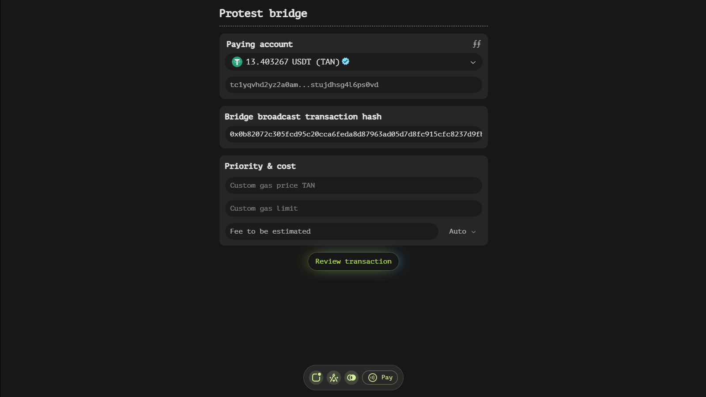

# Protest Function

The Protest function is designed to facilitate the process of contesting bridge withdrawals, allowing users to recover their funds under specific circumstances. This documentation will provide a detailed overview of the components and functionalities available within this interface, ensuring you have a comprehensive understanding of how to utilize it effectively.

## Understanding the Protest Window Structure

### Dedicated Protest Window

The Protest type introduces a new window that is specifically tailored for handling protest transactions. This window contains a single, crucial field:

- **Successful transaction hash**: This field requires the hash of the 'broadcast' transaction associated with the 'withdraw' transaction request that you wish to protest. Entering this hash is essential as it identifies the specific withdrawal you are contesting and seeking to recover funds from.

## Purpose and Use Case

The Protest type is particularly useful in scenarios where an off-chain transaction has not been completed within a specified time-lock period. By initiating a protest, users can signal their intention to reclaim their funds, assuming that the withdrawal process has failed or been delayed beyond the acceptable time frame.

### Key Considerations

- **Time-Lock Period**: Ensure that you are initiating the protest after the time-lock period has passed. This is crucial as protests submitted before this period may be considered premature and potentially invalid.
- **Accurate Hash Input**: The successful transaction hash must be entered precisely. Any errors in this field could lead to the protest being associated with the wrong withdrawal, potentially complicating the recovery process.

## Step-by-Step Guide

1. **Identify the Withdrawal**: Determine the specific withdrawal transaction that you wish to protest. This should be a 'withdraw' transaction request for which you have not received the expected funds due to an off-chain absence.

2. **Obtain the Transaction Hash**: Retrieve the hash of the 'broadcast' transaction associated with the withdrawal. This hash is typically available in your transaction history or can be obtained from blockchain explorers.

3. **Enter the Hash**: Input the successful transaction hash into the designated field in the Protest window. Double-check for accuracy to ensure that the protest is correctly associated with the intended withdrawal.

4. **Review and Submit**: Once the hash has been entered, review the details to ensure everything is correct. Then, proceed to submit the protest transaction.

## Best Practices and Tips

To ensure a smooth experience when using the Protest window, consider the following best practices:

- **Keep Records**: Maintain detailed records of your withdrawal transactions, including their hashes and corresponding time-lock periods. This will facilitate quicker and more accurate protests if needed.
- **Monitor Time-Locks**: Stay vigilant about the time-lock periods for your withdrawals. Setting reminders can help ensure that you initiate protests promptly after the period has elapsed.
- **Verify Hash Accuracy**: Always double-check the transaction hash before submitting a protest to avoid any potential mismatches.