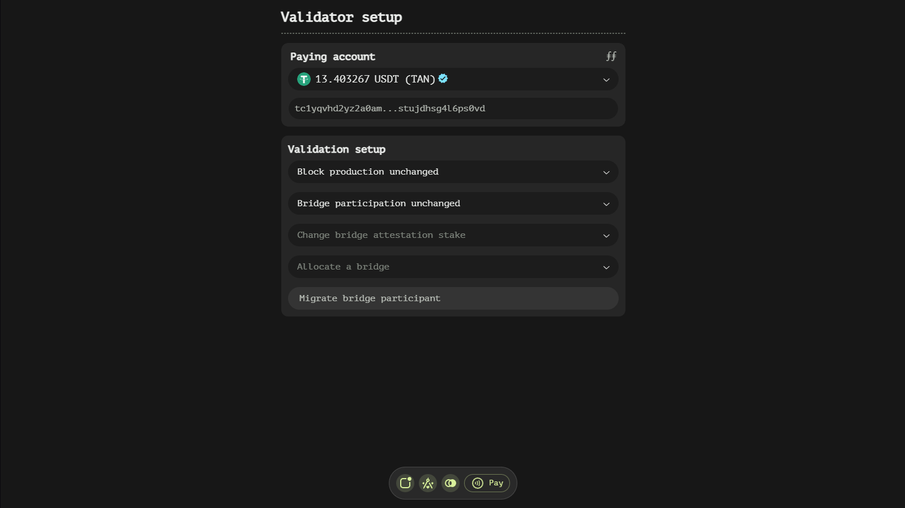
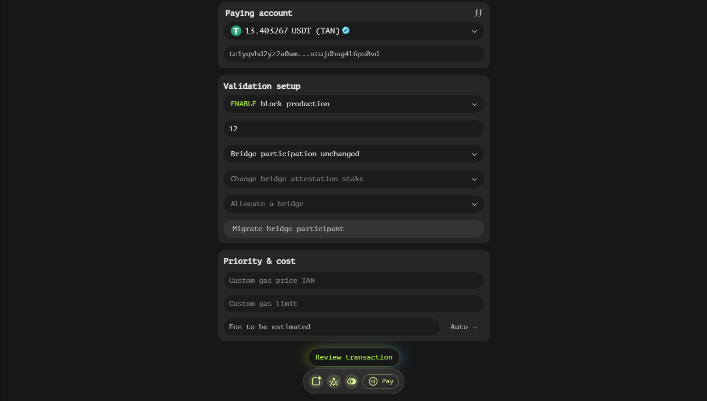
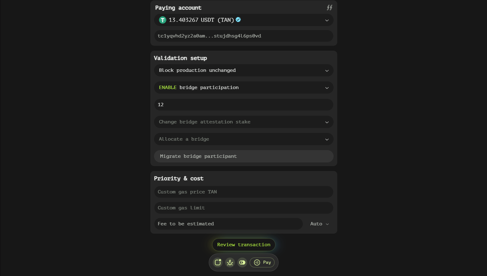
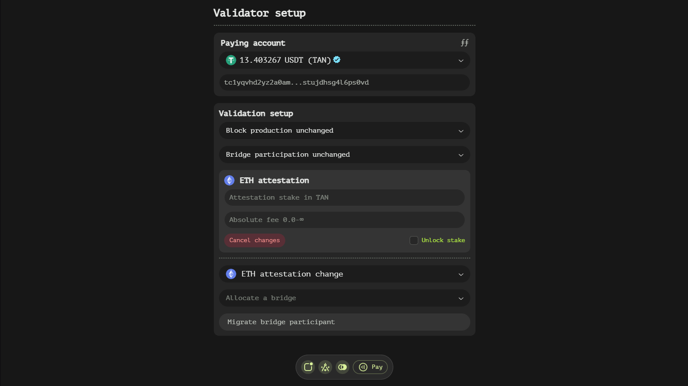
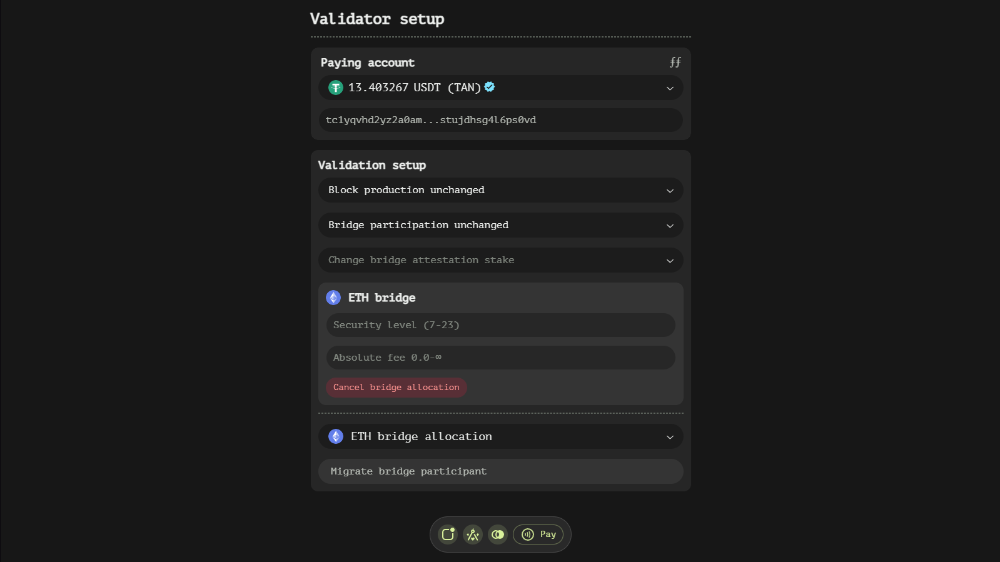
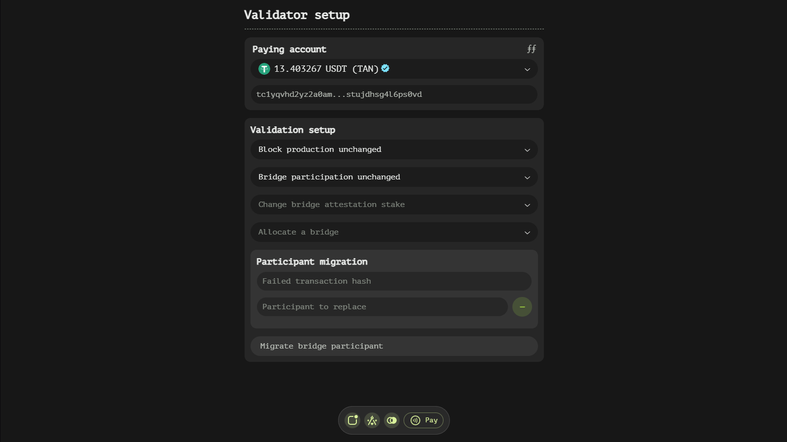

# Setup Function

The Setup function is designed to configure and manage various aspects of your account's participation in the blockchain network, including block production, bridge participation, and attestation settings. This documentation will provide a detailed overview of the components and functionalities available within this interface, ensuring you have a comprehensive understanding of how to utilize it effectively.

## Understanding the Setup Window Structure

### Block Production Status

This field allows you to enable or disable your account's capability to produce blocks. When enabled, an additional subfield appears:

- **Block production stake**: Specify the amount of TAN tokens you wish to stake for block production. This stake is crucial for participating in the consensus mechanism and earning rewards.

### Bridge Participation Status

This field enables or disables your account's capability to participate in bridge production. When enabled, an additional subfield becomes available:

- **Bridge participation stake**: Specify the amount of TAN tokens you wish to stake for bridge participation. This stake is necessary for engaging in cross-chain activities and earning associated rewards.

### Bridge Attestation Change

A dropdown menu lists various blockchains. Selecting a blockchain adds an 'Attestation' subwindow, allowing you to configure attestation settings for the chosen blockchain.

### Bridge Allocation

A dropdown menu that also lists various blockchains. Selecting a blockchain adds an 'Bridge' subwindow, allowing you to create a new bridge for the chosen blockchain.

### Migrate Bridge Participant

A button that, when clicked, adds a 'Participant migration' subwindow. This feature is useful for replacing failed participants in a bridge.

## Attestation Subwindow Fields

The Attestation subwindow appears when a blockchain is selected from the 'Attestation Change' dropdown menu. It contains several fields to configure attestation settings:

- **Attestation stake**: Specify the amount of TAN tokens to stake for attestation purposes.
- **Absolute fee**: Optionally specify the minimal bridge fee to be coordinating the bridge operation.
- **Cancel changes button**: Remove the Attestation subwindow if you need to revert or start over.
- **Unlock stake checkbox**: Check this box to disable the bridge and unlock the staked tokens, including any accumulated rewards.

## Bridge Subwindow Fields

The Bridge subwindow appears when a blockchain is selected from the 'Bridge Allocation' dropdown menu. It contains several fields to required to create a bridge:

- **Security level**: Define how many participants must be included in a bridge to ensure security and reliability.
- **Absolute fee**: Define the withdrawal fees for the current bridge.
- **Cancel bridge allocation button**: Remove the Bridge subwindow if you need to revert or start over.

## Participant Subwindow Fields

The Participant subwindow is added when you click the 'Migrate Bridge Participant' button. It contains fields for handling participant migrations:

- **Failed transaction hash**: Enter the hash of a 'broadcast' transaction that has failed. This helps identify the specific failure point.
- **Participant to replace**: Input the account address of the bridge's participant assumed to be responsible for the 'broadcast' transaction failure. This step is crucial for replacing the faulty participant with a new one.

## Key Features and Benefits

- **Flexible Staking Options**: The ability to specify stakes for block production, bridge participation, and attestation provides users with control over their engagement and reward potential.
- **Detailed Bridge Configuration**: The Attestation subwindow offers comprehensive settings for managing bridge operations, including fees, thresholds, and policies.
- **Participant Management**: The Participant subwindow facilitates the smooth replacement of failed participants, ensuring the continued functionality and security of the bridge.

## Best Practices and Tips

To ensure a smooth experience when using the Setup window, consider the following best practices:

- **Plan Your Stakes**: Carefully consider the amount of TAN tokens to stake for each activity. Higher stakes can increase your chances of earning rewards but also lock more funds.
- **Monitor Bridge Settings**: Regularly review and adjust bridge settings, such as fees and participation thresholds, to optimize performance and security.
- **Stay Informed About Failures**: Keep track of failed transactions and be prompt in replacing participants to maintain the integrity of the bridge.